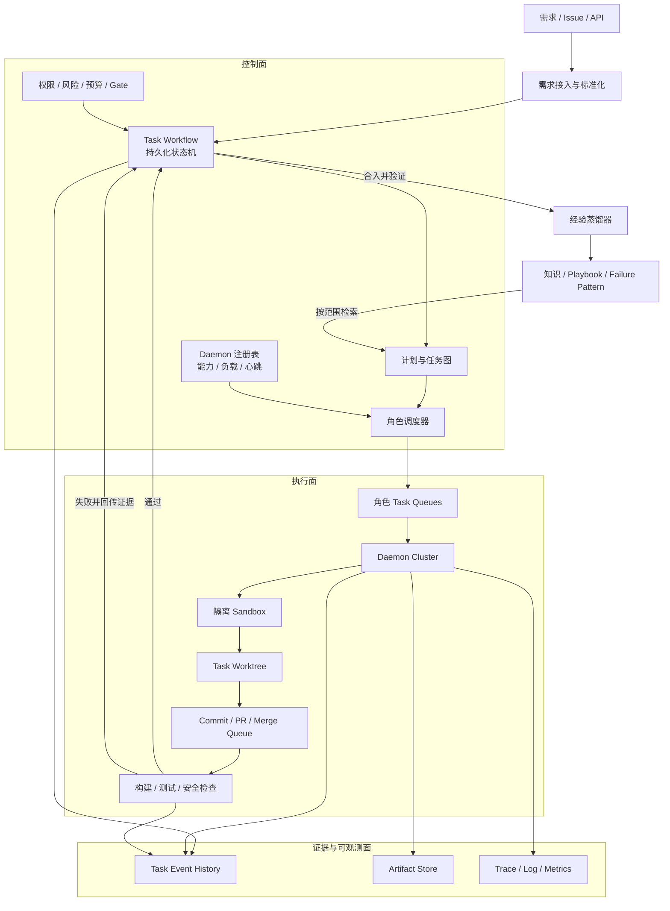
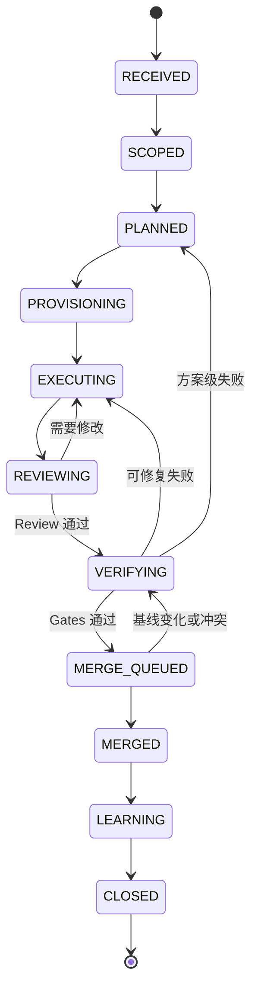
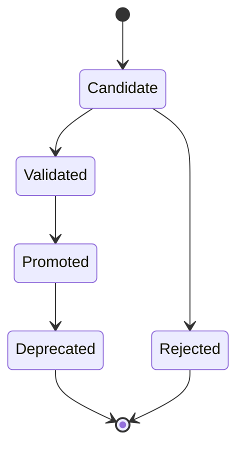

# 全自动研发闭环 Harness 架构设计

> 文档类型：Architecture  
> 状态：Draft  
> 版本：v0.2
> 更新日期：2026-08-22

## 1. 背景

本文设计一套面向代码研发任务的全自动 Harness。系统以任务为中心，协调不同角色的 Agent，从接收需求、生成计划、创建隔离 Worktree、编码、评审、验证，一直到合入主干，并在任务结束后自动沉淀可复用经验。

系统需要同时满足三个核心目标：

1. 基于 Daemon 集群，按角色、能力和负载派发 Agent。
2. 使用统一数据结构绑定完整任务周期，使需求、执行、代码、证据、合并和清理都归属于同一个 Task。
3. 将执行过程中的成功模式、失败模式、架构事实和操作方法沉淀为可追溯、可验证、可演进的知识。

本文默认研发流程基于 Git，使用独立分支和 Worktree，并通过 PR 或 Merge Queue 合入主干。

### 1.1 文档结构

本文作为 Harness 的总体架构总纲，描述系统边界、核心概念和各领域之间的关系。各子领域的状态机、协议、故障恢复和实现约束拆分到独立详细设计中；技术选型、竞品和验证性结论放入 Research 目录，避免总纲持续膨胀。

- [Task Runtime Kernel 详细设计](./task-runtime-kernel.md)：Task 完整生命周期、错误分类、重试、Checkpoint、交接和对账。
- [Restate PoC 架构](./poc-01-restate.md)：已经实现的最小 Task/Archive Workflow、Board 和强杀恢复证据。
- [Durable Workflow 与可观测方案调研](../../../sources/research/durable-workflow-and-observability-options.md)：Restate、Hatchet、DBOS、Temporal、LangGraph 以及看板和 Trace 方案。

### 1.2 当前实现切片

当前代码实现了总体架构中的本地单 Agent 垂直切片：Task/Archive Durable Workflow、冻结 TaskEnvelope、Step/Attempt/Evidence、隔离 Worktree、Fake/真实 Codex/Claude Adapter、运行中 Agent JSONL Stream、Verification、本地原子 Merge、查询投影、三层 Trace、CLI/Skill 和本地 Board。一键 Demo 可在隔离 Git Fixture 中选择 Fake、Codex 或 Claude，Board 把 Task、Workflow、Agent Session 与 Git Commit 聚合成中文七阶段业务旅程，并通过 cursor API 持续展示完整 CLI 事件；Restate UI 只作为高级运行时排障入口。

多角色 Core 目前实现了纯领域 Control Kernel，Docs、Implementation、Review 共用的 Role Attempt/Request/Result/Artifact 协议和确定性 Fake Role Runner，以及结构化 Self Review、ReviewResult、ReviewFinding 追加处置和 Blocking Gate。Projection 能按唯一 Pending Dispatch 依次推进三个角色；Review Run 完成后必须经内容寻址 Gate，才进入 Verification 或停在 Repair Required。稳定 Execution Intent、Manifest 对账和 `UNKNOWN_SIDE_EFFECT` 保护已由单测验证。它尚未接入 keyed Restate Core Workflow，真实 Codex/Claude 多角色 Adapter、Repair/Replan 循环与 Observer 也尚未实现。Daemon 集群、远程 Git/PR、生产可观测性与知识蒸馏仍是目标架构，不能从纯领域协议推断为已实现。

## 2. 设计结论

整体系统应当被设计成一个 **Task-centric Durable Workflow Harness**，而不是一组可以自由对话的 Agent。

核心原则如下：

> Task 是业务聚合根；Workflow 是唯一流程控制者；Event 是事实；Artifact 是证据；Trace 用于诊断；Knowledge 是成功闭环后的派生资产。

所有执行行为必须能回答以下问题：

- 它属于哪个 Task？
- 它执行的是哪个 Step？
- 它是第几次 Attempt？
- 谁派发、谁执行、在哪个 Daemon 上执行？
- 输入上下文、工具权限和代码基线是什么？
- 产生了哪些代码、日志、测试结果和决策？
- 为什么进入下一个状态？
- 最终合入了哪个 commit？
- 哪些经验由此产生，又被哪些后续任务使用？

## 3. 目标与非目标

### 3.1 目标

- 完整覆盖从需求进入到合入主干的任务生命周期。
- 在 Daemon 节点失败、进程重启和消息重复投递后仍能恢复执行。
- 支持 Planner、Coder、Reviewer、Verifier、Integrator 等角色协作。
- 支持并行子任务，同时保持工作区、上下文和权限隔离。
- 对每次模型调用、工具调用、文件修改、测试和合并提供关联查询能力。
- 用确定性的状态机和结构化协议约束 Agent 的非确定性。
- 建立知识产生、验证、提升、检索、反馈和废弃的闭环。
- 支持风险、预算、重试、人工审批和安全策略。

### 3.2 非目标

- 不追求多个 Agent 之间完全自由的自然语言自治协作。
- 不使用聊天记录作为系统状态或审计事实。
- 不允许编码 Agent 直接修改或合并主干。
- 不将所有原始执行记录直接写入正式知识库。
- 不承诺分布式系统中的严格 exactly-once；通过幂等、租约和对账实现可收敛的一致结果。

## 4. 总体架构



### 4.1 控制面

控制面负责决定“下一步应该做什么”，包含：

- 需求接入和标准化；
- Task 生命周期状态机；
- 计划生成和依赖图管理；
- 角色、能力、资源和优先级调度；
- 风险、权限、预算、重试及人工 Gate；
- 超时、失败恢复、取消和补偿；
- Task 查询模型和操作界面。

### 4.2 执行面

执行面负责完成有副作用的工作，包含：

- Agent Runtime；
- 模型和工具适配器；
- Sandbox；
- Git Worktree；
- 构建和测试运行器；
- PR、Merge Queue 和代码托管平台适配器。

### 4.3 证据与知识面

证据与知识面回答“发生了什么、为什么、结果能否被验证，以及未来是否可以复用”，包含：

- 持久化 Workflow History；
- 结构化 Task Event；
- 内容寻址 Artifact；
- OpenTelemetry Trace、Log、Metrics；
- 经验候选、知识验证和知识检索。

## 5. 核心领域模型

### 5.1 对象层次

| 对象 | 含义 | 生命周期 |
|---|---|---|
| `Task` | 一次完整研发需求 | 从需求接收到合入和知识沉淀完成 |
| `Subtask` | 可独立调度的任务分片 | 从计划展开到结果汇总 |
| `Step` | 计划图中的逻辑节点 | 从就绪到成功、失败或跳过 |
| `Attempt` | Step 的一次实际执行 | 从派发到结果提交或租约失效 |
| `Workspace` | Task 的代码隔离环境 | 从创建 Worktree 到归档清理 |
| `Artifact` | 输入、输出和证据 | 原则上不可变，按保留策略归档 |
| `Event` | 已发生事实 | 只追加，不原地修改 |
| `GateResult` | 一次策略或质量门禁判断 | 绑定输入、规则版本和证据 |
| `KnowledgeItem` | 可复用经验或事实 | Candidate 到 Deprecated |

区分 Step 和 Attempt 非常重要：同一个 Step 的重试必须生成新的 Attempt，否则无法准确表达重试、租约转移、成本和失败原因。

### 5.2 Task 数据结构

```yaml
Task:
  task_id: "01J..."
  schema_version: 1
  revision: 12

  source:
    type: issue
    uri: "https://..."
    requester: "user-or-system-id"
    received_at: "2026-08-19T10:00:00+08:00"

  objective:
    requirement_ref: "artifact://sha256/..."
    acceptance_criteria:
      - id: AC-1
        statement: "..."
    non_goals: []
    constraints: []

  repository:
    repo_id: "service/moye"
    remote_uri: "git@..."
    base_ref: main
    base_sha: "abc123"

  workflow:
    workflow_id: "task/01J..."
    state: VERIFYING
    plan_version: 3
    risk_level: medium
    priority: normal

  workspace:
    worktree_id: "wt-01J..."
    path: "/workspaces/service-moye/01J..."
    branch: "agent/01J..."
    base_sha: "abc123"
    head_sha: "def456"

  policy:
    tool_profile: coding
    max_cost: 20
    max_task_duration: "24h"
    max_attempts_per_step: 3
    human_gates: []

  outcome:
    pr_ref: null
    merge_sha: null
    closure_reason: null

  archive:
    status: NOT_READY
    archived_path: null
    archived_at: null

  created_at: "..."
  updated_at: "..."
```

### 5.3 全局关联标识

所有命令、事件、日志、模型调用、工具调用和 Git 操作都必须携带：

```text
task_id
step_id
attempt_id
workflow_id
idempotency_key
artifact_ids[]
```

必要时额外携带：

```text
subtask_id
daemon_id
lease_id
fencing_token
trace_id
span_id
git_base_sha
git_head_sha
```

其中 `task_id` 是跨越完整生命周期的业务关联根。`trace_id` 只用于一次相对短暂的技术执行，不作为业务主键。

## 6. 生命周期状态机

### 6.1 主流程



### 6.2 旁路状态

任意非终态可以根据策略进入：

- `WAITING_HUMAN`：需要业务、架构、安全或成本审批；
- `RETRYING`：等待退避后重试；
- `BLOCKED`：缺少外部依赖或权限；
- `CANCELLED`：用户或上游系统取消；
- `FAILED`：已超过自动恢复边界。

### 6.3 状态推进原则

- 只有 Workflow 可以改变 Task 主状态。
- Agent 和 Daemon 只能提交结构化结果，不能自行推进 Task。
- 每个状态迁移必须有事件、操作者、原因和证据引用。
- Review 和 Gate 失败必须声明失败层级：实现级、计划级、需求级或环境级。
- 每种失败都有确定的回退目标和最大重试次数。
- 状态机代码需要版本化；运行中的旧 Task 应继续使用兼容版本。

### 6.4 关闭条件

Task 进入 `CLOSED` 前至少满足：

- 需求验收条件都有对应证据；
- 最终 merge candidate 通过 required checks；
- 主干上的实际 `merge_sha` 已确认；
- 任务分支和 Worktree 已归档或安全清理；
- Artifact 已按策略保存；
- 经验蒸馏已经完成，或有结构化的跳过原因；
- 不存在仍持有有效租约的 Attempt。

PR 创建成功不等同于 Task 闭环。

Task `CLOSED` 后还要执行独立 Archive：冻结 Spec、验证、Outcome、Docs Impact 和 Closure Report，再把活动 Task 包移入 `docs/delivery/tasks/archive/`。Archive 状态不属于 Task 主状态机，归档失败不能重新触发编码或 Merge。

## 7. Durable Workflow

建议使用持久化工作流引擎承载 Task 状态机。以 Temporal 为例：

```text
Workflow ID       = task/<task_id>
Child Workflow ID = task/<task_id>/subtask/<subtask_id>
```

Workflow 内只执行确定性控制逻辑，以下外部副作用必须放入 Activity：

- 数据库和外部 API 调用；
- LLM 调用；
- 文件系统操作；
- Git 和代码托管平台操作；
- 构建、测试和安全扫描；
- Artifact 上传；
- 通知和人工审批。

Workflow History 是执行顺序和恢复的权威记录。面向 UI、搜索和报表的 PostgreSQL Task 表是可查询投影，应当能够通过历史和领域事件重建。

不要再在消息队列或普通数据库中实现第二套流程状态机。消息队列用于传递执行工作或广播事件，不负责决定 Task 当前处于哪个阶段。

## 8. 计划与任务图

Planner 输出的不是一段说明文字，而是版本化的执行图：

```yaml
Plan:
  task_id: "01J..."
  version: 3
  based_on_sha: "abc123"
  assumptions: []
  steps:
    - step_id: inspect-api
      role: planner
      depends_on: []
      outputs: [impact-analysis]

    - step_id: implement-handler
      role: coder
      depends_on: [inspect-api]
      workspace_mode: write
      outputs: [patch, unit-tests]

    - step_id: verify-handler
      role: verifier
      depends_on: [implement-handler]
      outputs: [test-report]

  completion_policy:
    required_steps: [implement-handler, verify-handler]
```

计划图需要支持：

- DAG 依赖；
- 并行和汇聚；
- 条件分支；
- 动态重新规划；
- 计划版本差异；
- Step 输入输出类型检查；
- 资源冲突和代码区域冲突提示。

重新规划不能覆盖旧计划。新计划必须增加 `plan_version`，并记录触发原因以及旧 Step 如何映射到新 Step。

## 9. Daemon 集群和调度

### 9.1 Daemon 定位

Daemon 是通用 Agent Runtime，不应该写死为某一种角色。它负责：

- 注册能力和资源；
- 从角色队列领取 Attempt；
- 建立 Sandbox 和工具上下文；
- 启动 Agent；
- 发送心跳；
- 收集结构化结果和 Artifact；
- 上报 Trace、Metrics 和 Event；
- 在取消或租约失效时终止执行。

### 9.2 能力注册

```yaml
DaemonCapability:
  daemon_id: "daemon-sh-01"
  runtimes: [codex, custom-agent]
  roles: [planner, coder, reviewer]
  languages: [go, typescript]
  tool_profiles: [read-only, coding, test]
  sandbox_types: [container, microvm]
  repo_affinity: [service/*]
  capacity: 4
  active_slots: 2
  version: "2026.08.1"
  heartbeat_at: "..."
```

### 9.3 调度维度

调度器综合考虑：

- Step 要求的角色和能力；
- 仓库、语言和工具亲和性；
- Daemon 当前负载和健康度；
- Sandbox 风险等级；
- 数据和代码本地性；
- 模型成本和 Token 预算；
- Deadline 和 Task 优先级；
- 相同类型任务的历史成功率；
- 版本兼容性。

### 9.4 Lease 与 Fencing Token

每次派发生成：

```yaml
AttemptLease:
  attempt_id: "attempt-..."
  lease_id: "lease-..."
  daemon_id: "daemon-sh-01"
  fencing_token: 42
  acquired_at: "..."
  expires_at: "..."
  heartbeat_interval: "15s"
```

Daemon 必须持续续租。如果租约过期，调度器可以重新派发新的 Attempt。所有有副作用的写入都校验 `fencing_token`，防止旧 Agent 恢复后覆盖新执行结果。

### 9.5 幂等

每个有副作用的操作使用确定性幂等键：

```text
<task_id>/<step_id>/<attempt_no>/<operation>
```

适用操作包括：

- 创建 Worktree；
- 创建分支；
- 上传 Artifact；
- 创建或更新 PR；
- 提交 GateResult；
- 执行合并；
- 写入知识候选。

对于无法原子完成的外部操作，使用“执行后查询 + 对账”的方式收敛状态。

## 10. Agent 角色与权限

| 角色 | 主要职责 | 代码权限 | 关键输出 |
|---|---|---|---|
| Planner | 分析需求和代码、生成计划 | 只读 | Plan、风险、影响面 |
| Coder | 修改代码和编写测试 | 当前 Task Worktree 可写 | Patch、Commit、实现说明 |
| Reviewer | 独立审查实现 | 只读 | Review findings、结论 |
| Verifier | 构建、测试、扫描和验收 | 只读或临时测试写权限 | GateResult、测试报告 |
| Integrator | 更新基线、处理合并和确认结果 | 受控 merge 权限 | PR、merge SHA |
| Curator | 蒸馏和维护知识 | 仅知识候选区可写 | Knowledge candidates |

权限应通过独立凭证、工具白名单和 Sandbox 策略实施，而不是只写在 Prompt 中。

Integrator 是唯一拥有合入权限的角色。Coder 即使认为任务已经完成，也只能提交候选结果。

## 11. Agent 输入输出协议

### 11.1 TaskEnvelope

Agent 不直接接收整个可变 Task 对象或无限增长的聊天历史，而是接收某一时刻的不可变执行快照：

```yaml
TaskEnvelope:
  schema_version: 1

  identity:
    task_id: "01J..."
    subtask_id: null
    step_id: "implement-handler"
    attempt_id: "attempt-03"
    role: coder

  objective:
    requirement_ref: "artifact://sha256/..."
    acceptance_criteria: [AC-1, AC-2]
    non_goals: []

  code:
    repo_id: "service/moye"
    base_sha: "abc123"
    worktree: "/workspaces/..."
    current_head_sha: "def456"

  execution:
    lease_id: "lease-..."
    fencing_token: 42
    deadline: "..."

  context_refs:
    - "artifact://sha256/architecture-context"
    - "knowledge://repo/service-moye/item-123"

  policies:
    tool_profile: coding
    allowed_paths: ["src/**", "tests/**"]
    denied_paths: ["infra/prod/**"]
    max_cost: 3

  expected_outputs:
    - patch
    - tests
    - claims
```

### 11.2 StepResult

```yaml
StepResult:
  schema_version: 1
  task_id: "01J..."
  step_id: "implement-handler"
  attempt_id: "attempt-03"

  status: succeeded
  summary: "实现接口并补充单元测试"

  artifacts:
    - type: git_patch
      uri: "artifact://sha256/..."
      digest: "sha256:..."
    - type: test_report
      uri: "artifact://sha256/..."
      digest: "sha256:..."

  claims:
    - statement: "实现满足 AC-2"
      acceptance_criteria: [AC-2]
      evidence_refs:
        - "artifact://sha256/..."
        - "git://service/moye/commit/def456"

  gate_results: []
  failure: null
  suggested_next_action: verify
```

Agent 之间通过 Artifact、Claim、Event 和计划图协作，不通过不可审计的私有对话协作。

## 12. Worktree 和 Git 闭环

### 12.1 隔离策略

每个 Task 独占一个分支和 Worktree：

```text
branch   = agent/<task_id>
worktree = <workspace-root>/<repo-id>/<task_id>
```

创建时记录：

- 仓库身份；
- `base_ref`；
- 精确 `base_sha`；
- Worktree 路径；
- 分支；
- Git 配置和工具版本；
- 创建该 Worktree 的事件和 Attempt。

不能只记录 `main`，因为它会移动，无法作为可重放基线。

### 12.2 并行开发

默认一个 Task 一个可写 Worktree。如果一个 Task 内存在可真正独立的子任务，可采用：

1. 每个 Subtask 独立 Worktree；
2. 子任务先生成独立 commit；
3. 汇聚节点按确定顺序集成；
4. 冲突由 Integrator 或专门的 Conflict Resolver 处理；
5. 集成后的候选 SHA 重新执行完整验证。

不建议多个 Coder 并发写同一个 Worktree。

### 12.3 合并流程

Integrator 执行：

1. 刷新目标分支。
2. 检查 Task 的 `base_sha` 是否过旧。
3. rebase 或合并最新目标分支。
4. 解决冲突，或者返回实现/规划阶段。
5. 对最终候选 SHA 执行 required checks。
6. 创建或更新 PR。
7. 进入 Merge Queue。
8. 确认实际合入主干的 `merge_sha`。
9. 回写 Task Outcome。
10. 归档和清理工作区。

合并操作需要幂等键，并通过代码托管平台反查实际结果，避免请求超时导致重复合并或错误状态。

## 13. Gate 体系

Gate 不只表示测试是否通过。建议至少包含：

- Requirement Gate：需求和验收条件是否明确；
- Plan Gate：计划是否覆盖验收条件和风险；
- Change Scope Gate：修改是否超出授权范围；
- Build Gate：项目是否可构建；
- Test Gate：单测、集成测试和验收测试；
- Review Gate：独立 Review 是否通过；
- Security Gate：依赖、密钥、漏洞和危险操作检查；
- Policy Gate：预算、许可、路径和人工审批；
- Merge Gate：最终候选 SHA 是否满足合入规则。

结构示例：

```yaml
GateResult:
  gate_id: "test/unit"
  gate_version: "v4"
  task_id: "01J..."
  attempt_id: "attempt-04"
  subject_sha: "def456"
  status: passed
  started_at: "..."
  finished_at: "..."
  evidence_refs:
    - "artifact://sha256/test-report"
  summary: "238 tests passed"
```

GateResult 必须绑定被验证的 commit SHA。旧 commit 上的成功结果不能直接用于新的候选代码。

## 14. Event、Artifact 和 Trace

### 14.1 Task Event

领域 Event 是不可采样、只追加的业务事实，例如：

```text
TaskCreated
RequirementNormalized
PlanVersionCreated
WorkspaceProvisioned
AttemptDispatched
AttemptStarted
AttemptCompleted
AttemptLeaseExpired
PatchProduced
GateEvaluated
ReviewRejected
MergeQueued
CommitMerged
KnowledgePromoted
TaskClosed
```

统一事件信封：

```yaml
EventEnvelope:
  event_id: "evt-..."
  event_type: "AttemptCompleted"
  schema_version: 1
  task_id: "01J..."
  sequence: 87
  occurred_at: "..."
  actor:
    type: daemon
    id: "daemon-sh-01"
  causation_id: "cmd-..."
  correlation_id: "01J..."
  payload: {}
  artifact_refs: []
```

### 14.2 Artifact

大型内容和敏感内容不直接塞入 Event 或 Trace，而是保存为内容寻址 Artifact：

```text
artifact://sha256/<digest>
```

Artifact 类型包括：

- 原始需求和标准化需求；
- 计划；
- 上下文快照；
- Prompt 和模型响应；
- Patch、Diff 和 Commit metadata；
- 构建、测试、覆盖率和安全报告；
- Review 报告；
- 决策记录；
- 知识蒸馏输入输出。

```yaml
Artifact:
  artifact_id: "sha256:..."
  media_type: "application/json"
  kind: "test_report"
  size: 18342
  storage_uri: "s3://..."
  created_by_attempt: "attempt-04"
  task_id: "01J..."
  redaction_policy: "internal"
  retention_policy: "task-evidence-365d"
  created_at: "..."
```

### 14.3 技术 Trace

建议的 OpenTelemetry Span：

```text
task.intake
workflow.transition
step.dispatch
agent.run
llm.call
tool.call
git.worktree.create
git.commit
test.execute
gate.evaluate
merge.execute
knowledge.distill
```

统一属性：

```text
task.id
subtask.id
step.id
attempt.id
agent.role
agent.runtime
daemon.id
repo.id
git.base_sha
git.head_sha
model.name
token.input
token.output
cost
artifact.digest
```

一次 Task 可能持续数小时或数天，因此不建议创建一个跨越整个 Task 的超长 trace。每个 Attempt 或短执行单元创建独立 trace，并使用 `task.id` 关联，通过 Span Links 表达异步因果关系。

Prompt、源代码、模型完整输出和密钥不得直接作为 Span attribute。Trace 中只保存摘要、长度、digest 和受控 Artifact URI。

当前轻量 PoC 已落地其中最小切片：Core 通过 `TraceSink` 默认 Noop，显式开启后输出标准 OTLP/HTTP protobuf；Phoenix 仅作为本地可选 UI。Coding Projection 中已经完成的 Attempt 被重建为短 Span，稳定 Task Trace ID 与 `task.id` 用于跨 Span 查询，Agent JSONL 则作为不可采样、带摘要的受控 Artifact 保留。Moye 不把 Trace、Phoenix 或 Agent CLI 原生遥测当作业务状态与恢复权威，详见 [ADR-0004](../../decisions/adr/0004-use-otlp-contract-and-optional-phoenix.md)。

### 14.4 日志

日志必须是结构化日志，并自动带上当前 Trace Context 以及 Task Context。日志中的错误应引用对应的 Artifact、Attempt 和 Step，避免只能依靠全文搜索推断上下文。

## 15. 知识与经验沉淀

### 15.1 知识分层

#### Episodic Knowledge

某次 Task 的原始经历：执行轨迹、失败、重试、上下文、工具调用和最终结果。

#### Semantic Knowledge

相对稳定的事实：仓库架构、模块职责、术语、依赖、约束和接口关系。

#### Procedural Knowledge

可复用的方法：Skill、Playbook、测试策略、故障处理流程和代码修改模式。

### 15.2 知识生命周期



Agent 只能写入 Candidate 区。知识提升至少检查：

- 相关代码已经合入；
- 对应 Gate 通过；
- 有明确适用范围；
- 有可追溯证据；
- 不与当前代码版本冲突；
- 经过重复成功验证，或获得人工批准；
- 不包含密钥、个人信息和其他禁止内容。

### 15.3 KnowledgeItem

```yaml
KnowledgeItem:
  knowledge_id: "knowledge-..."
  kind: "playbook"
  title: "为 HTTP Handler 增加参数校验"
  statement: "..."

  scope:
    organization: "..."
    repo: "service/moye"
    modules: ["internal/http"]
    languages: ["go"]

  applicability:
    conditions: []
    excluded_conditions: []

  evidence_task_ids:
    - "01J..."
  evidence_artifacts:
    - "artifact://sha256/..."
  validated_against_sha: "merge789"

  confidence: 0.86
  status: promoted
  owner: "knowledge-curator"
  created_at: "..."
  expires_at: "..."
```

### 15.4 检索策略

检索顺序：

1. 按组织、仓库、模块、语言和任务类型做 metadata filter；
2. 检查知识是否适用于当前代码版本；
3. 执行关键词和向量混合检索；
4. 根据证据质量、时效性和历史效果重排；
5. 只将少量高相关知识加入 TaskEnvelope；
6. 记录哪些知识被检索、被采用以及是否改善结果。

正式知识库不是聊天记录仓库，也不能依靠 embedding 相似度替代适用性判断。

### 15.5 反馈闭环

需要持续衡量：

- 使用某条知识后的 Step 成功率；
- 重试次数是否下降；
- Review 缺陷是否减少；
- 是否引入回滚或线上问题；
- Agent 是否真正引用该知识形成决策；
- 知识是否已经被代码变化淘汰。

低价值或过期知识自动降权，并进入重新验证或 Deprecated 状态。

## 16. 可靠性设计

### 16.1 至少一次投递

默认所有任务派发、事件传输和外部操作都可能重复。系统通过以下机制保证结果可收敛：

- 幂等键；
- Attempt 唯一标识；
- Lease 和 Fencing Token；
- 乐观锁或 revision；
- Transactional Outbox；
- 外部状态反查；
- 周期性 Reconciler。

### 16.2 Reconciler

对账任务至少检查：

- Workflow 状态与 Task 查询投影是否一致；
- 有效租约是否存在对应活跃 Daemon；
- Worktree 和分支是否仍存在；
- PR 和 Merge 状态是否与 Task Outcome 一致；
- `MERGED` Task 是否存在真实 merge SHA；
- 已关闭 Task 是否仍有活跃 Attempt；
- Artifact URI 是否可访问且 digest 正确；
- 知识引用的 Task 和 Artifact 是否存在。

### 16.3 超时与重试

区分：

- Schedule-to-start timeout：没有合适 Daemon；
- Start-to-close timeout：Agent 执行过久；
- Heartbeat timeout：Daemon 失联；
- Task deadline：整个 Task 超时；
- External dependency timeout：CI、审批或代码托管平台未响应。

重试策略需要按错误类型分类，不能对权限错误、需求不明确或确定性编译错误无限重试。

## 17. 安全与治理

### 17.1 最小权限

- 按角色签发短期凭证；
- 默认无主干写权限；
- 限制文件路径和网络出口；
- 高风险工具只能在受控 Sandbox 中运行；
- Production 凭证不进入普通编码 Task；
- Agent 无权自行扩大 Tool Profile。

### 17.2 供应链与代码安全

- 固定 Agent Runtime、工具和基础镜像版本；
- 对 Artifact、镜像和关键事件签名；
- 记录依赖变更和安装行为；
- 扫描密钥、漏洞、许可证和恶意文件；
- 合并前验证 commit 与已审查候选一致。

### 17.3 Prompt 和知识安全

- 将仓库文本、Issue、网页和日志视为不可信输入；
- 区分系统策略、任务指令和外部内容；
- 外部内容不能修改权限或工具策略；
- 正式知识提升前执行注入、隐私和敏感数据检查；
- Prompt 与模型输出采用分级访问和保留策略。

## 18. 可观测性和运营指标

### 18.1 结果指标

- 自动闭环率；
- 首次成功率；
- 合入后回滚或重新打开率；
- 人工介入率；
- 验收条件覆盖率。

### 18.2 流程指标

- 需求到计划耗时；
- 排队时间；
- Agent 执行时间；
- Review 和 Verify 循环次数；
- 从创建 Task 到 merge 的总时长；
- Worktree 存活时间。

### 18.3 资源指标

- 每个成功合入 Task 的模型成本；
- Token、CPU、内存和 Sandbox 时长；
- 各角色和 Daemon 的利用率；
- 各模型、工具、仓库和任务类型的成功率。

### 18.4 知识指标

- 知识命中率和采用率；
- 采用知识后的成功率提升；
- 过期知识比例；
- 错误知识导致的失败次数；
- 从 Candidate 到 Promoted 的周期。

## 19. 推荐技术栈

| 能力 | 建议方案 |
|---|---|
| Durable Workflow | Temporal |
| Task 查询投影、策略和索引 | PostgreSQL |
| Artifact Store | S3 / MinIO |
| Trace | OpenTelemetry Collector + Tempo 或 ClickHouse |
| Metrics | Prometheus |
| Daemon Supervisor | Go 或 Rust |
| Sandbox | Container 起步，高风险任务使用 microVM |
| Knowledge | PostgreSQL + pgvector 起步 |
| Git 集成 | Git Provider API + Merge Queue |
| Policy | 代码内策略起步，复杂后引入 OPA |

初期采用“模块化单体控制面 + 多 Daemon”，避免过早拆分大量微服务。

如果使用 Temporal，优先使用按角色划分的 Task Queue：

```text
agent.plan
agent.code
agent.review
agent.verify
agent.integrate
knowledge.distill
```

只有在需要跨系统广播大量领域事件时，再引入 NATS JetStream 或 Kafka。事件总线不拥有流程状态。

## 20. 建议模块边界

```text
harness/
├── api/                 # 需求接入和操作 API
├── domain/              # Task、Step、Attempt、Event 等模型
├── workflow/            # 持久化状态机和恢复逻辑
├── planner/             # 计划协议和任务图
├── scheduler/           # Daemon 注册、能力匹配、Lease
├── runtime/             # Agent Runtime 与模型适配
├── sandbox/             # 隔离执行环境
├── scm/                 # Git、Worktree、PR、Merge Queue
├── gates/               # Build、Test、Review、Security、Policy
├── artifacts/           # 内容寻址存储
├── telemetry/           # Trace、Log、Metrics
├── knowledge/           # 蒸馏、验证、检索和反馈
├── reconciler/          # 外部状态对账
└── ui/                  # Task Timeline、证据和运营界面
```

模块可以先部署在同一个控制面进程中，通过稳定接口保持边界，后续再按扩缩容和故障域需求拆分。

## 21. 分阶段落地

### Phase 0：协议和骨架

- 定义 Task、Step、Attempt、Event、Artifact schema；
- 定义主状态机；
- 定义 TaskEnvelope 和 StepResult；
- 建立 `task_id` 全链路传播；
- 实现基础 Task Timeline。

验收标准：任何一次模拟任务都能通过 Timeline 解释每个状态迁移。

### Phase 1：单节点闭环

- 单个 Daemon；
- Planner、Coder、Verifier、Integrator 四个逻辑角色；
- 自动创建 Worktree；
- 自动生成代码、运行测试并创建 PR；
- 受控合入后关闭 Task；
- 保存基本 Artifact。

验收标准：一个低风险任务可以无人干预地从需求走到 merge SHA。

### Phase 2：集群可靠性

- Daemon Registry；
- 角色队列和能力调度；
- Lease、Heartbeat、Fencing Token；
- 幂等和 Transactional Outbox；
- 失败恢复和 Reconciler；
- 并行 Subtask。

验收标准：执行过程中任意终止一个 Daemon，Task 最终仍能恢复并得到唯一结果。

### Phase 3：证据和可观测性

- OpenTelemetry 全链路；
- LLM 和工具调用成本；
- Artifact 内容寻址；
- Claim 与验收条件映射；
- Task 证据页面；
- 风险和人工 Gate。

验收标准：可以从 Task、commit、测试或某次模型调用互相跳转并解释合入原因。

### Phase 4：知识闭环

- Candidate Knowledge；
- 自动蒸馏和验证；
- metadata + hybrid retrieval；
- 知识使用效果统计；
- 过期和废弃机制；
- 将稳定流程提升为 Skill 或 Playbook。

验收标准：知识必须有证据，且能够量化其对后续任务成功率或成本的影响。

### Phase 5：治理和规模化

- 多租户和资源配额；
- 动态模型路由；
- 高风险 microVM；
- 跨仓库 Task；
- 生产反馈和回滚关联；
- 自动策略优化。

## 22. 架构不变量

以下规则应当作为实现和评审时不可绕过的不变量：

1. 每个执行行为都必须属于一个 Task、Step 和 Attempt。
2. 只有 Workflow 能推进 Task 主状态。
3. Agent 不能直接合入主干。
4. 每个 Task 使用隔离的可写工作区。
5. GateResult 必须绑定精确 commit SHA 和证据。
6. 业务 Event 不采样，技术 Trace 可以按策略采样。
7. Trace 不是业务状态数据库。
8. 所有可能重复的副作用都必须幂等或可对账。
9. 旧 Lease 的执行者不能覆盖新 Attempt 的结果。
10. Agent 不能直接写入正式知识库。
11. 正式知识必须引用已验证 Task 和 Artifact。
12. 创建 PR 不等于 Task 完成，确认 merge SHA 后才进入闭环阶段。

## 23. 主要风险

| 风险 | 表现 | 缓解措施 |
|---|---|---|
| 多套状态源 | Workflow、数据库和队列显示不同状态 | Workflow 单一控制权，其他均为投影或传输层 |
| 重复副作用 | 重复创建 PR、重复提交结果 | 幂等键、Fencing Token、状态反查 |
| Agent 越权 | 修改主干、访问生产凭证 | 角色权限、短期凭证、Sandbox、工具白名单 |
| Trace 不完整 | 长任务被采样或跨异步边界断裂 | `task_id` 业务关联、短 trace、Span Links |
| 知识污染 | 失败结论进入后续上下文 | Candidate/Validated/Promoted 生命周期 |
| 无限修复循环 | Coder 与 Reviewer 往返不止 | 分层失败分类、最大 Attempt、重新规划和人工 Gate |
| 基线漂移 | 在旧 main 上测试通过，合并时失效 | 记录 `base_sha`，对最终候选 SHA 重新验证 |
| 上下文膨胀 | 把全部历史塞给 Agent | TaskEnvelope 快照、Artifact 引用、受控知识检索 |

## 24. 后续需要形成的详细设计

本文是总体架构。进入实现前，还需要分别补充：

1. [Task Runtime Kernel 详细设计](./task-runtime-kernel.md)，并继续补充其中 Task/Step/Attempt/Event 的 JSON Schema 或 Protobuf 定义；
2. Workflow 状态转换表和错误分类；
3. Daemon 注册、领取、续租和取消协议；
4. TaskEnvelope/StepResult 版本兼容策略；
5. Worktree 生命周期和清理策略；
6. Artifact 安全、脱敏和保留策略；
7. OTel semantic convention；
8. Gate 插件接口；
9. KnowledgeItem schema 和提升规则；
10. MVP 的端到端测试场景与故障注入方案。

## 25. 参考资料

- [Temporal Workflow](https://docs.temporal.io/workflows)
- [OpenTelemetry Traces](https://opentelemetry.io/docs/concepts/signals/traces/)
- [OpenTelemetry Generative AI Semantic Conventions](https://opentelemetry.io/docs/specs/semconv/gen-ai/)
- [Git Worktree](https://git-scm.com/docs/git-worktree.html)
- [NATS JetStream Pull Consumers](https://docs.nats.io/learn/jetstream/pull-consumers)
- [GitHub Actions `merge_group` event](https://docs.github.com/en/actions/reference/workflows-and-actions/events-that-trigger-workflows#merge_group)
