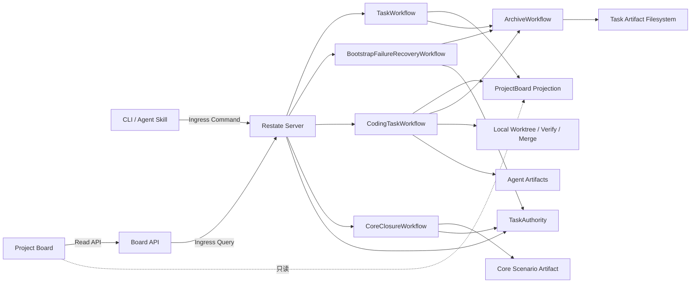

# Restate Task Runtime 最小 PoC 架构

> 文档类型：Architecture  
> 状态：Implemented  
> 版本：v0.7
> 更新日期：2026-08-22
> 决策依据：[ADR-0001](../../decisions/adr/0001-use-restate-for-task-runtime-poc.md)、[ADR-0003](../../decisions/adr/0003-use-typescript-for-restate-poc.md)

## 1. 已实现范围

本垂直切片验证 Task 业务关闭和材料归档可以在进程中断后分别收敛。它包含：

- keyed `TaskWorkflow/<task_id>`；
- keyed `ArchiveWorkflow/<task_id>`；
- `ProjectBoard/<project_id>` 查询投影；
- Task 主状态与 `archive_status` 两个正交维度；
- 带稳定 operation ledger 的副作用样例；
- Manifest 冻结、目录摘要、原子移动和未知结果 Reconcile；
- HTTP API、四列 Board、CLI 和项目 Skill；
- Git Backlog 文档到 ProjectBoard 的显式批次同步；
- 在真实编码 Workflow 完成前记录外层 Goal Commit 与验证引用的窄化 Bootstrap Evidence；
- 真实 Restate Server 1.7.4 下的 Worker `SIGKILL` 恢复测试。
- keyed `CodingTaskWorkflow/<task_id>`、Verification Gate、本地 Merge Effect 与 Fake/真实 Codex Fixture 编码闭环。
- `TaskAuthority/<task_id>` 单一主权声明、Coding→ProjectBoard 投影与独立 ArchiveWorkflow 串联。
- `TaskAuthority` owner 查询、Coding Trace Builder、`/api/tasks/<task_id>/trace` 与三层看板详情。
- keyed `CoreClosureWorkflow/<task_id>`、三种不可变 Core Closure、内容寻址 Scenario Artifact 与真实 Restate 故障矩阵。

它不包含多 Daemon、远程 Git 平台/PR、鉴权、多租户和生产级 Telemetry；真实 LLM 已在隔离 Fixture 和普通本地 Git 仓库完成产品闭环验收，但不代表生产调度能力已经完成。

## 2. 运行拓扑



Node 进程暴露 HTTP/2 Restate Endpoint（默认 `9080`）和普通 HTTP Board（默认 `3000`）。Restate Ingress 默认为 `8080`，Admin/API 默认为 `9070`。

## 3. 状态所有权

`TaskWorkflow` 是通用 Task/Archive 演示聚合的主状态唯一写入者：

```text
RECEIVED → EXECUTING → VERIFYING → CLOSED
```

`ArchiveWorkflow` 在 Task 关闭后独立更新：

```text
NOT_READY → PENDING → ARCHIVED | FAILED
```

ProjectBoard 只保存查询投影。CLI、Skill、Board API 和目录位置都不能直接推进状态。`task_id` 同时是 Workflow key、事件关联和人类查询入口。

`TaskAuthority/<task_id>` 在任一主 Workflow 开始前冻结 `owner + spec_revision`，冲突 owner 被拒绝；相同 Coding owner 可随合法 Replan 单调提升 Revision。升级前遗留的确定性 Bootstrap Invocation Failure 可以追加一次 `recoveryWorkflowRef`，但不覆盖 owner 或原 Workflow 历史；CLI/Board 查询该 successor 的当前 Projection 并同时保留 source ref。`CodingTaskWorkflow` 独占编码聚合 Projection，产品模式按 Context Role、Workspace、Implementation、Self Review、Verification、independent Review、Repair/Replan、Merge、Docs Gate、Closure、Archive 推进；`CoreClosureWorkflow` 独占确定性控制协议 Projection，并把 Scenario Adapter 的结果固定为一个 Closure Digest。Workspace、Role/Agent、Review、Verification、Merge、Docs 和 Scenario Adapter 只返回证据，不写 Projection。Observer 把兼容 Coding TaskProjection 同步到 ProjectBoard，但 Board 不是主状态源；当前 Scenario Core Workflow 只提供 Restate `status` 查询，不作为产品执行入口。

Git Backlog 是导入条目字段的所有者。CLI 完整校验 `BL-*.yaml` 后，通过单次 `ProjectBoard.syncBacklog` 提交；Object 比较 Source Digest，内容未变时不重写状态。Projection 独有记录采用 `PRESERVE` 并显式报告，Web 查询仍然只读取 Projection。

Goal Bootstrap 是自举期的实际执行者。它只能提交干净 HEAD 上的真实 Result Commit、首次引入 Manifest 时冻结的 Base、Verification 和 Docs Impact 引用；TaskWorkflow 在发布 `CLOSED` 前重新验证并持久化关闭材料，不产生 Agent 执行事实。稳定 Task Artifact 引用由 Active/Archive Resolver 根据 Projection 解析。`CLOSED` 后仍调用独立 ArchiveWorkflow。

Bootstrap 在 CLI 派发前、TaskWorkflow 首次状态写入前和 Closure Gate 三处复用同一冻结基线校验。前两处拒绝无效输入且不产生 Task Projection；进入 Projection 后才发现的确定性 Evidence/Closure 错误由原 Workflow 形成 `FAILED_TERMINAL` 和失败 Artifact，再进入 Archive。升级前已卡死实例只能通过核验原 Invocation 的 append-only `BootstrapFailureRecoveryWorkflow` successor 收敛，不能删除原历史。

Sealed Result Commit 同样执行三层校验：`seal-start` 在发送 keyed Invocation 前只读验证 HEAD/Base、Active package、Manifest identity 与 Archive path；`SealedTaskWorkflow` 在 Authority claim 和首个 Projection 前 durable 重验；Result Commit Gate 最终验证 Commit 与冻结 Evidence。派发前失败不创建 Runtime Task。旧版本若在第一条 command 已 completed Failure 且没有 Intent/Projection，不满足 rejected-Evidence Recovery 的前置条件，必须保留原 Invocation 并用新 Task 接管，不能重提 key 或补造 `FAILED_TERMINAL`。

## 4. 可恢复副作用

Archive 使用 `archive/<task_id>/revision-<spec_revision>` 作为稳定操作标识。

1. `freeze-archive-manifest` 用稳定 `.pending` 文件对账中断的原子写入；
2. `move-task-package` 在每次尝试前观察 source/target；
3. source-only 执行同文件系统 rename；target-only 视为已移动；
4. 两端都有且摘要一致时清除重复 source；摘要不同则停止并标记未知副作用冲突；
5. 两端都没有时产生不可重试错误；
6. 昂贵副作用以 operation ledger 为事实，计数文件只是可重建投影。

故障注入点位于 rename 成功后、Durable Step 响应前。服务被 `SIGKILL` 后，Restate 重放该 Step；第二次观察到 target-only，从而返回 `ALREADY_MOVED`，不会再生成目录。

## 5. 错误与重试

- `TRANSIENT_IO` 在单个 `ctx.run` 内有界重试 5 次；
- Validation、Not Found、Conflict 和 Unknown Side Effect 转为 Terminal Error；
- Archive 错误只把 `archive_status` 标为 `FAILED`，不会重开已经 `CLOSED` 的 Task；
- Pipeline Step 在 5 次预算耗尽后关闭为 `FAILED_TERMINAL`，保留错误并继续归档失败证据，不会在 Board 中永久停留为 `EXECUTING`；
- 进程退出不属于业务失败，Journal 保持未确认步骤并在新进程恢复；
- 同一 Workflow key 拒绝重复 `run` 提交；CLI `status/wait` 只读查询既有结果。遗留 Bootstrap Recovery 使用单独 successor key 和 append-only Authority handoff，不能作为常规重复执行入口。
- Workflow 事件时间从 Restate durable time 派生；Activity 是否在重放时执行不会改变后续 Journal 命令。
- Verification/Codex 先落稳定 Intent；未确认结果停止为 UNKNOWN。Merge 用 `update-ref` CAS 原子校验 Expected Base，避免检查与写入之间的 TOCTOU。

Core Scenario Effect 同样先写稳定 Intent，但把整个确定性场景结果保存为内容寻址 Artifact。结果 rename 后 Worker 退出时，Restate 可以重放 `ctx.run`，Adapter 会验证并复用结果；仅有 Intent 而无结果时停止为 UNKNOWN。Core Closure 的成功、预算终止和取消都从同一最终 Projection 推导，Observer、Board、Archive 或外层 Merge 失败不能回写已确认 Outcome。

Core PoC 已用确定性 Adapter 验证完整控制协议。Coding 产品路径已接入真实 Context、Implementation、Self Review、独立 Review、Docs Gate、Repair、Spec Revision N+1 Replan、成功/失败 Archive 与 Durable UNKNOWN Reconcile Signal；统一 CLI 与 Board 只读 Trace 形成当前可用产品入口。仍未实现多 Daemon Lease/Fencing、人工冲突编辑器、跨设备 Git Artifact、远程 Provider 或 Scenario Core Board UI。

## 6. 查询与 Trace

Board 固定展示需求池、进行中、待归档、已归档，并且只读。通用 Task 与 Coding Task 都通过 `TaskAuthority` owner 解析后查询唯一主 Workflow Projection；纯函数 Trace Builder 先形成状态机 Definition/History，再形成三个明确分区：

1. Business Facts：状态、Step、Attempt、Evidence Binding 和领域 Event，是任务结果权威；
2. Durable Runtime：Workflow Ref 与 Restate Admin 入口，Journal 是执行、重放和中断恢复权威；
3. Technical Evidence：Agent Session/Artifact、Branch、Checkpoint、Verification 和 Merge，是诊断证据。

`GET /api/tasks/<task_id>/trace` 和看板详情只读。`definition` 展示当前代码允许的 normal、Repair、Replan、reconcile、failure 与 archive 边，`history` 只从连续 Event sequence 派生实际转换；未走过的合法边不会冒充已发生。Board 将同一份 Definition/History/Executions 投影为完整 SVG Graph：合法异常路径保留，实际经过边以 Event sequence 点亮。总览画布只在 traversed edge 上绘制 sequence 徽标，未经过边的完整说明通过 SVG accessible name、完整合法边文本和节点按需详情提供，避免用无法阅读的小字承载核心语义。项目总览位于 `/`；选择 Task 后使用 History API 进入可直达、可刷新、可前后导航的全屏 `/tasks/<task_id>` Task Audit Page，右上角返回项目。路由和滚动位置只是浏览器状态，服务端只对合法 Task ID 页面路径返回同一静态入口。Task Page 默认居中并由 Graph 占据主视区；节点详情只有在用户选择节点后才出现，桌面使用画布右侧 Inspector，窄屏使用 Bottom Sheet，关闭后焦点返回来源节点。Inspector 不维护节点副本，而是从同一 Trace 按稳定 Step 归属聚合实际 Domain Event、Step Attempt、Agent/Role/Review Run、Session、Evidence 以及与节点匹配的 Verification、Git Effect、Recovery 和 Archive 事实；`DOCS_GATE` 归入 `DOCS`，Archive 执行归入 `ARCHIVING`。完整 Domain Event 在独立纵向时间线按 sequence 展示：只用同 sequence 的 History 绑定 `来源 → 目标`，同时保留 type/time/detail；业务事实没有转换时明确标记，不推断不存在的边。合法转换按进入/离开分组展示完整来源和目标，并用 History sequence 显式区分“本次经过”与“合法但未发生”。有 Session 的节点先呈现 Agent Activity，并从受控 Events URL 异步读取真实分类计数和末尾事件预览；完整流继续复用全局 Chatbot Dialog。该预览是 Session JSONL 的只读派生，不进入 Projection，读取失败也不能改变节点或 Task 状态。Inspector 将 Domain Event 标为“状态流转记录”：它是 Workflow 写入、证明状态如何进入和离开的业务事实，与 Session 内的对话、工具调用、工具结果、系统和错误 Agent Event 明确分区。没有 Session 的节点不显示 Agent 卡；没有进入的节点明确显示零 Event/Execution，不能补造 Attempt、Session 或 Evidence。长 Run/Attempt/Evidence ID 默认收进技术详情；文本 History、完整合法边、Execution 与角色会话默认折叠但继续作为可访问事实视图。路径筛选、缩放、折叠状态和视觉布局都只是浏览器内 UI 状态，不是 Task 状态源。Coding Task 的 Spec Revision、StepAttempt、全部 Role/Agent/Review Run、Verification 都归一化为执行证据。每个当前 Run 在启动前发布稳定 Locator，并通过 cursor Viewer 增量读取；全部已完成 Session 通过 `/api/tasks/<task_id>/roles/<run-id>/events` 提供摘要校验的原始 JSONL。只有 `reconcile-task` 是显式控制入口，且只能解析当前 Workflow Durable Promise；普通 Trace/Event Viewer 不推进状态。

标准本地 Compose 把 Restate `/restate-data` 挂载到 `restate_data` 命名卷；`runtime:down` 只停止服务，不删除卷。ProjectBoard Projection 与 Workflow Journal 由 Restate 持有，Git 中 `docs/delivery/tasks/archive/` 的 Task Package 与关闭证据由仓库持有。两者是不同权威：Board 不扫描 Git Archive 补造运行历史，Git Artifact 也不能在没有显式导入/对账协议时恢复已经丢失的 Journal。曾经使用未挂载数据目录的临时容器所丢失的 Runtime 历史不可逆；该事实记录在 [2026-08-22 Incident](../../../sources/incidents/2026-08-22-restate-board-projection-lost-after-container-recreate.md)。

TASK-0009 在这个只读派生层增加后端无关 `TraceSink`：默认 Noop，显式开启后由官方 OpenTelemetry exporter 发送 OTLP/HTTP protobuf。稳定 Task Trace ID 只用于查询关联；每个已持久化 Attempt 映射为短 Span，Agent Run 是 IMPLEMENT Attempt 的子 Span，另有零时长 Task Snapshot，不创建持续数天的在线 root span。导出在 Coding Workflow 已得到业务 Projection 后执行，失败最多形成诊断日志，不能反向改变成功、失败或归档终态。Phoenix 是 `compose.yaml` 的可选本地 Profile，并非运行时依赖；该边界由 [ADR-0004](../../decisions/adr/0004-use-otlp-contract-and-optional-phoenix.md) 冻结。

Agent Events 和可选 Raw Model IO 完成后仍是内容寻址 Artifact。运行中的 Event Stream 是同一稳定 Run 下的 growing evidence，不写入 Restate Journal；Board 不接受路径参数，只接受 Task ID、cursor 和有界 limit。服务从主 Projection 取得 allowlisted 引用，再验证声明根属于 `MOYE_ARTIFACT_ROOTS`、execution intent 与 Run 绑定一致、候选路径与 realpath 未逃逸且目标是普通文件；完成下载再校验大小和 SHA-256。Raw Model IO 仅在文件真实存在时出现在 UI，并标记为敏感证据。

Workflow Projection 保留 Adapter 的结构化 `errorCode/errorCategory`。产品 Runtime 的 `UNKNOWN_SIDE_EFFECT` 在 Workspace、Role/Agent 与 Merge 边界进入 `WAITING_RECONCILE`，保存稳定 token 并等待带 Evidence 的 durable signal 后对账同一 operation；无 signal 的纯单元适配路径仍可返回 UNKNOWN 失败事实。确定性失败进入 `FAILED_TERMINAL` 后也归档，不再停留为未处置卡片。Board 静态/Artifact 路径在读取前同时校验 lexical path、`realpath`、受管根和摘要。强杀/丢回执开关仅在显式测试进程中可用。

## 7. 验证结论

自动化 E2E 已证明：

- rename 后强杀 Worker，新进程自动恢复；
- Task 最终唯一为 `CLOSED + ARCHIVED`；
- 归档目标只有一个，source 消失；
- 昂贵副作用 operation 只计数一次；
- Board 最终只在 Archived 列出现该 Task。
- Pipeline 重试耗尽时形成唯一失败终态，并且失败材料仍能归档。
- Fake Coding Workflow 在真实 Restate 中成功闭环并只产生一个 Merge Commit；Verification 失败时目标 master 保持不变。
- Merge 回执丢失会由 marker/双亲对账；Verification 命令执行后强杀 Worker，新 Worker 接管且命令只运行一次，结果安全停止为 UNKNOWN。
- Git ref 原子更新完成但 Merge Step 尚未确认时强杀 Worker，新 Worker 通过 Git facts 复用唯一 Merge；重复 Workflow 命令被 Restate 409 拒绝，Agent 异常退出形成可追踪终态且不合并。
- Trace API 从单个 task_id 返回 6 个 Attempt、Agent Session、任务 Branch、Result/Merge Commit、Verification Evidence、技术 Artifact 和恢复分类。
- 真实 Codex 已在 Runtime Root 与 Git common dir 分离的普通本地仓库中完成 Context、Implementation、Self Review、Verification、独立 Review、唯一 Merge、Docs Gate 与 Archive；`npm run acceptance:live` 同时证明 CLI create/wait 和 Fake 拒绝。Implementation 固定使用 `workspace-write + --add-dir <validated-git-common-dir>`，只读角色使用 read-only sandbox，不使用 `danger-full-access`。TASK-0021 记录完整多角色产品验收。
- 默认 Noop 不产生网络请求；本地 OTLP Receiver 能解码稳定 Trace/Span ID、父子关系和 Task/Attempt/Agent 属性，真实 Restate Coding E2E 同时证明 Trace 导出与 Artifact 下载不会改变唯一 Merge。
- Core 六场景都通过真实 Restate 收敛：成功、Repair、Replan 与 UNKNOWN 对账得到 `SUCCEEDED`，预算耗尽得到 `FAILED_TERMINAL`，取消得到 `CANCELLED`；Docs Gate 首次失败可恢复且 Observer 失败不阻塞 Closure。
- Core Scenario Artifact 落盘后 Worker `SIGKILL`，新 Worker 对账同一结果且执行计数为 1；异步提交未保留关闭响应时，重复只读 status 返回同一 Closure Digest。

完整证据和命令见 [TASK-0001 Verification](../../../delivery/tasks/archive/2026-08-20-TASK-0001/verification.md) 与 [本地 PoC Runbook](../../guidance/runbooks/local-restate-poc.md)。本结论只证明最小恢复语义成立，不代表最终生产选型。
