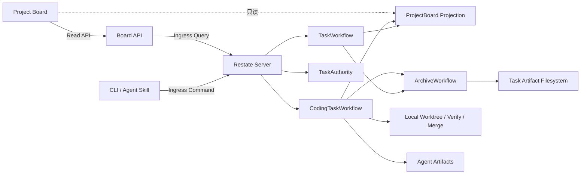

# Restate Task Runtime 最小 PoC 架构

> 文档类型：Architecture  
> 状态：Implemented  
> 版本：v0.5
> 更新日期：2026-08-20
> 决策依据：[ADR-0001](../../decisions/adr/0001-use-restate-for-task-runtime-poc.md)、[ADR-0003](../../decisions/adr/0003-use-typescript-for-restate-poc.md)

## 1. 已实现范围

本垂直切片验证 Task 业务关闭和材料归档可以在进程中断后分别收敛。它包含：

- keyed `TaskWorkflow/<task_id>`；
- keyed `ArchiveWorkflow/<task_id>`；
- `ProjectBoard/<project_id>` 查询投影；
- Task 主状态与 `archive_status` 两个正交维度；
- 带稳定 operation ledger 的副作用样例；
- Manifest 冻结、目录摘要、原子移动和未知结果 Reconcile；
- HTTP API、四列 Board、CLI 和项目 Skill；
- Git Backlog 文档到 ProjectBoard 的显式批次同步；
- 在真实编码 Workflow 完成前记录外层 Goal Commit 与验证引用的窄化 Bootstrap Evidence；
- 真实 Restate Server 1.7.4 下的 Worker `SIGKILL` 恢复测试。
- keyed `CodingTaskWorkflow/<task_id>`、Verification Gate、本地 Merge Effect 与 Fake/真实 Codex Fixture 编码闭环。
- `TaskAuthority/<task_id>` 单一主权声明、Coding→ProjectBoard 投影与独立 ArchiveWorkflow 串联。
- `TaskAuthority` owner 查询、Coding Trace Builder、`/api/tasks/<task_id>/trace` 与三层看板详情。

它不包含多 Daemon、远程 Git 平台/PR、鉴权、多租户和生产级 Telemetry；真实 LLM 仅在一次性本地 Fixture 中完成 Smoke Test。

## 2. 运行拓扑



Node 进程暴露 HTTP/2 Restate Endpoint（默认 `9080`）和普通 HTTP Board（默认 `3000`）。Restate Ingress 默认为 `8080`，Admin/API 默认为 `9070`。

## 3. 状态所有权

`TaskWorkflow` 是通用 Task/Archive 演示聚合的主状态唯一写入者：

```text
RECEIVED → EXECUTING → VERIFYING → CLOSED
```

`ArchiveWorkflow` 在 Task 关闭后独立更新：

```text
NOT_READY → PENDING → ARCHIVED | FAILED
```

ProjectBoard 只保存查询投影。CLI、Skill、Board API 和目录位置都不能直接推进状态。`task_id` 同时是 Workflow key、事件关联和人类查询入口。

`TaskAuthority/<task_id>` 在任一主 Workflow 开始前冻结 `owner + spec_revision`，冲突 owner 被拒绝。`CodingTaskWorkflow` 独占编码聚合 Projection，按固定八阶段推进；Workspace、Agent、Verification、Merge 和 Docs Adapter 只返回证据，不写 Projection。Observer 把兼容 TaskProjection 同步到 ProjectBoard，但 Board 不是主状态源。

Git Backlog 是导入条目字段的所有者。CLI 完整校验 `BL-*.yaml` 后，通过单次 `ProjectBoard.syncBacklog` 提交；Object 比较 Source Digest，内容未变时不重写状态。Projection 独有记录采用 `PRESERVE` 并显式报告，Web 查询仍然只读取 Projection。

Goal Bootstrap 是自举期的实际执行者。它只能提交干净 HEAD 上的真实 Result Commit、首次引入 Manifest 时冻结的 Base、Verification 和 Docs Impact 引用；TaskWorkflow 在发布 `CLOSED` 前重新验证并持久化关闭材料，不产生 Agent 执行事实。稳定 Task Artifact 引用由 Active/Archive Resolver 根据 Projection 解析。`CLOSED` 后仍调用独立 ArchiveWorkflow。

## 4. 可恢复副作用

Archive 使用 `archive/<task_id>/revision-<spec_revision>` 作为稳定操作标识。

1. `freeze-archive-manifest` 用稳定 `.pending` 文件对账中断的原子写入；
2. `move-task-package` 在每次尝试前观察 source/target；
3. source-only 执行同文件系统 rename；target-only 视为已移动；
4. 两端都有且摘要一致时清除重复 source；摘要不同则停止并标记未知副作用冲突；
5. 两端都没有时产生不可重试错误；
6. 昂贵副作用以 operation ledger 为事实，计数文件只是可重建投影。

故障注入点位于 rename 成功后、Durable Step 响应前。服务被 `SIGKILL` 后，Restate 重放该 Step；第二次观察到 target-only，从而返回 `ALREADY_MOVED`，不会再生成目录。

## 5. 错误与重试

- `TRANSIENT_IO` 在单个 `ctx.run` 内有界重试 5 次；
- Validation、Not Found、Conflict 和 Unknown Side Effect 转为 Terminal Error；
- Archive 错误只把 `archive_status` 标为 `FAILED`，不会重开已经 `CLOSED` 的 Task；
- Pipeline Step 在 5 次预算耗尽后关闭为 `FAILED_TERMINAL`，保留错误并继续归档失败证据，不会在 Board 中永久停留为 `EXECUTING`；
- 进程退出不属于业务失败，Journal 保持未确认步骤并在新进程恢复；
- 同一 Workflow key 保证重复 `create/close` 命令不会创建第二条生命周期。
- Workflow 事件时间从 Restate durable time 派生；Activity 是否在重放时执行不会改变后续 Journal 命令。
- Verification/Codex 先落稳定 Intent；未确认结果停止为 UNKNOWN。Merge 用 `update-ref` CAS 原子校验 Expected Base，避免检查与写入之间的 TOCTOU。

PoC 尚未实现 Repair/Replan、中央预算、人工解除冲突和跨设备 Git Artifact，这些继续由 [Task Runtime Kernel](./task-runtime-kernel.md) 约束后续设计。

## 6. 查询与 Trace

Board 固定展示需求池、进行中、待归档、已归档。通用 Task 保留原详情；Coding Task 通过 `TaskAuthority` owner 解析后查询唯一 `CodingTaskWorkflow` Projection，并由纯函数 Trace Builder 形成三个明确分区：

1. Business Facts：状态、Step、Attempt、Evidence Binding 和领域 Event，是任务结果权威；
2. Durable Runtime：Workflow Ref 与 Restate Admin 入口，Journal 是执行、重放和中断恢复权威；
3. Technical Evidence：Agent Session/Artifact、Branch、Checkpoint、Verification 和 Merge，是诊断证据。

`GET /api/tasks/<task_id>/trace` 和看板详情只读。默认页面把业务事实整理为“需求与上下文 → 隔离工作区 → Agent 编码 → 自动验证 → 合入分支 → 文档检查 → 归档”，并直接展示 `Task → CodingTaskWorkflow → Agent Session → Git Commit` 关联链。Agent Events 可在当前 Task 详情中按 JSONL 行安全解析、限量展示并展开原始 JSON；原始 Artifact 下载仍是显式次级入口。Journal、其他 Artifact 和恢复建议渐进披露在高级诊断区；Restate 链接携带 Workflow service 与 Task key 过滤条件，而不是打开无上下文首页。恢复分类从已有 Projection 派生为 `NONE | WAIT_OR_RECONCILE | FAILED_TERMINAL | ARCHIVE_RETRY`，只说明应等待、对账、创建后续 Task 或重新附着 Archive，不直接推进状态。因此 Trace 不会成为第二套状态机，三层事实只通过 `task_id`、Attempt ID、Effect ID 和 Content Digest 关联。

TASK-0009 在这个只读派生层增加后端无关 `TraceSink`：默认 Noop，显式开启后由官方 OpenTelemetry exporter 发送 OTLP/HTTP protobuf。稳定 Task Trace ID 只用于查询关联；每个已持久化 Attempt 映射为短 Span，Agent Run 是 IMPLEMENT Attempt 的子 Span，另有零时长 Task Snapshot，不创建持续数天的在线 root span。导出在 Coding Workflow 已得到业务 Projection 后执行，失败最多形成诊断日志，不能反向改变成功、失败或归档终态。Phoenix 是 `compose.yaml` 的可选本地 Profile，并非运行时依赖；该边界由 [ADR-0004](../../decisions/adr/0004-use-otlp-contract-and-optional-phoenix.md) 冻结。

Agent Events 和可选 Raw Model IO 仍是内容寻址 Artifact。Board 下载 API 不接受路径参数，只接受 Task ID 与固定种类；服务从主 Projection 取得 allowlisted 引用，再验证声明根属于 `MOYE_ARTIFACT_ROOTS`、候选路径与 realpath 未逃逸、目标是普通文件，且大小和 SHA-256 与投影一致。Raw Model IO 仅在文件真实存在时出现在 UI，并标记为敏感证据。

Workflow Projection 保留 Adapter 的结构化 `errorCode/errorCategory`。`UNKNOWN_SIDE_EFFECT` 在 Workspace、Agent、Verification 和 Merge 四个边界统一进入 `WAIT_OR_RECONCILE`；只有确定性失败才允许建议创建后续 Task。Board 静态文件路径在读取前同时校验 lexical path 与 `realpath` 位于 `publicRoot`，拒绝指向根外的符号链接。强杀/丢回执开关仅在显式 `MOYE_TEST_FAULT_INJECTION=enabled` 的测试进程中可用，不属于正常任务能力。

## 7. 验证结论

自动化 E2E 已证明：

- rename 后强杀 Worker，新进程自动恢复；
- Task 最终唯一为 `CLOSED + ARCHIVED`；
- 归档目标只有一个，source 消失；
- 昂贵副作用 operation 只计数一次；
- Board 最终只在 Archived 列出现该 Task。
- Pipeline 重试耗尽时形成唯一失败终态，并且失败材料仍能归档。
- Fake Coding Workflow 在真实 Restate 中成功闭环并只产生一个 Merge Commit；Verification 失败时目标 master 保持不变。
- Merge 回执丢失会由 marker/双亲对账；Verification 命令执行后强杀 Worker，新 Worker 接管且命令只运行一次，结果安全停止为 UNKNOWN。
- Git ref 原子更新完成但 Merge Step 尚未确认时强杀 Worker，新 Worker 通过 Git facts 复用唯一 Merge；重复 Workflow 命令被 Restate 409 拒绝，Agent 异常退出形成可追踪终态且不合并。
- Trace API 从单个 task_id 返回 6 个 Attempt、Agent Session、任务 Branch、Result/Merge Commit、Verification Evidence、技术 Artifact 和恢复分类。
- 真实 Codex 只在临时 Fixture 中完成一次提交、验证与唯一 Merge，原始 JSONL 和摘要保存在 TASK-0006。
- 默认 Noop 不产生网络请求；本地 OTLP Receiver 能解码稳定 Trace/Span ID、父子关系和 Task/Attempt/Agent 属性，真实 Restate Coding E2E 同时证明 Trace 导出与 Artifact 下载不会改变唯一 Merge。

完整证据和命令见 [TASK-0001 Verification](../../../delivery/tasks/archive/2026-08-20-TASK-0001/verification.md) 与 [本地 PoC Runbook](../../guidance/runbooks/local-restate-poc.md)。本结论只证明最小恢复语义成立，不代表最终生产选型。
