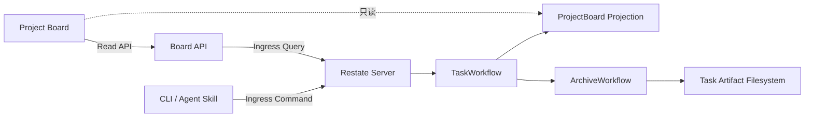

# Restate Task Runtime 最小 PoC 架构

> 文档类型：Architecture  
> 状态：Implemented  
> 版本：v0.3
> 更新日期：2026-08-20
> 决策依据：[ADR-0001](../../decisions/adr/0001-use-restate-for-task-runtime-poc.md)、[ADR-0003](../../decisions/adr/0003-use-typescript-for-restate-poc.md)

## 1. 已实现范围

本垂直切片验证 Task 业务关闭和材料归档可以在进程中断后分别收敛。它包含：

- keyed `TaskWorkflow/<task_id>`；
- keyed `ArchiveWorkflow/<task_id>`；
- `ProjectBoard/<project_id>` 查询投影；
- Task 主状态与 `archive_status` 两个正交维度；
- 带稳定 operation ledger 的副作用样例；
- Manifest 冻结、目录摘要、原子移动和未知结果 Reconcile；
- HTTP API、四列 Board、CLI 和项目 Skill；
- Git Backlog 文档到 ProjectBoard 的显式批次同步；
- 在真实编码 Workflow 完成前记录外层 Goal Commit 与验证引用的窄化 Bootstrap Evidence；
- 真实 Restate Server 1.7.4 下的 Worker `SIGKILL` 恢复测试。

它不包含真实 LLM Agent、多 Daemon、Git 平台合并、鉴权、多租户和生产级 Telemetry。

## 2. 运行拓扑



Node 进程暴露 HTTP/2 Restate Endpoint（默认 `9080`）和普通 HTTP Board（默认 `3000`）。Restate Ingress 默认为 `8080`，Admin/API 默认为 `9070`。

## 3. 状态所有权

`TaskWorkflow` 是 Task 主状态唯一写入者：

```text
RECEIVED → EXECUTING → VERIFYING → CLOSED
```

`ArchiveWorkflow` 在 Task 关闭后独立更新：

```text
NOT_READY → PENDING → ARCHIVED | FAILED
```

ProjectBoard 只保存查询投影。CLI、Skill、Board API 和目录位置都不能直接推进状态。`task_id` 同时是 Workflow key、事件关联和人类查询入口。

Git Backlog 是导入条目字段的所有者。CLI 完整校验 `BL-*.yaml` 后，通过单次 `ProjectBoard.syncBacklog` 提交；Object 比较 Source Digest，内容未变时不重写状态。Projection 独有记录采用 `PRESERVE` 并显式报告，Web 查询仍然只读取 Projection。

Goal Bootstrap 是自举期的实际执行者。它只能提交干净 HEAD 上的真实 Result Commit、首次引入 Manifest 时冻结的 Base、Verification 和 Docs Impact 引用；TaskWorkflow 在发布 `CLOSED` 前重新验证并持久化关闭材料，不产生 Agent 执行事实。稳定 Task Artifact 引用由 Active/Archive Resolver 根据 Projection 解析。`CLOSED` 后仍调用独立 ArchiveWorkflow。

## 4. 可恢复副作用

Archive 使用 `archive/<task_id>/revision-<spec_revision>` 作为稳定操作标识。

1. `freeze-archive-manifest` 用稳定 `.pending` 文件对账中断的原子写入；
2. `move-task-package` 在每次尝试前观察 source/target；
3. source-only 执行同文件系统 rename；target-only 视为已移动；
4. 两端都有且摘要一致时清除重复 source；摘要不同则停止并标记未知副作用冲突；
5. 两端都没有时产生不可重试错误；
6. 昂贵副作用以 operation ledger 为事实，计数文件只是可重建投影。

故障注入点位于 rename 成功后、Durable Step 响应前。服务被 `SIGKILL` 后，Restate 重放该 Step；第二次观察到 target-only，从而返回 `ALREADY_MOVED`，不会再生成目录。

## 5. 错误与重试

- `TRANSIENT_IO` 在单个 `ctx.run` 内有界重试 5 次；
- Validation、Not Found、Conflict 和 Unknown Side Effect 转为 Terminal Error；
- Archive 错误只把 `archive_status` 标为 `FAILED`，不会重开已经 `CLOSED` 的 Task；
- Pipeline Step 在 5 次预算耗尽后关闭为 `FAILED_TERMINAL`，保留错误并继续归档失败证据，不会在 Board 中永久停留为 `EXECUTING`；
- 进程退出不属于业务失败，Journal 保持未确认步骤并在新进程恢复；
- 同一 Workflow key 保证重复 `create/close` 命令不会创建第二条生命周期。

PoC 尚未实现 Repair/Replan、中央预算、人工解除冲突和跨设备 Git Artifact，这些继续由 [Task Runtime Kernel](./task-runtime-kernel.md) 约束后续设计。

## 6. 查询与 Trace

Board 固定展示 Backlog、Active、Archive Pending、Archived。Task 详情包含 Task/Archive 状态、当前步骤、Attempt、Spec Revision、Backlog、Workflow Ref、结果路径和 Durable Event Trace。

领域 Event/Projection 用于业务解释；Restate Admin/API 用于 Invocation 和 Journal 排障。二者通过 `task_id` 关联，技术 Trace 不替代业务状态。

## 7. 验证结论

自动化 E2E 已证明：

- rename 后强杀 Worker，新进程自动恢复；
- Task 最终唯一为 `CLOSED + ARCHIVED`；
- 归档目标只有一个，source 消失；
- 昂贵副作用 operation 只计数一次；
- Board 最终只在 Archived 列出现该 Task。
- Pipeline 重试耗尽时形成唯一失败终态，并且失败材料仍能归档。

完整证据和命令见 [TASK-0001 Verification](../../../delivery/tasks/archive/2026-08-20-TASK-0001/verification.md) 与 [本地 PoC Runbook](../../guidance/runbooks/local-restate-poc.md)。本结论只证明最小恢复语义成立，不代表最终生产选型。
