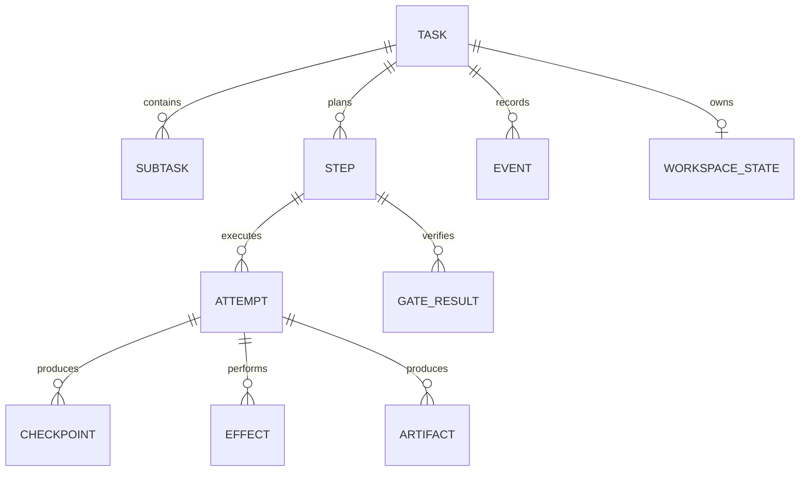
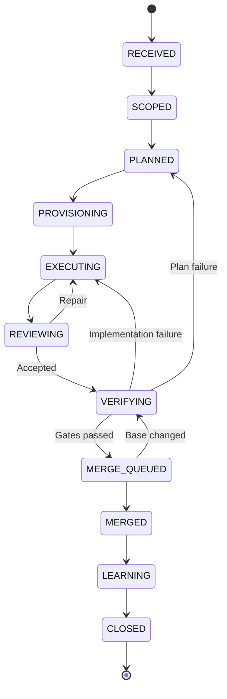
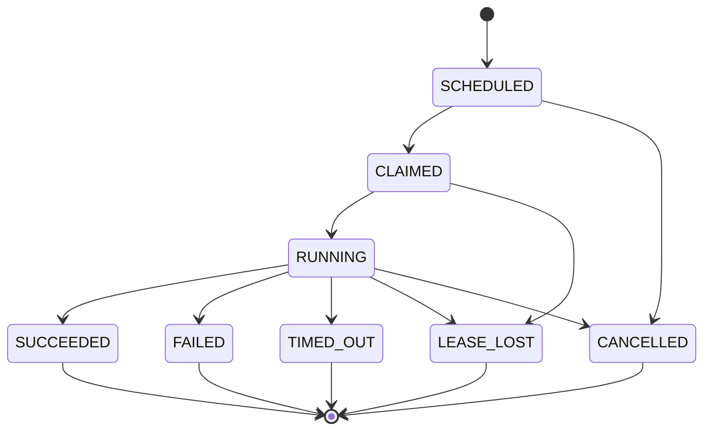
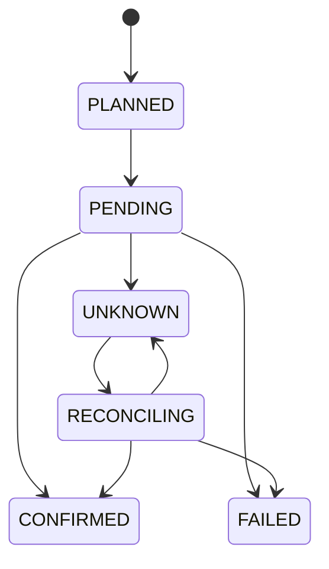

# Task Runtime Kernel 详细设计

> 文档类型：Detailed Design  
> 状态：Draft  
> 版本：v0.2
> 更新日期：2026-08-22
> 上位文档：[全自动研发闭环 Harness 架构设计](./overview.md)

## 1. 文档目的

本文描述 Harness 中 Task 领域的详细设计，重点解决一个研发任务从接收到关闭期间的三个核心难题：

1. Pipeline 中局部错误如何分类和处理；
2. Agent Loop、修复循环和重新规划如何控制重试；
3. Daemon、Agent 或进程中断后，任务如何由其他执行者安全接管。

本文不详细讨论模型选型、Agent Prompt、知识检索算法和具体 UI 设计。它们是 Task Runtime Kernel 的消费者或周边领域。

## 2. 核心结论

Harness 的核心不是 Agent Manager，而是一个 **Recoverable Task Runtime Kernel**。

系统必须以如下故障假设为前提：

> Agent、Daemon、进程和机器随时可能消失；Task 不能依赖任何执行者的进程内存继续存在。

因此，“交接”不是把旧 Agent 的隐藏思维或模型 Session 原样转移给新 Agent，而是让任意新执行者从最后一个持久化安全点重建执行上下文。

Task Runtime Kernel 由七个核心能力组成：

```text
Task Event Log
+ Deterministic State Reducer
+ Step / Attempt Model
+ Lease / Fencing Token
+ Checkpoint / Handoff Protocol
+ Retry Policy Engine
+ Effect Ledger / Reconciler
```

Daemon 调度、角色 Agent、Worktree、Git、Gate 和知识沉淀都建立在该内核之上。

## 3. 领域边界

### 3.1 Runtime Kernel 负责

- Task、Step、Attempt 的生命周期；
- 状态迁移合法性；
- 命令和领域事件；
- Attempt 派发、领取、租约、心跳和失效；
- 错误分类和重试预算；
- Checkpoint 注册及恢复游标；
- 外部副作用账本和对账；
- 中断检测和接管；
- 取消、暂停、等待、恢复和终止；
- Task 关闭条件；
- 面向查询和看板的 Task Projection。

### 3.2 Runtime Kernel 不负责

- Agent 如何推理和生成代码；
- 某个编程语言的具体构建方式；
- Git Provider 的具体 API 实现；
- LLM Trace 后端；
- 知识内容如何生成和排序；
- 业务需求本身是否正确。

这些能力通过 Activity、Adapter、Gate Plugin 或其他领域服务接入。

## 4. 架构不变量

实现必须始终满足以下不变量：

1. 每个执行行为都属于唯一的 `task_id`、`step_id` 和 `attempt_id`。
2. 只有 Task Workflow 可以推进 Task 主状态。
3. Step 的每次重试都创建新 Attempt，不复活旧 Attempt。
4. Agent 进程内存不是持久化状态。
5. 任意新 Agent 都能从 TaskEnvelope、Event 和 Checkpoint 重建上下文。
6. 只有持有最新 Fencing Token 的执行者可以提交有效结果。
7. 外部副作用必须幂等，或者进入 Effect Ledger 并可对账。
8. `UNKNOWN` 外部结果必须先对账，不能盲目重试。
9. Retry、Repair 和 Replan 是三种不同的控制动作。
10. Task 失败不能由单个 Attempt 失败直接推导。
11. Worktree 是执行缓存，Git 和 Artifact 才是可迁移持久状态。
12. Task 状态可以由 Event History 重建，Projection 只是查询优化。

## 5. 核心模型

### 5.0 当前 PoC 已实现协议切片

`src/domain/coding-task.ts` 已实现不依赖 Runtime、Git 或 Agent 的最小编码任务协议：

- `TaskEnvelope` 固定 Task ID、Spec Revision、Base SHA、Requirement、argv 验证命令和 Context Plan，并通过规范内容摘要与深冻结保持不可变；
- Pipeline 固定为 `CONTEXT → WORKSPACE → IMPLEMENT → VERIFY → MERGE → DOCS`，Archive 仍是 `CLOSED` 后的独立 Workflow；
- `CodingStep` 绑定 Envelope Digest 与 Spec Revision；`StepAttempt` 独立记录 Generation 和终态，重试创建新 Attempt 而不复活旧实例；
- Attempt Evidence 固定 Artifact Content Digest 与 Producer Tuple，Binding 只能从成功 Attempt 生成；Envelope、Attempt、Evidence 和 Binding 使用 Canonical Digest 与 Expected Digest 重建，Spec 升版或 Context/Requirement 变化会让旧证据失效但不会删除历史。

这一切片尚未接入 Restate 主状态机，也不包含 Worktree、Agent、Lease、Fencing 或 Retry Budget。以下完整模型仍是后续设计目标。

### 5.0.1 当前 PoC 已实现本地 Git Effect 切片

`src/git/workspace-effect.ts` 已实现不推进 Task 主状态的本地 Git Adapter：

- `WorkspaceEffectRequest` 从 Task、Spec Revision、Repository、Git Common Dir、Managed Worktree Root、完整 Base Ref 和 Base SHA 规范生成稳定 Effect ID；任务分支编码完整 Effect 摘要，Worktree 目标路径按 Task ID 派生；
- 路径创建前后都通过物理路径、Git 元数据禁区、直接子级、文件系统根目录与符号链接约束检查；Git 只以 argv 和 `shell:false` 执行；
- 每次创建先检查 Worktree List、Task Branch 和 HEAD。完全匹配视为已完成；ownership、Branch、路径、prunable 状态或 ancestry 只部分匹配时停止为 Conflict；
- Git 命令失败或调用方丢失结果后再次读取上述事实。确认已经完成时返回 `ALREADY_APPLIED`，确认未发生时才暴露可重试错误，无法读取事实则标记 `UNKNOWN_SIDE_EFFECT`；
- `GitCheckpoint` 只接受无 tracked dirty 和 untracked 文件的 Worktree，固定 Base、Branch、Result Commit、Git Tree Object ID 与 Workspace Effect ID，创建时验证 Branch HEAD 和 Base ancestry；序列化恢复要求外部 Expected Digest。

该切片尚未把 Effect Record 持久化到 Workflow，也不执行 Agent、Verification 或 Merge。Worktree 路径仍然只是单机缓存；可迁移恢复点是已提交的 Commit 与 Tree Object ID。

### 5.0.2 当前 PoC 已实现 AgentRunner 切片

`src/agent/` 已实现不拥有 Task 主状态的单 Attempt Agent 边界：

- `AgentRunRequest` 固定 Task、Spec Revision、IMPLEMENT Attempt、Runner Kind、Git Workspace、受管 Artifact Root 与 Prompt Digest，派生稳定 Run ID；
- `FakeAgentRunner` 用确定 Event Script 驱动自动化；`CodexExecAgentRunner` 按本机官方 CLI 契约通过 argv、`shell:false` 执行 `codex exec --json --sandbox workspace-write --cd`；
- JSONL 必须以唯一 `thread.started` 开始，并保存 Session ID、最后一个完成的 Agent Message、turn 结果、退出码、Signal 和 Duration；Malformed Stream 独立标记 `INVALID_OUTPUT`，原始内容仍保留；
- Artifact Bundle 原子保存 stdout JSONL、stderr、final message 和 manifest。Manifest 固定文件摘要、Producer Tuple 与 Run Digest；读取时同时重算语义和文件内容，外部消费者还必须提供 Expected Digest；
- 同一完成 Run 直接从 Artifact 对账；pending manifest 可恢复，不完整且无法证明的 Bundle 停止为 Conflict，不能再次调用昂贵 Agent。

这一切片不接入 Workflow、不执行 Verification 或 Merge，也不实现 Session Resume。真实 Codex Fixture 调用在端到端 Workflow Task 中验收。

### 5.0.3 当前 PoC 已实现单 Agent 编码 Workflow

`CodingTaskWorkflow/<task_id>` 已串联 `CONTEXT → WORKSPACE → IMPLEMENT → VERIFY → MERGE → DOCS → CLOSED → ARCHIVE`。`TaskAuthority/<task_id>` 保证通用 TaskWorkflow 与 CodingTaskWorkflow 不会同时认领同一个 Task revision；Workflow 通过 Observer 独占 Projection 写入并同步 ProjectBoard 查询副本。六个领域 Step 都把 Step、Attempt、Evidence 与 Binding 写入 Projection；每个外部操作经 Restate `ctx.run`，Adapter 只能返回可验证结果。

- Verification Gate 只执行 Envelope argv 并固定 `shell:false`；稳定 Operation Intent 让完成 Outcome 可复用，pending/未知结果停止而不重跑命令；Branch Commit 漂移或任一失败都不会产生 Binding；
- Local Merge Request 只能从可信 Verification Binding 构造；确定性双亲 Commit 通过 `git update-ref` Expected-Base CAS 原子发布，未知结果由 marker、双亲和 target ancestry 对账；
- Fake Coding Runner 用 Commit marker 对账中断点；真实 Codex 在进程启动前写稳定 Intent，缺少完整结果时标记 UNKNOWN 并禁止自动重启；
- Docs Step 即使 `not_applicable` 也生成明确 Artifact；证据不齐不能 CLOSED，Restate 路径在 CLOSED 后调用独立 ArchiveWorkflow。

ProjectBoard 接收 Coding 的状态和事件摘要；`src/trace/coding-trace.ts` 再从只读 Coding Projection 派生三层 Trace：业务 Event/Step/Attempt/Evidence 是任务事实，Restate Journal 是 durable execution/replay 事实，Agent/Verification/Git Artifact 是诊断证据。Workflow 把 Adapter 的 `code + category` 结构化保存到失败 Projection；任何 `UNKNOWN_SIDE_EFFECT`，无论发生在 Workspace、Agent、Verification 或 Merge，都只能派生等待/对账建议，不能建议并行新 Task。Trace 没有写入口，不能复活 Attempt 或形成第二套状态机。完整 Repair/Replan 操作仍属于后续切片。

`TaskAuthority.get` 为查询层返回冻结的 owner 与 Spec Revision，Board 据此访问唯一主 Workflow，不扫描目录猜测类型。Git ref 更新完成后 Worker 退出的路径由相同 Merge Effect 重放：先读取 marker、双亲和 target ancestry，确认已应用后返回 `ALREADY_APPLIED`，再由 Workflow 确认 Step。

### 5.0.4 当前已实现 Core Control Kernel 切片

`src/domain/core-control.ts` 已实现多角色 Core Workflow 使用的纯领域控制内核，但尚未接入 Restate 主循环：

- `CoreProjection` 固定 Task、Spec Revision、Envelope Digest、Projection Version、Control State、Stage、中央预算摘要、Applied Decision 和唯一 Pending Role Dispatch；
- `ControlDecision` 固定 Expected State、Expected Projection Version、Action、Target Role、Finding/Evidence 引用、预算申请、原因和规范 SHA-256 Digest；
- 确定性 Fake Orchestrator 只从已验证的 `TaskEnvelope + CoreProjection` 生成初始 Docs Role 候选，不读取聊天历史、Agent 内存或本地临时路径；
- Reducer 是当前切片唯一合法转换入口。它先识别已确认的相同 Decision 重放，再校验 Task/Spec、状态、版本、预算、单 Pending Role 和 Required Gate，保证丢失确认后不会重复派发；
- 初始阶段只允许 `SCHEDULE_ROLE/DOCS`。`RETRY`、`REPAIR`、`REPLAN`、Role 完成、Finding、Verification、Docs Impact 和 Closure 仍由后续切片实现，不能由当前 Projection 伪造。

这个模块是未来 keyed `CoreClosureWorkflow/<task_id>` 的 Reducer，不拥有独立进程或第二套运行时状态。现有 `CodingTaskWorkflow` 在完整 Core Workflow 接入前继续保持当前行为。

### 5.1 模型关系



### 5.2 TaskRuntime

```yaml
TaskRuntime:
  task_id: "01J..."
  schema_version: 1
  state_version: 87
  workflow_version: 3
  plan_version: 2
  last_event_sequence: 212

  lifecycle_state: EXECUTING
  active_step_ids:
    - implement-handler

  retry_budget:
    operation_remaining: 8
    attempt_remaining: 4
    repair_loop_remaining: 2
    replan_remaining: 1
    cost_remaining: 18.4

  wait:
    kind: null
    reason: null
    wakeup_at: null

  workspace_checkpoint_ref: "checkpoint://cp-42"
  pending_effect_ids: []

  created_at: "..."
  updated_at: "..."
```

`state_version` 用于乐观并发控制。所有状态更新都必须声明期望版本：

```text
update task where task_id = ? and state_version = expected_version
```

更新成功后递增版本；版本不匹配时重新读取并重新决策。

### 5.3 Step

Step 是计划图中的逻辑工作，不等同于一次 Worker 执行。

```yaml
Step:
  step_id: "implement-handler"
  task_id: "01J..."
  plan_version: 2
  kind: implementation
  role: coder
  dependencies:
    - inspect-api
  status: RUNNING
  generation: 3
  max_attempts: 2
  completion_policy: all_outputs_valid
  expected_outputs:
    - patch
    - tests
    - claims
```

Step 状态：

```text
PENDING
READY
RUNNING
SUCCEEDED
FAILED
SKIPPED
CANCELLED
SUPERSEDED
```

当重新规划产生新计划版本时，旧计划中不再适用的 Step 进入 `SUPERSEDED`，而不是从历史中删除。

### 5.4 Attempt

Attempt 表示 Step 的一次实际执行。

```yaml
Attempt:
  attempt_id: "attempt-03"
  task_id: "01J..."
  step_id: "implement-handler"
  generation: 3
  status: RUNNING

  daemon_id: "daemon-sh-02"
  input_snapshot_ref: "artifact://sha256/..."
  latest_checkpoint_ref: "checkpoint://cp-42"
  result_ref: null

  lease:
    lease_id: "lease-03"
    fencing_token: 42
    acquired_at: "..."
    expires_at: "..."
    last_heartbeat_at: "..."

  error: null
  started_at: "..."
  finished_at: null
```

Attempt 状态：

```text
SCHEDULED
CLAIMED
RUNNING
SUCCEEDED
FAILED
TIMED_OUT
LEASE_LOST
CANCELLED
SUPERSEDED
```

终态 Attempt 不允许再次变为运行态。

## 6. 两级状态机

Task 和 Attempt 必须使用不同状态机。

### 6.1 Task 主状态机



Task 主状态保持粗粒度。具体的错误类型、重试次数和等待原因不应无限扩充为新的主状态。

`CLOSED` 是 Task 的业务终态，不等于历史包已经归档。归档状态由独立的 `ArchiveRecord` 或 Projection 表达，避免归档存储失败重新打开 Task 状态机。

### 6.2 Attempt 状态机



Attempt 的失败由 Workflow 消费后产生新的控制决策，但不直接改写 Task 为 `FAILED`。

### 6.3 Wait 状态

等待信息独立建模：

```yaml
WaitState:
  kind: HUMAN_APPROVAL | EXTERNAL_EVENT | BACKOFF | CAPACITY | DEPENDENCY
  reason: "..."
  wait_ref: "..."
  wakeup_at: "..."
  timeout_at: "..."
```

这样可以避免产生 `WAITING_FOR_REVIEW_APPROVAL`、`WAITING_FOR_DAEMON` 等大量互斥状态。

## 7. Command、Event 与 Reducer

### 7.1 写入路径

```text
Command
  → 校验当前 Task State 和 expected_version
  → 产生一个或多个 Domain Event
  → 原子追加 Event
  → Reducer 更新 Projection
  → Outbox 发布后续工作
```

Command 表达意图，例如：

```text
CreateTask
AcceptRequirement
CreatePlanVersion
ScheduleAttempt
ClaimAttempt
RecordCheckpoint
CompleteAttempt
FailAttempt
RequestRepair
RequestReplan
PauseTask
ResumeTask
CancelTask
ConfirmEffect
CloseTask
```

Event 表达事实，例如：

```text
TaskCreated
RequirementAccepted
PlanVersionCreated
AttemptScheduled
AttemptClaimed
AttemptHeartbeatReceived
CheckpointRecorded
AttemptCompleted
AttemptFailed
AttemptLeaseExpired
RepairRequested
ReplanRequested
EffectOutcomeBecameUnknown
EffectReconciled
TaskClosed
```

### 7.2 EventEnvelope

```yaml
EventEnvelope:
  event_id: "evt-..."
  event_type: "AttemptFailed"
  schema_version: 1
  task_id: "01J..."
  sequence: 213
  occurred_at: "..."

  actor:
    type: daemon
    id: "daemon-sh-02"

  causation_id: "cmd-..."
  correlation_id: "01J..."
  idempotency_key: "01J/implement-handler/attempt-03/fail"
  payload: {}
  artifact_refs: []
```

同一 Task 的 `sequence` 必须严格递增。Reducer 必须是确定性的：相同初始状态和 Event 序列得到相同最终状态。

### 7.3 Snapshot

Event 是事实来源；Snapshot 用于优化恢复性能。

```yaml
TaskSnapshot:
  task_id: "01J..."
  through_sequence: 200
  state_ref: "artifact://sha256/..."
  state_digest: "sha256:..."
  created_at: "..."
```

恢复时读取最近 Snapshot，再重放其后的 Event。Snapshot 可删除和重建，Event 不可修改。

## 8. 错误分类

错误必须先分类，再决定控制动作。

| 分类 | 例子 | 默认动作 |
|---|---|---|
| `TRANSIENT_OPERATION` | 网络闪断、限流、临时 5xx | 当前操作退避重试 |
| `ATTEMPT_INFRA_FAILURE` | Daemon 崩溃、进程退出、机器失联 | 结束旧 Attempt，创建新 Attempt |
| `IMPLEMENTATION_FAILURE` | 编译错误、单测失败、Review finding | 创建 Repair Step 或新实现 Attempt |
| `PLAN_FAILURE` | 修改方向错误、遗漏关键模块 | 创建新 Plan Version |
| `REQUIREMENT_FAILURE` | 验收条件冲突或信息缺失 | 等待需求澄清或人工 Gate |
| `POLICY_FAILURE` | 越权路径、成本超限、安全策略拒绝 | 阻塞或终止，默认不自动重试 |
| `EXTERNAL_DEPENDENCY` | CI、审批、外部系统不可用 | Durable Wait 或受控重试 |
| `UNKNOWN_SIDE_EFFECT` | Push/Merge 超时，结果未知 | 进入 Reconcile，禁止盲目重试 |
| `TERMINAL` | 不可恢复数据损坏、明确取消 | 终止或补偿 |

统一错误结构：

```yaml
TaskError:
  code: "SCM_MERGE_OUTCOME_UNKNOWN"
  category: UNKNOWN_SIDE_EFFECT
  retryable: false
  scope: effect
  message: "merge request timed out"
  source: scm-adapter
  evidence_refs: []
  suggested_action: reconcile
  occurred_at: "..."
```

`retryable` 不能只由异常类型或 HTTP 状态码推导。Adapter 应结合操作语义和外部系统幂等能力分类。

## 9. 分层重试模型

### 9.1 五层预算

```text
Operation Retry
  < Attempt Retry
    < Repair Loop
      < Replan Loop
        < Task Budget
```

| 层级 | 重试对象 | 是否创建新 Attempt | 例子 |
|---|---|---:|---|
| Operation | 单次 API、模型或工具调用 | 否 | 限流后重试 |
| Attempt | 同一 Step 的执行者 | 是 | Daemon 崩溃后换节点 |
| Repair | 根据 Finding 修改实现 | 通常是 | Review 不通过 |
| Replan | 替换当前执行方案 | 是，并增加计划版本 | 架构方案错误 |
| Task | 整个任务资源上限 | 不适用 | 超时、成本耗尽 |

### 9.2 RetryPolicy

```yaml
RetryPolicy:
  operation:
    max_attempts: 3
    initial_backoff: "1s"
    max_backoff: "30s"
    multiplier: 2
    jitter: true

  attempt:
    max_attempts_per_step: 2

  repair_loop:
    max_rounds: 3

  replan:
    max_versions: 2

  task:
    max_duration: "24h"
    max_cost: 30
    max_total_model_calls: 100
```

### 9.3 中央预算

嵌套重试可能形成乘法放大。Task Workflow 必须维护统一资源账本：

```yaml
BudgetLedger:
  model_calls_used: 27
  tokens_used: 182340
  cost_used: 11.6
  wall_time_used: "3h21m"
  attempts_used: 7
  repair_rounds_used: 2
  replans_used: 1
```

任何局部重试在开始前都需要申请预算。超出局部或全局预算后，Workflow 在 `WAITING_HUMAN`、`FAILED` 或降级策略之间做显式选择。

## 10. Attempt 派发和所有权

### 10.1 派发协议

```text
Workflow 创建 AttemptScheduled
  → 生成不可变 TaskEnvelope
  → 发布到角色队列
  → Daemon 使用 CAS 领取
  → 分配 Lease 和递增 Fencing Token
  → AttemptClaimed
  → Agent 执行并发送 Heartbeat
```

### 10.2 Lease

```yaml
AttemptLease:
  lease_id: "lease-03"
  attempt_id: "attempt-03"
  daemon_id: "daemon-sh-02"
  fencing_token: 42
  acquired_at: "..."
  expires_at: "..."
  heartbeat_interval: "15s"
```

心跳只表示执行者存活，不表示执行已经取得业务进展。长时间只有心跳但没有 Checkpoint 时，应触发 Stuck Detection。

### 10.3 Fencing Token

每次重新分配 Attempt 所有权时递增 token：

```text
Daemon A: token=41
Daemon A 失联
Lease 过期
Daemon B: token=42
Daemon A 恢复并提交结果
控制面拒绝 token=41 的写入
```

以下写入必须校验 token：

- Checkpoint；
- Attempt Result；
- Workspace ownership；
- 受控分支更新；
- Effect 状态；
- Artifact producer metadata。

## 11. Checkpoint 与交接协议

### 11.1 安全点

Agent Runtime 需要在明确边界记录持久化安全点：

```text
领取 Attempt
  → 保存输入快照
  → 分析
  → Checkpoint
  → 调用工具
  → 保存工具结果
  → Checkpoint
  → 修改代码
  → 保存 Git/Patch Checkpoint
  → 执行测试
  → 保存测试报告
  → Checkpoint
  → 提交 StepResult
```

通常至少在以下时刻保存：

- 外部副作用之前和之后；
- LLM 返回一个完整决策后；
- 工具调用完成后；
- 代码形成可构建或可测试状态后；
- 长时间测试开始前和结束后；
- Agent 准备进入新阶段时。

### 11.2 ExecutionCheckpoint

```yaml
ExecutionCheckpoint:
  checkpoint_id: "cp-42"
  task_id: "01J..."
  step_id: "implement-handler"
  attempt_id: "attempt-03"
  fencing_token: 42
  after_event_sequence: 212

  execution_cursor:
    phase: implementation
    completed_action_ids:
      - inspect-handler
      - update-schema
    pending_action_ids:
      - add-tests
      - run-verification

  workspace:
    base_sha: "abc123"
    checkpoint_sha: "def456"
    dirty_patch_ref: "artifact://sha256/..."
    untracked_files_ref: "artifact://sha256/..."
    tree_digest: "sha256:..."

  context:
    decision_summary_ref: "artifact://sha256/..."
    tool_result_refs: []
    relevant_knowledge_refs: []

  effects:
    completed_effect_ids: []
    pending_effect_ids: []
    unknown_effect_ids: []

  created_at: "..."
```

### 11.3 Handoff Package

交接包由最近有效 Checkpoint 和新的执行约束组成：

```yaml
HandoffPackage:
  previous_attempt_id: "attempt-03"
  new_attempt_id: "attempt-04"
  checkpoint_ref: "checkpoint://cp-42"
  task_envelope_ref: "artifact://sha256/..."
  superseding_reason: "LEASE_EXPIRED"
  resume_policy: FROM_LAST_SAFE_CHECKPOINT
  required_revalidations:
    - workspace_tree_digest
    - base_branch_status
    - pending_effects
```

新 Agent 不继承旧 Agent 的隐藏推理，只继承持久化决策摘要、输入、输出、证据和下一步约束。

## 12. Workspace 可迁移恢复

### 12.1 原则

只保存某台机器上的 Worktree 路径无法支持跨 Daemon 恢复。可迁移状态必须包含：

```text
base_sha
checkpoint commit SHA
dirty patch artifact
untracked files artifact
git status digest
tree digest
dependency lock digest
```

### 12.2 恢复流程

```text
新 Daemon 领取 Attempt
  → 创建新 Worktree
  → Checkout checkpoint SHA
  → 下载并校验 dirty patch
  → 恢复 untracked files
  → 校验 tree digest
  → 检查 base branch 是否漂移
  → Reconcile pending/unknown effects
  → 从 execution cursor 继续
```

### 12.3 Checkpoint 存储策略

- 阶段性稳定成果保存为 checkpoint commit；
- 未提交修改保存为内容寻址 patch；
- 未跟踪文件单独归档；
- 大型构建缓存不视为持久状态，可按需重建；
- 凭证、临时 Socket 和进程信息不得进入 Checkpoint；
- 恢复后必须重新校验工具链和依赖版本。

如果不同 Daemon 不共享 Git Object Database，则 checkpoint commit 必须通过受控隐藏 ref、Git bundle 或 Artifact 传输，不能只记录本地 commit SHA。

## 13. Effect Ledger 与对账

### 13.1 为什么需要 Effect Ledger

以下操作在网络超时后可能已经发生，但调用方没有收到结果：

- Push 分支；
- 创建或更新 PR；
- 提交 Review；
- Merge PR；
- 发布制品；
- 修改 Issue；
- 发送通知。

直接重试可能造成重复副作用。

### 13.2 EffectRecord

```yaml
EffectRecord:
  effect_id: "01J/merge/final"
  task_id: "01J..."
  attempt_id: "attempt-08"
  kind: merge_pull_request
  idempotency_key: "01J/merge/final"

  status: UNKNOWN
  request_digest: "sha256:..."
  subject_ref: "pr://123"
  external_ref: null

  last_error_ref: "artifact://sha256/..."
  reconcile_after: "..."
  created_at: "..."
  updated_at: "..."
```

状态机：



### 13.3 Merge 未知结果

Merge API 超时时执行：

1. Effect 标记为 `UNKNOWN`；
2. 暂停 Task 的合并推进；
3. 查询 PR、head SHA、目标分支和 merge SHA；
4. 如果已经合并，补记 `CONFIRMED` 和 `CommitMerged`；
5. 如果确认没有发生，使用相同幂等键重试；
6. 如果仍无法判断，继续等待、告警或进入人工 Gate。

## 14. 中断恢复场景

### 14.1 Daemon 在领取后、启动前崩溃

- Lease 到期；
- Attempt 进入 `LEASE_LOST`；
- 不存在业务 Checkpoint；
- Workflow 创建新 Attempt，从原 TaskEnvelope 开始。

### 14.2 Agent 在完成工具调用后崩溃

- 如果工具结果已经写入 Checkpoint，新 Attempt 复用结果；
- 如果 Effect 为 `PENDING` 或 `UNKNOWN`，先对账；
- 不重新执行已确认的非幂等副作用。

### 14.3 Agent 修改代码但尚未提交

- 恢复最近 dirty patch 和 untracked file Artifact；
- 校验 tree digest；
- 新 Agent 从该 Workspace Checkpoint 继续；
- 如果 Checkpoint 不完整，则回退到上一个安全 checkpoint commit。

### 14.4 Daemon 恢复后继续提交旧结果

- 所有写入校验 Fencing Token；
- 旧 token 的 Checkpoint 和 StepResult 被拒绝；
- 可将旧执行输出保存为诊断 Artifact，但不能改变 Task 状态。

### 14.5 Workflow 服务重启

- 从 Workflow Journal 或 Event Log 恢复；
- Reducer 重建 Task State；
- 检查所有 Active Attempt 的 Lease；
- 对不确定外部状态执行 Reconcile；
- 重新注册 Durable Timer 和等待条件。

### 14.6 Workflow 代码升级

- Workflow 定义和 Event Schema 版本化；
- 运行中的 Task 使用兼容路径或显式迁移；
- Reducer 需要支持历史 Event Schema；
- 禁止通过修改旧 Event 修复线上问题；
- 必要时通过新 Event 表达校正事实。

## 15. Reconciler

Reconciler 是独立于正常执行路径的收敛机制。

### 15.1 检查内容

- Task Projection 与 Workflow History 是否一致；
- Active Attempt 是否有有效 Lease；
- Daemon 是否仍然健康；
- Worktree ownership 是否与 token 一致；
- checkpoint commit、patch 和 Artifact 是否可用；
- PR 状态是否与 Effect Ledger 一致；
- `MERGED` Task 是否存在真实 merge SHA；
- `CLOSED` Task 是否仍有 Active Attempt；
- `UNKNOWN` Effect 是否已经可以确定结果。

### 15.2 修复原则

- Reconciler 不直接篡改 Task Projection；
- 它提交 Command，由正常状态机产生校正 Event；
- 自动修复必须保留前后状态和证据；
- 无法无歧义修复时进入人工 Gate。

## 16. 与 Durable Workflow 引擎的边界

采用 Restate、Hatchet、DBOS 或 Temporal 后，Runtime Kernel 不需要自行实现底层 Journal、Timer、基础重试和 Worker 通信，但仍需实现研发领域语义。

### 16.1 可委托给引擎

- Workflow Journal 和 Replay；
- Durable Timer；
- Activity/Task 派发；
- 基础 Worker 失联恢复；
- Step Retry 和 Timeout；
- 等待外部事件；
- 暂停、恢复和取消；
- Workflow 执行历史和基础 UI。

### 16.2 领域层必须保留

- Task/Step/Attempt 标识和模型；
- Retry、Repair、Replan 的业务分类；
- Task 总预算；
- TaskEnvelope 和 StepResult；
- Workspace Checkpoint；
- SCM Effect Ledger；
- Gate 与 acceptance criteria；
- Task 关闭条件；
- 业务 Projection 和 Task 看板。

Workflow 引擎的 Workflow ID 应直接映射 Task：

```text
workflow_id = task/<task_id>
```

引擎自己的 execution status 不直接等同于 Task lifecycle state。例如 Workflow 处于运行态时，Task 可能处于 `WAITING_HUMAN`。

## 17. 可观测性

### 17.1 三种历史

| 类型 | 用途 | 是否允许采样 |
|---|---|---:|
| Workflow Journal / Domain Event | 恢复和业务审计 | 否 |
| Artifact / Checkpoint | 证据和交接 | 否，按保留策略归档 |
| OpenTelemetry Trace | 性能和技术诊断 | 可以 |

### 17.2 推荐 Span

```text
task.command
task.transition
step.schedule
attempt.claim
attempt.run
checkpoint.persist
effect.execute
effect.reconcile
workspace.restore
retry.decide
gate.evaluate
```

统一属性：

```text
task.id
task.state
task.state_version
step.id
attempt.id
attempt.generation
daemon.id
lease.id
fencing_token
checkpoint.id
effect.id
workflow.id
```

Task 可能持续数天，不使用一个超长 trace 覆盖全生命周期。每个 Attempt、Reconcile 或短执行单元创建 trace，并通过 `task.id`、Event causation 和 Span Links 关联。

## 18. Task 关闭和清理

Task 关闭前执行最终一致性检查：

```text
所有 Required Step 成功
AND 所有 Acceptance Criteria 有证据
AND 所有 Required Gate 绑定最终候选 SHA 并通过
AND merge SHA 已确认
AND 没有 Active Attempt
AND 没有 PENDING / UNKNOWN Effect
AND Workspace 已归档或清理
AND Knowledge Distillation 已完成或明确跳过
```

清理动作包括：

- 撤销仍存活的 Lease；
- 停止 Agent 和 Sandbox；
- 保存最终 Workspace Manifest；
- 删除或归档 Worktree；
- 按策略删除临时构建缓存；
- 设置 Event、Trace 和 Artifact 保留期；
- 生成 Task Closure Report。

清理本身也通过可重试 Activity 和 Effect Record 执行，不能因为删除 Worktree 失败而伪装成已经完全关闭。

### 18.1 Task Artifact Archive

Task 进入 `CLOSED` 后执行独立 Archive Workflow：

```yaml
ArchiveRecord:
  task_id: "01J..."
  status: PENDING | ARCHIVED | FAILED
  source_path: "docs/delivery/tasks/TASK-0042"
  archived_path: "docs/delivery/tasks/archive/2026-08-19-TASK-0042"
  closure_report_ref: "artifact://sha256/..."
  archived_at: "..."
```

Archive 固化 Task Spec、最终验证、Outcome、Docs Impact 和 Closure Report，并更新文档图谱路径。Archive 失败只重试归档步骤，不重新执行 Agent、验证或 Merge。Task ID 在移动前后保持不变。

## 19. 故障注入测试

Runtime Kernel 上线前必须通过以下场景：

| 场景 | 期望结果 |
|---|---|
| 在每个 Step 边界 Kill Agent | 从最近 Checkpoint 恢复，不重复已确认副作用 |
| Kill Daemon | Lease 过期后由其他 Daemon 接管 |
| 旧 Daemon 恢复并提交 | 旧 Fencing Token 被拒绝 |
| LLM 调用完成后进程崩溃 | 已持久化响应不重复请求 |
| 修改代码后进程崩溃 | 新 Worktree 恢复相同 tree digest |
| Push 成功但响应超时 | Reconciler 确认远端状态，不重复 Push |
| Merge 成功但响应超时 | 最终获得唯一 merge SHA |
| Event 重复投递 | Reducer 结果不变 |
| Projection 删除 | 可以从 Snapshot 和 Event 重建 |
| Workflow 升级 | 旧 Task 能继续或显式迁移 |
| Retry 预算耗尽 | 进入预定 Gate，不继续消耗资源 |
| Task 取消 | 不再派发新 Attempt，并完成必要清理 |

## 20. MVP 范围

第一阶段不需要实现完整 Event Sourcing 平台，但必须保留未来演进边界。

MVP 最少包含：

1. Task、Step、Attempt 表；
2. 追加式领域事件表；
3. 一个 Durable Workflow；
4. 一个角色队列；
5. Attempt Lease 和 Fencing Token；
6. TaskEnvelope 和 StepResult；
7. Git checkpoint commit 与 dirty patch Artifact；
8. Operation、Attempt、Repair 三层重试；
9. Push/PR/Merge Effect Ledger；
10. 一个周期性 Reconciler；
11. Task Timeline 查询接口；
12. 关键故障注入测试。

MVP 完成标准：

> 在 Agent、Daemon 和控制面进程被随机终止的情况下，一个低风险代码任务最终仍能得到唯一、可解释、可验证的结束状态。

## 21. 待决策问题

1. Durable Workflow 引擎最终选择 Restate、Hatchet、DBOS 还是 Temporal；
2. Event Log 使用引擎 Journal 直接投影，还是维护独立 Domain Event Store；
3. Checkpoint commit 通过隐藏 Git ref 还是 Git bundle/Artifact 迁移；
4. Task 是否允许多个可写 Subtask Worktree 并行；
5. 哪些错误分类允许 Agent 建议，哪些必须由确定性 Adapter 决定；
6. Reconciler 的扫描频率和自动修复权限；
7. Workflow 和 Event Schema 的升级策略；
8. Task 关闭后 Artifact、Prompt 和源代码快照的保留周期。
