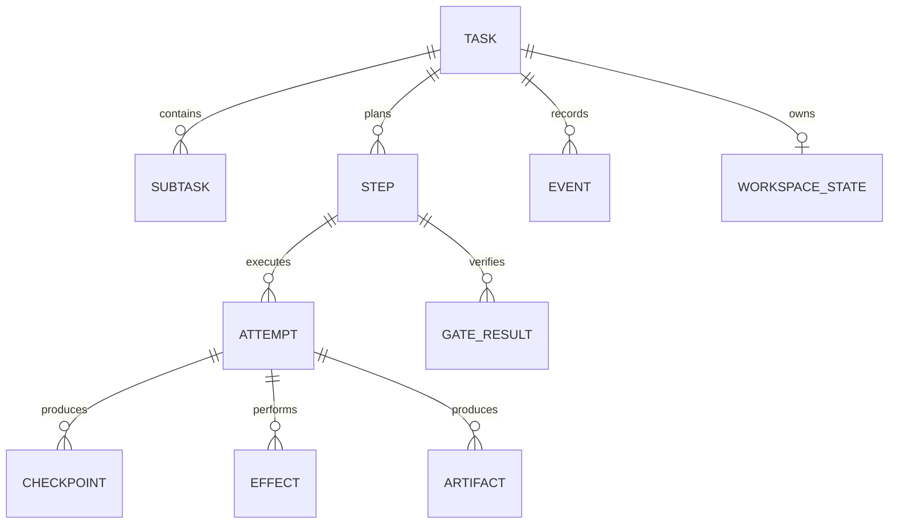
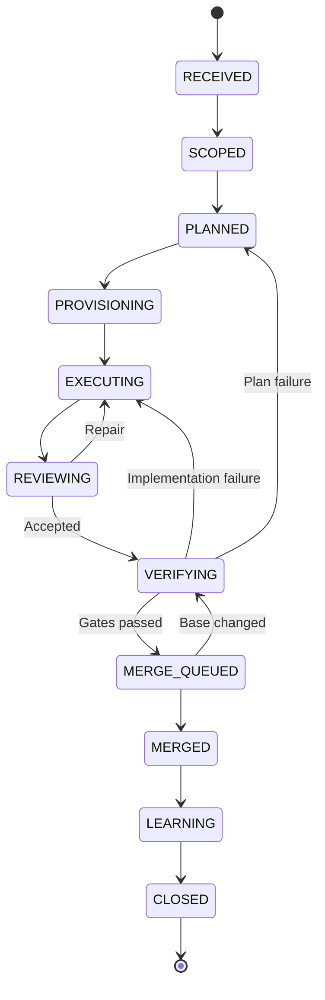
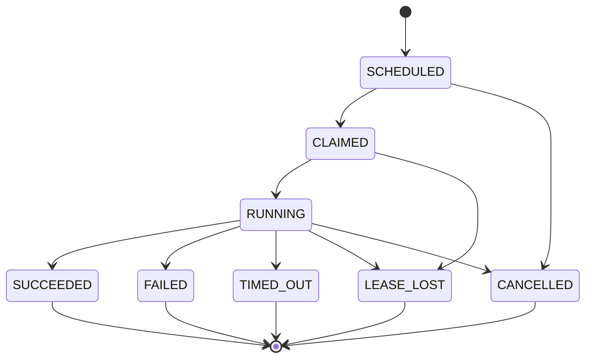
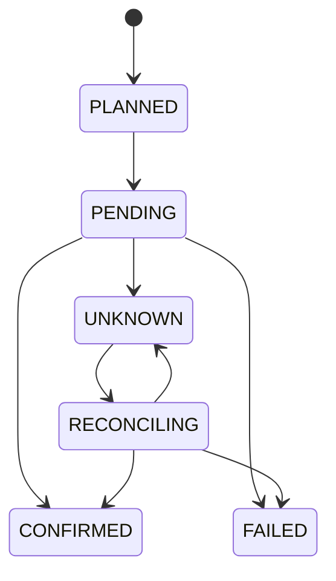

# Task Runtime Kernel 详细设计

> 文档类型：Detailed Design  
> 状态：Draft  
> 版本：v0.2
> 更新日期：2026-08-22
> 上位文档：[全自动研发闭环 Harness 架构设计](./overview.md)

## 1. 文档目的

本文描述 Harness 中 Task 领域的详细设计，重点解决一个研发任务从接收到关闭期间的三个核心难题：

1. Pipeline 中局部错误如何分类和处理；
2. Agent Loop、修复循环和重新规划如何控制重试；
3. Daemon、Agent 或进程中断后，任务如何由其他执行者安全接管。

本文不详细讨论模型选型、Agent Prompt、知识检索算法和具体 UI 设计。它们是 Task Runtime Kernel 的消费者或周边领域。

## 2. 核心结论

Harness 的核心不是 Agent Manager，而是一个 **Recoverable Task Runtime Kernel**。

系统必须以如下故障假设为前提：

> Agent、Daemon、进程和机器随时可能消失；Task 不能依赖任何执行者的进程内存继续存在。

因此，“交接”不是把旧 Agent 的隐藏思维或模型 Session 原样转移给新 Agent，而是让任意新执行者从最后一个持久化安全点重建执行上下文。

Task Runtime Kernel 由七个核心能力组成：

```text
Task Event Log
+ Deterministic State Reducer
+ Step / Attempt Model
+ Lease / Fencing Token
+ Checkpoint / Handoff Protocol
+ Retry Policy Engine
+ Effect Ledger / Reconciler
```

Daemon 调度、角色 Agent、Worktree、Git、Gate 和知识沉淀都建立在该内核之上。

## 3. 领域边界

### 3.1 Runtime Kernel 负责

- Task、Step、Attempt 的生命周期；
- 状态迁移合法性；
- 命令和领域事件；
- Attempt 派发、领取、租约、心跳和失效；
- 错误分类和重试预算；
- Checkpoint 注册及恢复游标；
- 外部副作用账本和对账；
- 中断检测和接管；
- 取消、暂停、等待、恢复和终止；
- Task 关闭条件；
- 面向查询和看板的 Task Projection。

### 3.2 Runtime Kernel 不负责

- Agent 如何推理和生成代码；
- 某个编程语言的具体构建方式；
- Git Provider 的具体 API 实现；
- LLM Trace 后端；
- 知识内容如何生成和排序；
- 业务需求本身是否正确。

这些能力通过 Activity、Adapter、Gate Plugin 或其他领域服务接入。

## 4. 架构不变量

实现必须始终满足以下不变量：

1. 每个执行行为都属于唯一的 `task_id`、`step_id` 和 `attempt_id`。
2. 只有 Task Workflow 可以推进 Task 主状态。
3. Step 的每次重试都创建新 Attempt，不复活旧 Attempt。
4. Agent 进程内存不是持久化状态。
5. 任意新 Agent 都能从 TaskEnvelope、Event 和 Checkpoint 重建上下文。
6. 只有持有最新 Fencing Token 的执行者可以提交有效结果。
7. 外部副作用必须幂等，或者进入 Effect Ledger 并可对账。
8. `UNKNOWN` 外部结果必须先对账，不能盲目重试。
9. Retry、Repair 和 Replan 是三种不同的控制动作。
10. Task 失败不能由单个 Attempt 失败直接推导。
11. Worktree 是执行缓存，Git 和 Artifact 才是可迁移持久状态。
12. Task 状态可以由 Event History 重建，Projection 只是查询优化。

## 5. 核心模型

### 5.0 当前 PoC 已实现协议切片

`src/domain/coding-task.ts` 已实现不依赖 Runtime、Git 或 Agent 的最小编码任务协议：

- `TaskEnvelope` 固定 Task ID、Spec Revision、Base SHA、Requirement、argv 验证命令和 Context Plan，并通过规范内容摘要与深冻结保持不可变；
- Pipeline 固定为 `CONTEXT → WORKSPACE → IMPLEMENT → VERIFY → MERGE → DOCS`，Archive 仍是 `CLOSED` 后的独立 Workflow；
- `CodingStep` 绑定 Envelope Digest 与 Spec Revision；`StepAttempt` 独立记录 Generation 和终态，重试创建新 Attempt 而不复活旧实例；
- Attempt Evidence 固定 Artifact Content Digest 与 Producer Tuple，Binding 只能从成功 Attempt 生成；Envelope、Attempt、Evidence 和 Binding 使用 Canonical Digest 与 Expected Digest 重建，Spec 升版或 Context/Requirement 变化会让旧证据失效但不会删除历史。

这一切片尚未接入 Restate 主状态机，也不包含 Worktree、Agent、Lease、Fencing 或 Retry Budget。以下完整模型仍是后续设计目标。

### 5.0.1 当前 PoC 已实现本地 Git Effect 切片

`src/git/workspace-effect.ts` 已实现不推进 Task 主状态的本地 Git Adapter：

- `WorkspaceEffectRequest` 从 Task、Spec Revision、Repository、Git Common Dir、Managed Worktree Root、完整 Base Ref 和 Base SHA 规范生成稳定 Effect ID；任务分支编码完整 Effect 摘要，Worktree 目标路径按 Task ID 派生；
- 路径创建前后都通过物理路径、Git 元数据禁区、直接子级、文件系统根目录与符号链接约束检查；Git 只以 argv 和 `shell:false` 执行；
- 每次创建先检查 Worktree List、Task Branch 和 HEAD。完全匹配视为已完成；ownership、Branch、路径、prunable 状态或 ancestry 只部分匹配时停止为 Conflict；
- Git 命令失败或调用方丢失结果后再次读取上述事实。确认已经完成时返回 `ALREADY_APPLIED`，确认未发生时才暴露可重试错误，无法读取事实则标记 `UNKNOWN_SIDE_EFFECT`；
- `GitCheckpoint` 只接受无 tracked dirty 和 untracked 文件的 Worktree，固定 Base、Branch、Result Commit、Git Tree Object ID 与 Workspace Effect ID，创建时验证 Branch HEAD 和 Base ancestry；序列化恢复要求外部 Expected Digest。

该切片尚未把 Effect Record 持久化到 Workflow，也不执行 Agent、Verification 或 Merge。Worktree 路径仍然只是单机缓存；可迁移恢复点是已提交的 Commit 与 Tree Object ID。

### 5.0.2 当前 PoC 已实现 AgentRunner 切片

`src/agent/` 已实现不拥有 Task 主状态的单 Attempt Agent 边界：

- `AgentRunRequest` 固定 Task、Spec Revision、IMPLEMENT Attempt、Runner Kind、Git Workspace、受管 Artifact Root 与 Prompt Digest，派生稳定 Run ID；
- `FakeAgentRunner` 用确定 Event Script 驱动自动化；`CodexExecAgentRunner` 按本机官方 CLI 契约通过 argv、`shell:false` 执行 `codex exec --json --sandbox workspace-write --cd`；
- JSONL 必须以唯一 `thread.started` 开始，并保存 Session ID、最后一个完成的 Agent Message、turn 结果、退出码、Signal 和 Duration；Malformed Stream 独立标记 `INVALID_OUTPUT`，原始内容仍保留；
- Artifact Bundle 原子保存 stdout JSONL、stderr、final message 和 manifest。Manifest 固定文件摘要、Producer Tuple 与 Run Digest；读取时同时重算语义和文件内容，外部消费者还必须提供 Expected Digest；
- 同一完成 Run 直接从 Artifact 对账；pending manifest 可恢复，不完整且无法证明的 Bundle 停止为 Conflict，不能再次调用昂贵 Agent。

这一切片不接入 Workflow、不执行 Verification 或 Merge，也不实现 Session Resume。真实 Codex Fixture 调用在端到端 Workflow Task 中验收。

#### Codex Provider 原生 Session Sidecar

`src/agent/codex-session-adapter.ts` 已实现 W01 Sidecar 合同的首个 Provider Adapter。它只消费已冻结 Capture Intent、Prompt Envelope 和 Role Manifest 派生 Binding，不拥有 Task 主状态：

- 以 Role Manifest 已确认的 `thread_id` 为唯一身份，在显式 allowlist 的 Codex Session Root 中定位唯一 rollout JSONL；Provider Home 绝对路径不进入 Manifest 或 Board；
- 对物理目录、普通文件、`O_NOFOLLOW`、大小上限和读取前后 inode/size/mtime 做 fail-closed 检查；越界配置、符号链接、重复源、坏行、Session 漂移和读取中变化都不会生成可用 Manifest；
- `full` 策略先保存 exact-byte raw snapshot，再按 Provider 源顺序生成 Prompt/User、Assistant、Tool Call/Result、Provider System/Thinking 和父子 Thread 的 canonical Timeline；Codex 新格式中注入的 developer/user 上下文与真正 rendered Role Prompt 通过 Prompt Envelope 精确字节区分；
- raw、normalized 和 Manifest 写入 Capture ID 派生的受管目录，使用 create-once 与内容一致重放；冲突字节拒绝。读取端重新校验 Manifest、normalized、raw 的 Digest，因此 Provider 源文件移除后仍可独立读取；
- Parser name/version/options、Source Locator、Capture Policy 与全部 Task/Revision/Generation/Attempt/Run/Session Binding 都进入 Capture Identity。Parser 语义变化必须产生新 Capture，不能覆盖旧 Artifact。

当前仅完成 Codex Adapter 和真实 Role 产品证据；Prompt 预持久化、Active Locator、Capture Effect/Receipt/UNKNOWN Reconcile 仍由 M1-W04 接入 Workflow，Board 仍不得直接调用本 Adapter 扫描 Provider Home。

### 5.0.3 当前 PoC 已实现单 Agent 编码 Workflow

`CodingTaskWorkflow/<task_id>` 的产品路径已串联 `CONTEXT(role) → WORKSPACE → IMPLEMENT(agent) → SELF_REVIEW(role) → VERIFY → REVIEW(independent role) → MERGE → DOCS_GATE(role) → CLOSED → ARCHIVE`。`TaskAuthority/<task_id>` 保证通用 TaskWorkflow、CodingTaskWorkflow 与 CoreClosureWorkflow 不会同时认领同一个 Task；同一 Coding owner 只允许单调提升 Spec Revision。Workflow 通过 Observer 独占 Projection 写入并同步 ProjectBoard 查询副本。六个领域 Step、虚拟 Role Step、每个 Attempt/Session/Evidence/Binding 都进入 Projection；每个外部操作经 Restate `ctx.run`，Adapter 只能返回可验证结果。

- Verification Gate 只执行 Envelope argv 并固定 `shell:false`；稳定 Operation Intent 让完成 Outcome 可复用，pending/未知结果停止而不重跑命令；Branch Commit 漂移或任一失败都不会产生 Binding；
- Local Merge Request 只能从可信 Verification Binding 或 Core v2 Verification Gate Digest 构造；确定性双亲 Commit 通过 `git update-ref` Expected-Base CAS 原子发布，未知结果由 effect marker、双亲和 target ancestry 对账。Core v2 Lifecycle 保存真实 effectId、target ref、Merge Commit、outcome 与 reconciled flag，禁止 Candidate SHA 冒充 Merge SHA；
- Fake Coding Runner 用 Commit marker 对账中断点；真实 Codex 在进程启动前写稳定 Intent，缺少完整结果时标记 UNKNOWN 并禁止自动重启；
- Context、Self Review 与 Docs Gate 使用 `src/agent/live-role.ts` 启动独立只读 Codex/Claude Session；Implementation 使用可写 Worktree Session；Review 使用另一独立只读 Session。每个 Run 固定 Intent、Session、原始 JSONL、stderr、Manifest 和 Digest；产品输入不允许 Fake；
- Review 的 Blocking Finding 必须声明 `REPAIR | REPLAN`。Repair 创建 Implementation Generation N+1；Replan 创建 TaskEnvelope Spec Revision N+1，旧 Attempt/Evidence 保留但不绑定新 Gate，Workspace 可作为缓存沿用，后续 Checkpoint/Verification 显式绑定新 Revision；
- 未知外部结果在产品 Runtime 进入 `WAITING_RECONCILE` 并等待 keyed Workflow Durable Promise。只有带当前 token 和外部 evidence 的 `reconcile-task` 能恢复原 operation；不会创建并行 Attempt。确定性失败形成 `FAILED_TERMINAL` 后也调用独立 ArchiveWorkflow 固化失败事实；
- Docs Step 即使 `not_applicable` 也先经真实 Docs Gate，再生成明确 Artifact；证据不齐不能 CLOSED，成功和失败的 Archive 都与业务 Outcome 分离。

ProjectBoard 接收 Coding 的状态和事件摘要；`src/trace/state-machine.ts` 与 `coding-trace.ts` 再从只读 Projection 派生状态机 Definition/History 和三层 Trace：业务 Event/Step/Attempt/Evidence 是任务事实，Restate Journal 是 durable execution/replay 事实，Role/Agent/Verification/Git Artifact 是诊断证据。只有连续 Event History 能把合法边标为 traversed；Projection 与 History 终点不一致时显式报告 `MISMATCH`，不能由页面补齐。Board 展示全部 Role/Agent Session、Spec Revision、Attempt、Finding、Git、Docs 与 Archive 回执，并为每个真实 Session 提供摘要校验的原始 JSONL。Trace 没有写入口，不能复活 Attempt 或形成第二套状态机。

`TaskAuthority.get` 为查询层返回冻结的 owner 与 Spec Revision，Board 据此访问唯一主 Workflow，不扫描目录猜测类型。Git ref 更新完成后 Worker 退出的路径由相同 Merge Effect 重放：先读取 marker、双亲和 target ancestry，确认已应用后返回 `ALREADY_APPLIED`，再由 Workflow 确认 Step。

### 5.0.4 当前已实现 Core Control Kernel 切片

`src/domain/core-control.ts` 已实现多角色 Core Workflow 使用的纯领域控制内核；TASK-0018 已通过确定性 Scenario Adapter 把它接入 Restate，领域规则仍不依赖运行时：

- `CoreProjection` 固定 Task、Spec Revision、Envelope Digest、Projection Version、Control State、Stage、中央预算摘要、Applied Decision、已完成 Role Dispatch 摘要和唯一 Pending Role Dispatch；
- `ControlDecision` 固定 Expected State、Expected Projection Version、Action、Target Role、Finding/Evidence 引用、预算申请、原因和规范 SHA-256 Digest；
- 确定性 Fake Orchestrator 只从已验证的 `TaskEnvelope + CoreProjection` 生成当前 Required Gate 对应的 Docs、Implementation 或 Review Role 候选，不读取聊天历史、Agent 内存或本地临时路径；
- Reducer 是当前切片唯一合法转换入口。它先识别已确认的相同 Decision 重放，再校验 Task/Spec、状态、版本、预算、单 Pending Role 和 Required Gate，保证丢失确认后不会重复派发；
- `completeRoleDispatch` 只接受与唯一 Pending Dispatch、Role、Input Digest、Attempt ID/Generation 一致的成功结果摘要；相同完成重放不推进版本，不同结果冲突。Docs 与 Implementation 完成后进入下一 Role Required，Review 完成后停在 `REVIEW_GATE_REQUIRED`；只有可信 Review Gate 可进入 `VERIFICATION_REQUIRED` 或 `REPAIR_REQUIRED`，Verification、Docs Impact 和 Closure 继续通过各自可信协议进入 Reducer。

这个模块是 keyed `CoreClosureWorkflow/<task_id>` 的 Reducer，不拥有独立进程或第二套运行时状态。现有 `CodingTaskWorkflow` 继续保持原单 Agent 行为，与 Core PoC 并存但不能共同认领同一 Task。

### 5.0.5 当前已实现统一 Role Runtime v2 切片

`src/domain/role-runtime-v2.ts` 与 `src/agent/role-runtime-v2.ts` 已提供五类主 Agent 和旁路 `OBSERVER_KNOWLEDGE` 共用的真实执行底座：

- 固定 Role/Phase 矩阵隔离 Architect、Implementation、Documentation、Test Plan、Test Assessment、Design Review、Final Review 和 Observer；产品协议的 Runner 只有 `CODEX_EXEC | CLAUDE_PRINT`，不接受 Fake；
- `RoleAttemptV2` 固定 Task、Spec Revision、Role、Phase、Generation、Runner、权限、输入摘要、Subject Commit 和 Artifact refs，并用连续领域 Event 表达单向状态；旧 Attempt 到达终态后不能复活；
- Runner 在启动进程前把稳定 Execution Intent 写入 Scope 外 Artifact Root。真实 CLI 使用 argv 与 `shell:false`；Session、原始 Event JSONL、stderr、结构化输出和 Manifest 都保存摘要；
- 完整 Manifest 恢复时重算语义摘要、三个文件摘要及 Evidence 的逐字段绑定；重复请求直接复用。只有 Intent 时生成与领域 Attempt 相同算法的 Reconcile Token，返回 `UNKNOWN_SIDE_EFFECT` 而不再次调用 Agent；
- `CONFIRMED` 只接受同一 Run/Attempt 的 Evidence；`NOT_APPLIED` 要求外部证据并把旧 Attempt 固定为失败，之后只能由 Workflow 创建 Generation N+1；
- Architect、Test/Verification、Review 和 Observer 为只读；Implementation、Documentation 为受管 Workspace Write。Artifact Root 与 Scope 分离，拒绝根目录、直接符号链接和路径重叠。

该底座尚未接入 Core v2 主 Workflow 阶段，因此不能单独推进 Task 或宣布 Gate 通过。`src/agent/role-runner.ts`、`live-role.ts`、`runner.ts` 和 `src/review/live-review.ts` 仍服务既有 Core/Coding 路径；后续 Task 按角色逐段迁移到 v2，最终由统一 Workflow 取代旧编排。

### 5.0.6 当前已实现 Self Review、ReviewResult 与 Finding 切片

`src/domain/review-finding.ts` 把 Implementation 自检和独立 Review 结果建模为可持久化领域事实，保持无 Restate、文件系统和模型依赖：

- `ImplementationSelfReview` 固定 Task/Spec、Implementation Attempt/Run、Candidate Commit、Diff、Checkpoint、Test Evidence、Checklist 和 Verdict；只有全部 Checklist 通过的 `READY_FOR_REVIEW` 可以创建 Review Input；
- `ReviewInput` 绑定 Candidate、Diff Digest、Checkpoint、Self Review Digest/Artifact 和验证证据。`ReviewResult` 只表示 Review Agent 成功执行后的 `PASSED | FINDINGS`，同时绑定 Role Run Manifest Digest；`ReviewExecutionFailure` 是独立错误事实，不能进入 Finding Gate；
- `ReviewFinding` 固定 Category、Severity、Requirement/Evidence、Recommended Action 与 Review Producer。Finding ID 不随处置变化；Record Digest 覆盖当前状态和完整追加历史；OPEN 只能处置为 RESOLVED、SUPERSEDED 或 ACCEPTED_RISK，终态不能复活；
- `ReviewGateResult` 要求 Result 中的 Finding 集合与当前 Finding Record 精确匹配。任一 `BLOCKING + OPEN` 产生 `BLOCKED`，否则 `PASSED`；Gate Digest 同时绑定业务 ReviewResult Digest 和 Role Run Manifest Digest；
- Core Reducer 对最近完成的 Review Manifest 再做 Gate 绑定。通过进入 `VERIFICATION_REQUIRED`，阻塞进入 `REPAIR_REQUIRED`；相同 Gate 重放不推进版本，不同 Gate 冲突。

### 5.0.7 当前已实现 Recovery Control 与中央预算切片

`src/domain/core-control.ts` 继续作为唯一 Reducer，已实现四类互不混淆的恢复语义：

- 明确 Role 失败先形成内容寻址 Failure Record；`RETRY(role)` 必须绑定最近失败，创建新 Dispatch 和 Generation N+1，只扣 Role Attempt/Model Call 预算；`RETRY(operation)` 不改变 Pending Role 或 Attempt Generation，只扣 Operation Retry 预算；
- 外部结果未知时，`WAIT` 保存 Unknown Effect 并进入 `WAITING_RECONCILE`。只有带证据的 `CONFIRMED | NOT_APPLIED` 对账才能恢复 RUNNING；等待期间 Reducer 拒绝 Retry、Repair 和 Replan；
- Blocking Review Gate 的 `REPAIR` 必须精确绑定全部未解决 Finding 和当前 Gate，保留 Gate 历史并派发 Implementation Generation N+1；Repair 原子扣减 Repair、Role Attempt 和 Model Call；
- `REPLAN` 必须绑定同一 Task 的 Spec Revision N+1 TaskEnvelope 和精确 Blocking Finding，派发新 Spec 的 Docs Attempt Generation N+1，同时显式记录旧 Envelope、Role Result、Review Gate 与 Finding 引用失效，历史事实不删除；Attempt Generation 在整个 Task 内连续，不能因 Spec Revision 变化发生 ID 碰撞；
- 每种 Decision 都有固定预算形状，Reducer 先完整校验再扣减，不能把 Operation Retry 夹带进 Role Retry/Repair/Replan。Required Gate 缺少所需预算时，确定性决策只产生一个内容寻址 `FAILED_TERMINAL` 候选并进入 `CLOSING`；最终 ClosureResult 仍由后续 Closure 切片生成。

纯 Core Reducer 仍保留上述完整恢复协议；产品 `CodingTaskWorkflow` 已接入 Repair、Replan、Spec Revision、中央次数预算和 WAITING_RECONCILE Durable Signal 的可执行子集。尚未接入的部分是多 Daemon Lease/Fencing 与跨机器调度，不再把真实多角色闭环列为未实现。

### 5.0.8 当前已实现 Observer 与 Docs Impact Gate 切片

`src/domain/core-observer.ts` 和 `src/domain/core-docs-impact.ts` 实现 Core Closure 前的只读诊断与文档门禁，仍不拥有独立 Runtime 状态：

- Observer 只接收可由 TaskEnvelope、Core Projection 和持久化 Attempt/Artifact/Finding/Verification/Invocation 定位重建的摘要；它校验 Attempt 必须存在于 Projection，再派生阶段耗时、模型调用、Token/Cost、四类恢复次数和内容寻址 Report；
- 长时间无进展、重复分类失败、预算逼近和待对账 UNKNOWN 形成稳定 Alert Candidate；Finding、Observer 与失败证据只生成 `PROPOSED` Knowledge Candidate，目标类型可为 Finding、Backlog、Pitfall、Runbook 或 Docs Impact，但不能声明已经提升长期知识；
- Final Context Route 复用 TaskEnvelope 的初始 Intent/Context Plan，把实际 changed paths 和最终证据路径重新交给现有 Router；最终 Required Read/Review 只能扩张不能丢失，Route/Report/Gate 都可用 Expected Digest 恢复；
- Docs Impact Report 必须精确处置 Final Route 的每个 Required Review；新 Markdown 必须同时声明图谱节点、关系和索引。`RubyDocsGraphAdapter` 使用 `shell:false` argv 调用现有 `docs_graph.rb route|validate|validate-impact` 并保存退出码和输出摘要；
- Validator 失败产生可信 `BLOCKED` Gate，Core 保持 `DOCS_IMPACT_REQUIRED`；带 Verification 与通过 Review 的 Projection 只有接受可信 `PASSED` Gate 后才进入 `CLOSURE_REQUIRED`。Observer 崩溃不改变 Projection，重复 Gate/Report 由 Digest 收敛。

当前生产 Trace 看板、Daemon 指标平台、知识自动提升和长期效果反馈仍保留在 BL-0006/BL-0007。

### 5.0.9 当前已实现 Core Closure 与真实 Restate 收敛切片

`src/domain/core-closure.ts`、`src/core/` 和 `src/restate/core-services.ts` 把前述领域协议接入唯一 keyed `CoreClosureWorkflow/<task_id>`：

- Closure 输入必须是 Expected Digest 验证后的 TaskEnvelope、Core Projection 和显式 Trace Index。Active Attempt 或 Pending Reconcile 非零时拒绝关闭；Outcome 只能从 Projection 推导，调用方不能选择或覆盖；
- `SUCCEEDED` 必须同时绑定 Passed Review Candidate、Verification 和最终 Passed Docs Impact；预算耗尽的 Terminal Candidate 形成 `FAILED_TERMINAL`；Cancellation Candidate 保存原因、最后 Attempt、Artifact 和命令证据并形成 `CANCELLED`；
- 三种 Outcome 都生成内容寻址、深冻结的 `CoreClosureResult` 和 `ClosedCoreProjection`。Trace Index 覆盖 Control Decision、Attempt、Session、Artifact、Finding、Verification、Docs Impact、Observer 与 Restate Invocation；恢复时重算完整 Closure Digest；
- `CoreClosureWorkflow` 先通过 `TaskAuthority` 声明 `CORE_WORKFLOW` 主权，再在一个 Restate `ctx.run` 中调用确定性 Scenario Artifact Adapter，并只持久化 `EXECUTING → CLOSED` Projection。`status` 是共享只读查询，Observer 错误只保存诊断文本，不改变主状态；
- Scenario Adapter 以 Task/Revision/Envelope/场景/Invocation 派生稳定 operation ID。完整结果按 Digest 对账，`.pending` 结果先原子完成 rename，仅有 Intent 时返回 `UNKNOWN_SIDE_EFFECT`，禁止第二次昂贵执行；测试专用 Worker Kill 发生在结果 rename 后、Step 确认前，新 Worker 只读取同一 Artifact；
- 当前 Adapter 用确定性 Fake Role/Review/Verification/Docs 事实验证控制闭环，不声称真实多角色模型质量。Board、Archive、外层 Merge 仍是正交外围状态，也尚未为 Core 新增 UI 投影。

真实 Restate 1.7.4 验证覆盖线性成功、Repair、Replan、UNKNOWN→Reconcile、预算耗尽、取消、Docs Gate 首次失败恢复、Observer 失败、异步提交回执丢失和 Worker `SIGKILL`。所有场景最终只有一个 Closure Digest，持久化后的场景执行计数保持 1。

### 5.0.10 当前已实现页面真实 Agent 产品切片

Board `POST /api/tasks` 只接受 `CODEX_EXEC | CLAUDE_PRINT`，在任何 Runtime 状态写入前拒绝 Fake。提交器校验允许仓库、冻结 Base/Target Ref、创建仓库外受管 Worktree/Artifact/Task Package，并异步派发唯一 `CodingTaskWorkflow/<task_id>`。

真实 Implementation Commit 先绑定 Verification，再由第二个只读 CLI Session 产生结构化 ReviewResult。存在 Blocking Finding 时，Workflow 在固定一次 Repair 预算内创建新的 Implementation Agent Run、Checkpoint、Verification 和 Review；预算耗尽则保留 Findings 并失败，不合入。通过后才允许 Merge、Docs disposition、业务关闭与独立 Archive。所有实际 Agent Run 都有稳定 Run ID 和 Artifact；产品 Trace 展示 Review/Repair，但 Board 与 Trace 仍不能推进状态。

该产品切片复用 Core 不变量，但当前状态所有者仍是 CodingTaskWorkflow；完整 Docs Role、Spec Replan 和 `CoreClosureResult` 接线仍属于后续 Core 产品化，不得从页面可用性推断为已完成。

### 5.0.11 当前已实现只读状态机审计切片

Board 不再把静态阶段条或任务提交表单当作闭环证明。`GET /api/tasks/<task_id>/trace` 对 CodingTaskWorkflow 与通用 TaskWorkflow 都返回版本化 State Machine Trace：`definition` 列出当前代码允许的 normal、Repair、failure、archive 边；`history` 只从连续 Runtime Event 派生，并保留 sequence、type、time 和 detail；`current.consistency` 核对 Projection 终点与 Event History 终点。未出现在 History 的合法边只能显示为“允许但未发生”。

Coding Workflow 在实际外部操作前发布对应 `STEP_STARTED`：Implementation 完成并固定 Checkpoint 后结束其 Attempt，再进入 Verification；Verification 通过后才进入 Review。Blocking Finding 先形成 `REVIEW_FINDINGS`，再创建 IMPLEMENT Generation N+1 的独立 StepAttempt、Agent Run 和 Checkpoint，随后创建 VERIFY Generation N+1 并重新 Review。Projection 同时保留 Agent Run、Checkpoint、Verification 与 Review 历史，页面可用 Attempt ID、Run/Session ID 和 Digest 交叉核对。

真实 Codex 仍运行在 `workspace-write`，但受管 Git Worktree 的 commit 必须写入外部 common dir。`AgentRunRequest` 先验证 Worktree top-level 和 Git common dir，再由 Adapter 用 `--add-dir <workspaceGitCommonDir>` 增加唯一额外可写根；不得用 `danger-full-access` 规避这个边界。

该视图仍只覆盖当前已经实现的 Coding/TaskWorkflow 状态，不冒充总体架构中规划的 Lease、Fencing、完整 Replan 或多 Daemon 状态。Board、Trace Builder 和浏览器均没有状态推进命令。

### 5.0.12 当前已实现 Bootstrap 预检与失败 successor 切片

Goal Bootstrap 使用三次同源校验：CLI 在派发前给出同步错误，`TaskWorkflow` 在 Authority claim 和首个 Projection 之前用 durable Step 兜底，最终 Closure Gate 在接受 Result Commit 时再次验证。三处复用 `verifyBootstrapPreflight` 的同一 Git 基线规则：当前 Manifest、首次引入 Manifest 的 `base_commit` 与引入提交父提交必须一致。派发前失败不创建 Authority、Projection 或 Board 记录；进入 Projection 后的确定性 Evidence/Closure 失败由 TaskWorkflow 追加唯一 `FAILED_TERMINAL`、写 `bootstrap-runtime-failure.json` 并进入同一 ArchiveWorkflow。

升级前已经以 Invocation Failure 结束、但 Projection 留在 `EXECUTING` 的 Bootstrap Task 不能 restart、purge、patch 或伪造 Board。唯一兼容路径是窄化的 `BootstrapFailureRecoveryWorkflow/<task_id>`：它按 Invocation ID attach 原失败、重放只读基线检查、验证无 Evidence 的 `EXECUTING/NOT_READY` Projection，再让 TaskAuthority 追加一次 successor ref。successor 只追加 `TaskRecoveryStarted` 和 `TaskClosed(FAILED_TERMINAL)`，持久化失败证据并调用既有 Archive；原 Workflow Projection 和 Invocation 永久保留为来源历史。该兼容路径不接受成功、非 Bootstrap、已关闭或错误码不匹配的 Task，也不是普通 Retry。

### 5.0.13 当前已实现 Sealed Result Commit 自举切片

`SealedTaskWorkflow/<task_id>` 解决旧 Bootstrap 在 Result Commit 后还要改 Manifest/移动目录而形成的 SHA 自引用。`seal-start` 在发送 Invocation 前先以 `createSealIntent` 只读校验当前 HEAD、`execution_mode: sealed-result-commit` Manifest、Task/Revision/Base、物理 Active package 和日期归档目标；无效输入不会创建 Runtime Task。Workflow 在 Authority claim 和首个 Projection 前用同一函数执行 durable 兜底校验，成功后持久化内容寻址 Seal Intent，将 Projection 显示为 `EXECUTING / waiting-result-commit`，再等待 keyed durable promise。TaskAuthority 的 `SEALED_TASK_WORKFLOW` owner 让 CLI、Board 和 Trace 始终查询同一状态所有者。

执行者只能按 Intent 把 package 标为 `seal_prepared` 并移动到固定 Archive 路径，然后创建唯一 Result Commit。`seal` shared handler 先校验 token、Artifact 路径和 producer，再解析 promise；错误 token 不消费信号，相同 Evidence 重放幂等，不同 Evidence 冲突。Worker 在等待期间退出并重启时，Journal 重放返回完全相同的 Intent。

最终 Gate 要求 Result Commit 是 clean worktree 的当前 HEAD，且只有一个父提交并精确等于冻结 Base；Active package 必须消失，Archive manifest/Verification/Docs Impact 必须存在于该 Commit并绑定相同 Task、Revision 与 Intent；Verification 必须 Accepted，Docs Impact 必须覆盖 `base..result` 的全部 changed paths并通过文档图谱影响校验。成功后 Workflow 只追加 Seal Receipt、`CLOSED` 和 `ARCHIVED` Runtime Event，不再写 Git；Result SHA 因而只存在于 Runtime Receipt。Archive 目录位置本身不能证明关闭，Git Roadmap 也只能声明自己的快照截止时间并指向实时查询，不能递归写入产生当前 Commit 的未来 Receipt。

如果调用方提交的 Evidence 本身错误，原 `SealedTaskWorkflow` 必须保留 `FAILED_TERMINAL`，不能解析第二次 Durable Promise。`SealedTaskRecoveryWorkflow`/`SealRecoveryAttemptWorkflow` 以 append-only successor 链恢复：每个失败 predecessor 只允许 TaskAuthority 登记一个下一 successor；第一条 numbered Attempt 可读取 `SealedTaskRecoveryWorkflow`，后续 Attempt 读取前一个 `SealRecoveryAttemptWorkflow`，并由 Authority 原子拒绝非当前 chain head。successor 读取原 Intent 和错误 Evidence，在目标 Result Commit 的 detached worktree 中重跑 Verification/Docs Impact，并要求该 Commit 是当前 HEAD 的祖先、唯一父提交仍等于冻结 Base。CLI、Board 和 Trace 默认解析 Authority 中最后一个 successor ref，显式 source ref 保留前序失败历史。`seal-submit` 在发送不可撤销回执前先用本地 `git cat-file` 拒绝不存在的 SHA。

### 5.0.14 当前已实现 Lifecycle Artifact 协议切片

`src/domain/lifecycle-artifact.ts` 将 Spec、Design、Plan、Docs Impact、Test Plan、Test Report、两次隔离 Review 和 Knowledge Disposition 建模为 discriminated schema。每个 Artifact 固定 Task、Spec Revision、Subject Commit、Producer Role/Phase、Attempt/Generation/Session、Dependency refs、Payload Content Digest 与整体 Artifact Digest；所有构造结果深冻结，跨 Worker JSON 必须通过 Parser 重建并比较 Expected Digest。

Artifact 依赖不是任意字符串：协议固定 Architect 三件套、Design Review、Documentation、Test Plan/Assessment、Final Review 的输入链。Review Subject Digest 从依赖集合派生；Test Report 必须绑定 Candidate Commit，在 Gate 中覆盖 Test Plan 的全部 Case，`PASS` 不能包含失败、未执行或未知 Outcome。Artifact Gate 同时解析整个声明集合，按 Task/Revision/Commit/Kind/Digest 精确匹配，并拒绝未解析到集合内真实 Artifact 的 Dependency ref。该模块不推进 Task；后续 Role Workflow 只消费它产生的可信 Artifact。

### 5.0.15 当前已实现 Core v2 成功 Archive 与停滞 successor

成功路径不再由 `state === CLOSED` 推断归档。Verification Gate 和本地双父 Merge Receipt 确认后，Workflow 先持久化 `Success Closure Artifact`，其中绑定 Revision、Generation、Candidate、Merge Receipt、Verification Gate、Knowledge Disposition、原 Workflow、全部 Attempt 与 Session；Reducer 再进入 `ARCHIVE_PENDING` 并派生稳定 Archive Effect ID。Archive Adapter 在 Task namespace 下以 content-checked pending/rename 写 Receipt，成功后才追加 `TaskClosed + ArchiveArchived`。失败时只保留 `ARCHIVE_FAILED` 和同一 Effect token；合法 signal 只能重试 Archive，不能重新进入 Agent、Trusted Test、Checkpoint、Gate 或 Merge。

已经卡在 Restate durable `Run` command 的历史 `CoreV2Workflow` 不能 purge、restart、复用 key 或改 Projection。操作员先暂停原 Invocation，使旧执行者失去继续推进的资格；`core-v2-recovery-plan` 再从 Restate Admin 的 `sys_invocation + sys_journal` 核验 Task/target、`paused`、最后 durable Run command/index/failure digest，并绑定完整 source Projection Digest。`TaskAuthority` 只允许当前 chain head 追加 `CoreV2FailureRecoveryWorkflow`；若该 successor 自身在 Authority handoff 前失败，后续必须以新 `CoreV2FailureRecoveryAttemptWorkflow/<recovery_id>` 绑定前序 completed Failure Invocation。successor 复制原 Attempt、Session、Artifact、Event 和失败原因，只追加 Recovery Record、Failure Artifact、Knowledge Disposition、Failure Closure 与 Archive；原 Workflow Projection 保持逐字节摘要不变。

### 5.1 模型关系



### 5.2 TaskRuntime

```yaml
TaskRuntime:
  task_id: "01J..."
  schema_version: 1
  state_version: 87
  workflow_version: 3
  plan_version: 2
  last_event_sequence: 212

  lifecycle_state: EXECUTING
  active_step_ids:
    - implement-handler

  retry_budget:
    operation_remaining: 8
    attempt_remaining: 4
    repair_loop_remaining: 2
    replan_remaining: 1
    cost_remaining: 18.4

  wait:
    kind: null
    reason: null
    wakeup_at: null

  workspace_checkpoint_ref: "checkpoint://cp-42"
  pending_effect_ids: []

  created_at: "..."
  updated_at: "..."
```

`state_version` 用于乐观并发控制。所有状态更新都必须声明期望版本：

```text
update task where task_id = ? and state_version = expected_version
```

更新成功后递增版本；版本不匹配时重新读取并重新决策。

### 5.3 Step

Step 是计划图中的逻辑工作，不等同于一次 Worker 执行。

```yaml
Step:
  step_id: "implement-handler"
  task_id: "01J..."
  plan_version: 2
  kind: implementation
  role: coder
  dependencies:
    - inspect-api
  status: RUNNING
  generation: 3
  max_attempts: 2
  completion_policy: all_outputs_valid
  expected_outputs:
    - patch
    - tests
    - claims
```

Step 状态：

```text
PENDING
READY
RUNNING
SUCCEEDED
FAILED
SKIPPED
CANCELLED
SUPERSEDED
```

当重新规划产生新计划版本时，旧计划中不再适用的 Step 进入 `SUPERSEDED`，而不是从历史中删除。

### 5.4 Attempt

Attempt 表示 Step 的一次实际执行。

```yaml
Attempt:
  attempt_id: "attempt-03"
  task_id: "01J..."
  step_id: "implement-handler"
  generation: 3
  status: RUNNING

  daemon_id: "daemon-sh-02"
  input_snapshot_ref: "artifact://sha256/..."
  latest_checkpoint_ref: "checkpoint://cp-42"
  result_ref: null

  lease:
    lease_id: "lease-03"
    fencing_token: 42
    acquired_at: "..."
    expires_at: "..."
    last_heartbeat_at: "..."

  error: null
  started_at: "..."
  finished_at: null
```

Attempt 状态：

```text
SCHEDULED
CLAIMED
RUNNING
SUCCEEDED
FAILED
TIMED_OUT
LEASE_LOST
CANCELLED
SUPERSEDED
```

终态 Attempt 不允许再次变为运行态。

## 6. 两级状态机

Task 和 Attempt 必须使用不同状态机。

### 6.1 Task 主状态机



Task 主状态保持粗粒度。具体的错误类型、重试次数和等待原因不应无限扩充为新的主状态。

`CLOSED` 是 Task 的业务终态，不等于历史包已经归档。归档状态由独立的 `ArchiveRecord` 或 Projection 表达，避免归档存储失败重新打开 Task 状态机。

### 6.2 Attempt 状态机



Attempt 的失败由 Workflow 消费后产生新的控制决策，但不直接改写 Task 为 `FAILED`。

### 6.3 Wait 状态

等待信息独立建模：

```yaml
WaitState:
  kind: HUMAN_APPROVAL | EXTERNAL_EVENT | BACKOFF | CAPACITY | DEPENDENCY
  reason: "..."
  wait_ref: "..."
  wakeup_at: "..."
  timeout_at: "..."
```

这样可以避免产生 `WAITING_FOR_REVIEW_APPROVAL`、`WAITING_FOR_DAEMON` 等大量互斥状态。

## 7. Command、Event 与 Reducer

### 7.1 写入路径

```text
Command
  → 校验当前 Task State 和 expected_version
  → 产生一个或多个 Domain Event
  → 原子追加 Event
  → Reducer 更新 Projection
  → Outbox 发布后续工作
```

Command 表达意图，例如：

```text
CreateTask
AcceptRequirement
CreatePlanVersion
ScheduleAttempt
ClaimAttempt
RecordCheckpoint
CompleteAttempt
FailAttempt
RequestRepair
RequestReplan
PauseTask
ResumeTask
CancelTask
ConfirmEffect
CloseTask
```

Event 表达事实，例如：

```text
TaskCreated
RequirementAccepted
PlanVersionCreated
AttemptScheduled
AttemptClaimed
AttemptHeartbeatReceived
CheckpointRecorded
AttemptCompleted
AttemptFailed
AttemptLeaseExpired
RepairRequested
ReplanRequested
EffectOutcomeBecameUnknown
EffectReconciled
TaskClosed
```

### 7.2 EventEnvelope

```yaml
EventEnvelope:
  event_id: "evt-..."
  event_type: "AttemptFailed"
  schema_version: 1
  task_id: "01J..."
  sequence: 213
  occurred_at: "..."

  actor:
    type: daemon
    id: "daemon-sh-02"

  causation_id: "cmd-..."
  correlation_id: "01J..."
  idempotency_key: "01J/implement-handler/attempt-03/fail"
  payload: {}
  artifact_refs: []
```

同一 Task 的 `sequence` 必须严格递增。Reducer 必须是确定性的：相同初始状态和 Event 序列得到相同最终状态。

### 7.3 Snapshot

Event 是事实来源；Snapshot 用于优化恢复性能。

```yaml
TaskSnapshot:
  task_id: "01J..."
  through_sequence: 200
  state_ref: "artifact://sha256/..."
  state_digest: "sha256:..."
  created_at: "..."
```

恢复时读取最近 Snapshot，再重放其后的 Event。Snapshot 可删除和重建，Event 不可修改。

## 8. 错误分类

错误必须先分类，再决定控制动作。

| 分类 | 例子 | 默认动作 |
|---|---|---|
| `TRANSIENT_OPERATION` | 网络闪断、限流、临时 5xx | 当前操作退避重试 |
| `ATTEMPT_INFRA_FAILURE` | Daemon 崩溃、进程退出、机器失联 | 结束旧 Attempt，创建新 Attempt |
| `IMPLEMENTATION_FAILURE` | 编译错误、单测失败、Review finding | 创建 Repair Step 或新实现 Attempt |
| `PLAN_FAILURE` | 修改方向错误、遗漏关键模块 | 创建新 Plan Version |
| `REQUIREMENT_FAILURE` | 验收条件冲突或信息缺失 | 等待需求澄清或人工 Gate |
| `POLICY_FAILURE` | 越权路径、成本超限、安全策略拒绝 | 阻塞或终止，默认不自动重试 |
| `EXTERNAL_DEPENDENCY` | CI、审批、外部系统不可用 | Durable Wait 或受控重试 |
| `UNKNOWN_SIDE_EFFECT` | Push/Merge 超时，结果未知 | 进入 Reconcile，禁止盲目重试 |
| `TERMINAL` | 不可恢复数据损坏、明确取消 | 终止或补偿 |

统一错误结构：

```yaml
TaskError:
  code: "SCM_MERGE_OUTCOME_UNKNOWN"
  category: UNKNOWN_SIDE_EFFECT
  retryable: false
  scope: effect
  message: "merge request timed out"
  source: scm-adapter
  evidence_refs: []
  suggested_action: reconcile
  occurred_at: "..."
```

`retryable` 不能只由异常类型或 HTTP 状态码推导。Adapter 应结合操作语义和外部系统幂等能力分类。

## 9. 分层重试模型

### 9.1 五层预算

```text
Operation Retry
  < Attempt Retry
    < Repair Loop
      < Replan Loop
        < Task Budget
```

| 层级 | 重试对象 | 是否创建新 Attempt | 例子 |
|---|---|---:|---|
| Operation | 单次 API、模型或工具调用 | 否 | 限流后重试 |
| Attempt | 同一 Step 的执行者 | 是 | Daemon 崩溃后换节点 |
| Repair | 根据 Finding 修改实现 | 通常是 | Review 不通过 |
| Replan | 替换当前执行方案 | 是，并增加计划版本 | 架构方案错误 |
| Task | 整个任务资源上限 | 不适用 | 超时、成本耗尽 |

### 9.2 RetryPolicy

```yaml
RetryPolicy:
  operation:
    max_attempts: 3
    initial_backoff: "1s"
    max_backoff: "30s"
    multiplier: 2
    jitter: true

  attempt:
    max_attempts_per_step: 2

  repair_loop:
    max_rounds: 3

  replan:
    max_versions: 2

  task:
    max_duration: "24h"
    max_cost: 30
    max_total_model_calls: 100
```

### 9.3 中央预算

嵌套重试可能形成乘法放大。Task Workflow 必须维护统一资源账本：

```yaml
BudgetLedger:
  model_calls_used: 27
  tokens_used: 182340
  cost_used: 11.6
  wall_time_used: "3h21m"
  attempts_used: 7
  repair_rounds_used: 2
  replans_used: 1
```

任何局部重试在开始前都需要申请预算。超出局部或全局预算后，Workflow 在 `WAITING_HUMAN`、`FAILED` 或降级策略之间做显式选择。

## 10. Attempt 派发和所有权

### 10.1 派发协议

```text
Workflow 创建 AttemptScheduled
  → 生成不可变 TaskEnvelope
  → 发布到角色队列
  → Daemon 使用 CAS 领取
  → 分配 Lease 和递增 Fencing Token
  → AttemptClaimed
  → Agent 执行并发送 Heartbeat
```

### 10.2 Lease

```yaml
AttemptLease:
  lease_id: "lease-03"
  attempt_id: "attempt-03"
  daemon_id: "daemon-sh-02"
  fencing_token: 42
  acquired_at: "..."
  expires_at: "..."
  heartbeat_interval: "15s"
```

心跳只表示执行者存活，不表示执行已经取得业务进展。长时间只有心跳但没有 Checkpoint 时，应触发 Stuck Detection。

### 10.3 Fencing Token

每次重新分配 Attempt 所有权时递增 token：

```text
Daemon A: token=41
Daemon A 失联
Lease 过期
Daemon B: token=42
Daemon A 恢复并提交结果
控制面拒绝 token=41 的写入
```

以下写入必须校验 token：

- Checkpoint；
- Attempt Result；
- Workspace ownership；
- 受控分支更新；
- Effect 状态；
- Artifact producer metadata。

## 11. Checkpoint 与交接协议

### 11.1 安全点

Agent Runtime 需要在明确边界记录持久化安全点：

```text
领取 Attempt
  → 保存输入快照
  → 分析
  → Checkpoint
  → 调用工具
  → 保存工具结果
  → Checkpoint
  → 修改代码
  → 保存 Git/Patch Checkpoint
  → 执行测试
  → 保存测试报告
  → Checkpoint
  → 提交 StepResult
```

通常至少在以下时刻保存：

- 外部副作用之前和之后；
- LLM 返回一个完整决策后；
- 工具调用完成后；
- 代码形成可构建或可测试状态后；
- 长时间测试开始前和结束后；
- Agent 准备进入新阶段时。

### 11.2 ExecutionCheckpoint

```yaml
ExecutionCheckpoint:
  checkpoint_id: "cp-42"
  task_id: "01J..."
  step_id: "implement-handler"
  attempt_id: "attempt-03"
  fencing_token: 42
  after_event_sequence: 212

  execution_cursor:
    phase: implementation
    completed_action_ids:
      - inspect-handler
      - update-schema
    pending_action_ids:
      - add-tests
      - run-verification

  workspace:
    base_sha: "abc123"
    checkpoint_sha: "def456"
    dirty_patch_ref: "artifact://sha256/..."
    untracked_files_ref: "artifact://sha256/..."
    tree_digest: "sha256:..."

  context:
    decision_summary_ref: "artifact://sha256/..."
    tool_result_refs: []
    relevant_knowledge_refs: []

  effects:
    completed_effect_ids: []
    pending_effect_ids: []
    unknown_effect_ids: []

  created_at: "..."
```

### 11.3 Handoff Package

交接包由最近有效 Checkpoint 和新的执行约束组成：

```yaml
HandoffPackage:
  previous_attempt_id: "attempt-03"
  new_attempt_id: "attempt-04"
  checkpoint_ref: "checkpoint://cp-42"
  task_envelope_ref: "artifact://sha256/..."
  superseding_reason: "LEASE_EXPIRED"
  resume_policy: FROM_LAST_SAFE_CHECKPOINT
  required_revalidations:
    - workspace_tree_digest
    - base_branch_status
    - pending_effects
```

新 Agent 不继承旧 Agent 的隐藏推理，只继承持久化决策摘要、输入、输出、证据和下一步约束。

## 12. Workspace 可迁移恢复

### 12.1 原则

只保存某台机器上的 Worktree 路径无法支持跨 Daemon 恢复。可迁移状态必须包含：

```text
base_sha
checkpoint commit SHA
dirty patch artifact
untracked files artifact
git status digest
tree digest
dependency lock digest
```

### 12.2 恢复流程

```text
新 Daemon 领取 Attempt
  → 创建新 Worktree
  → Checkout checkpoint SHA
  → 下载并校验 dirty patch
  → 恢复 untracked files
  → 校验 tree digest
  → 检查 base branch 是否漂移
  → Reconcile pending/unknown effects
  → 从 execution cursor 继续
```

### 12.3 Checkpoint 存储策略

- 阶段性稳定成果保存为 checkpoint commit；
- 未提交修改保存为内容寻址 patch；
- 未跟踪文件单独归档；
- 大型构建缓存不视为持久状态，可按需重建；
- 凭证、临时 Socket 和进程信息不得进入 Checkpoint；
- 恢复后必须重新校验工具链和依赖版本。

如果不同 Daemon 不共享 Git Object Database，则 checkpoint commit 必须通过受控隐藏 ref、Git bundle 或 Artifact 传输，不能只记录本地 commit SHA。

## 13. Effect Ledger 与对账

### 13.1 为什么需要 Effect Ledger

以下操作在网络超时后可能已经发生，但调用方没有收到结果：

- Push 分支；
- 创建或更新 PR；
- 提交 Review；
- Merge PR；
- 发布制品；
- 修改 Issue；
- 发送通知。

直接重试可能造成重复副作用。

### 13.2 EffectRecord

```yaml
EffectRecord:
  effect_id: "01J/merge/final"
  task_id: "01J..."
  attempt_id: "attempt-08"
  kind: merge_pull_request
  idempotency_key: "01J/merge/final"

  status: UNKNOWN
  request_digest: "sha256:..."
  subject_ref: "pr://123"
  external_ref: null

  last_error_ref: "artifact://sha256/..."
  reconcile_after: "..."
  created_at: "..."
  updated_at: "..."
```

状态机：



### 13.3 Merge 未知结果

Merge API 超时时执行：

1. Effect 标记为 `UNKNOWN`；
2. 暂停 Task 的合并推进；
3. 查询 PR、head SHA、目标分支和 merge SHA；
4. 如果已经合并，补记 `CONFIRMED` 和 `CommitMerged`；
5. 如果确认没有发生，使用相同幂等键重试；
6. 如果仍无法判断，继续等待、告警或进入人工 Gate。

## 14. 中断恢复场景

### 14.1 Daemon 在领取后、启动前崩溃

- Lease 到期；
- Attempt 进入 `LEASE_LOST`；
- 不存在业务 Checkpoint；
- Workflow 创建新 Attempt，从原 TaskEnvelope 开始。

### 14.2 Agent 在完成工具调用后崩溃

- 如果工具结果已经写入 Checkpoint，新 Attempt 复用结果；
- 如果 Effect 为 `PENDING` 或 `UNKNOWN`，先对账；
- 不重新执行已确认的非幂等副作用。

### 14.3 Agent 修改代码但尚未提交

- 恢复最近 dirty patch 和 untracked file Artifact；
- 校验 tree digest；
- 新 Agent 从该 Workspace Checkpoint 继续；
- 如果 Checkpoint 不完整，则回退到上一个安全 checkpoint commit。

### 14.4 Daemon 恢复后继续提交旧结果

- 所有写入校验 Fencing Token；
- 旧 token 的 Checkpoint 和 StepResult 被拒绝；
- 可将旧执行输出保存为诊断 Artifact，但不能改变 Task 状态。

### 14.5 Workflow 服务重启

- 从 Workflow Journal 或 Event Log 恢复；
- Reducer 重建 Task State；
- 检查所有 Active Attempt 的 Lease；
- 对不确定外部状态执行 Reconcile；
- 重新注册 Durable Timer 和等待条件。

### 14.6 Workflow 代码升级

- Workflow 定义和 Event Schema 版本化；
- 运行中的 Task 使用兼容路径或显式迁移；
- Reducer 需要支持历史 Event Schema；
- 禁止通过修改旧 Event 修复线上问题；
- 必要时通过新 Event 表达校正事实。

## 15. Reconciler

Reconciler 是独立于正常执行路径的收敛机制。

### 15.1 检查内容

- Task Projection 与 Workflow History 是否一致；
- Active Attempt 是否有有效 Lease；
- Daemon 是否仍然健康；
- Worktree ownership 是否与 token 一致；
- checkpoint commit、patch 和 Artifact 是否可用；
- PR 状态是否与 Effect Ledger 一致；
- `MERGED` Task 是否存在真实 merge SHA；
- `CLOSED` Task 是否仍有 Active Attempt；
- `UNKNOWN` Effect 是否已经可以确定结果。

### 15.2 修复原则

- Reconciler 不直接篡改 Task Projection；
- 它提交 Command，由正常状态机产生校正 Event；
- 自动修复必须保留前后状态和证据；
- 无法无歧义修复时进入人工 Gate。

## 16. 与 Durable Workflow 引擎的边界

采用 Restate、Hatchet、DBOS 或 Temporal 后，Runtime Kernel 不需要自行实现底层 Journal、Timer、基础重试和 Worker 通信，但仍需实现研发领域语义。

### 16.1 可委托给引擎

- Workflow Journal 和 Replay；
- Durable Timer；
- Activity/Task 派发；
- 基础 Worker 失联恢复；
- Step Retry 和 Timeout；
- 等待外部事件；
- 暂停、恢复和取消；
- Workflow 执行历史和基础 UI。

### 16.2 领域层必须保留

- Task/Step/Attempt 标识和模型；
- Retry、Repair、Replan 的业务分类；
- Task 总预算；
- TaskEnvelope 和 StepResult；
- Workspace Checkpoint；
- SCM Effect Ledger；
- Gate 与 acceptance criteria；
- Task 关闭条件；
- 业务 Projection 和 Task 看板。

Workflow 引擎的 Workflow ID 应直接映射 Task：

```text
workflow_id = task/<task_id>
```

引擎自己的 execution status 不直接等同于 Task lifecycle state。例如 Workflow 处于运行态时，Task 可能处于 `WAITING_HUMAN`。

## 17. 可观测性

### 17.1 三种历史

| 类型 | 用途 | 是否允许采样 |
|---|---|---:|
| Workflow Journal / Domain Event | 恢复和业务审计 | 否 |
| Artifact / Checkpoint | 证据和交接 | 否，按保留策略归档 |
| OpenTelemetry Trace | 性能和技术诊断 | 可以 |

### 17.2 推荐 Span

```text
task.command
task.transition
step.schedule
attempt.claim
attempt.run
checkpoint.persist
effect.execute
effect.reconcile
workspace.restore
retry.decide
gate.evaluate
```

统一属性：

```text
task.id
task.state
task.state_version
step.id
attempt.id
attempt.generation
daemon.id
lease.id
fencing_token
checkpoint.id
effect.id
workflow.id
```

Task 可能持续数天，不使用一个超长 trace 覆盖全生命周期。每个 Attempt、Reconcile 或短执行单元创建 trace，并通过 `task.id`、Event causation 和 Span Links 关联。

## 18. Task 关闭和清理

Task 关闭前执行最终一致性检查：

```text
所有 Required Step 成功
AND 所有 Acceptance Criteria 有证据
AND 所有 Required Gate 绑定最终候选 SHA 并通过
AND merge SHA 已确认
AND 没有 Active Attempt
AND 没有 PENDING / UNKNOWN Effect
AND Workspace 已归档或清理
AND Knowledge Distillation 已完成或明确跳过
```

清理动作包括：

- 撤销仍存活的 Lease；
- 停止 Agent 和 Sandbox；
- 保存最终 Workspace Manifest；
- 删除或归档 Worktree；
- 按策略删除临时构建缓存；
- 设置 Event、Trace 和 Artifact 保留期；
- 生成 Task Closure Report。

清理本身也通过可重试 Activity 和 Effect Record 执行，不能因为删除 Worktree 失败而伪装成已经完全关闭。

### 18.1 Task Artifact Archive

Task 进入 `CLOSED` 后执行独立 Archive Workflow：

```yaml
ArchiveRecord:
  task_id: "01J..."
  status: PENDING | ARCHIVED | FAILED
  source_path: "docs/delivery/tasks/TASK-0042"
  archived_path: "docs/delivery/tasks/archive/2026-08-19-TASK-0042"
  closure_report_ref: "artifact://sha256/..."
  archived_at: "..."
```

Archive 固化 Task Spec、最终验证、Outcome、Docs Impact 和 Closure Report，并更新文档图谱路径。Archive 失败只重试归档步骤，不重新执行 Agent、验证或 Merge。Task ID 在移动前后保持不变。

## 19. 故障注入测试

Runtime Kernel 上线前必须通过以下场景：

| 场景 | 期望结果 |
|---|---|
| 在每个 Step 边界 Kill Agent | 从最近 Checkpoint 恢复，不重复已确认副作用 |
| Kill Daemon | Lease 过期后由其他 Daemon 接管 |
| 旧 Daemon 恢复并提交 | 旧 Fencing Token 被拒绝 |
| LLM 调用完成后进程崩溃 | 已持久化响应不重复请求 |
| 修改代码后进程崩溃 | 新 Worktree 恢复相同 tree digest |
| Push 成功但响应超时 | Reconciler 确认远端状态，不重复 Push |
| Merge 成功但响应超时 | 最终获得唯一 merge SHA |
| Event 重复投递 | Reducer 结果不变 |
| Projection 删除 | 可以从 Snapshot 和 Event 重建 |
| Workflow 升级 | 旧 Task 能继续或显式迁移 |
| Retry 预算耗尽 | 进入预定 Gate，不继续消耗资源 |
| Task 取消 | 不再派发新 Attempt，并完成必要清理 |

## 20. MVP 范围

第一阶段不需要实现完整 Event Sourcing 平台，但必须保留未来演进边界。

MVP 最少包含：

1. Task、Step、Attempt 表；
2. 追加式领域事件表；
3. 一个 Durable Workflow；
4. 一个角色队列；
5. Attempt Lease 和 Fencing Token；
6. TaskEnvelope 和 StepResult；
7. Git checkpoint commit 与 dirty patch Artifact；
8. Operation、Attempt、Repair 三层重试；
9. Push/PR/Merge Effect Ledger；
10. 一个周期性 Reconciler；
11. Task Timeline 查询接口；
12. 关键故障注入测试。

MVP 完成标准：

> 在 Agent、Daemon 和控制面进程被随机终止的情况下，一个低风险代码任务最终仍能得到唯一、可解释、可验证的结束状态。

## 21. 待决策问题

1. Durable Workflow 引擎最终选择 Restate、Hatchet、DBOS 还是 Temporal；
2. Event Log 使用引擎 Journal 直接投影，还是维护独立 Domain Event Store；
3. Checkpoint commit 通过隐藏 Git ref 还是 Git bundle/Artifact 迁移；
4. Task 是否允许多个可写 Subtask Worktree 并行；
5. 哪些错误分类允许 Agent 建议，哪些必须由确定性 Adapter 决定；
6. Reconciler 的扫描频率和自动修复权限；
7. Workflow 和 Event Schema 的升级策略；
8. Task 关闭后 Artifact、Prompt 和源代码快照的保留周期。
