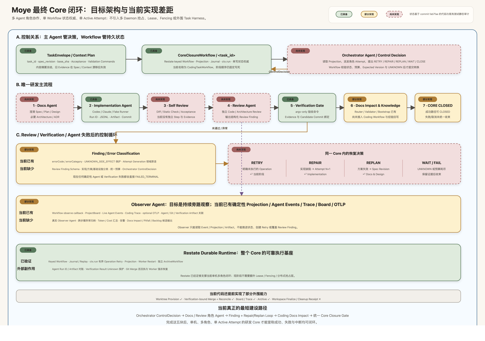
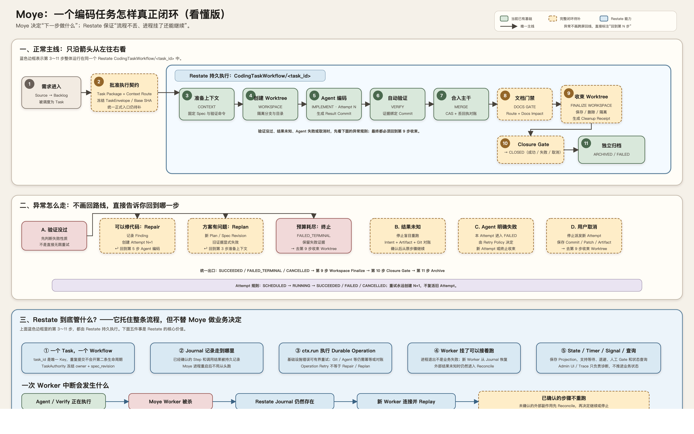
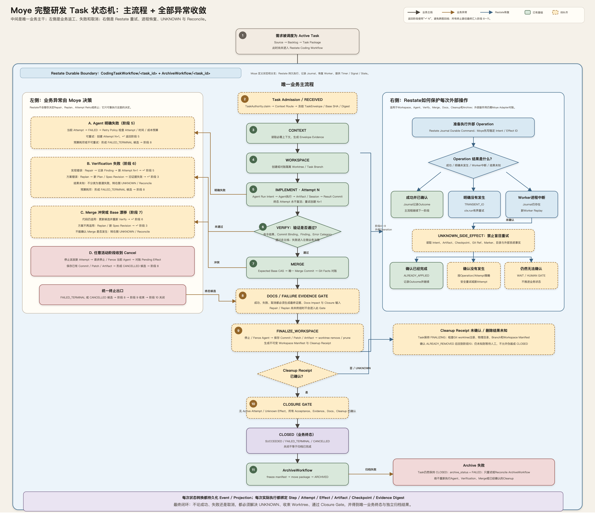

# Task 全生命周期与 Worktree 收束

> 文档类型：Brainstorm  
> 状态：Historical / Superseded for Current Core Roadmap  
> 更新日期：2026-08-22  
> 目标消费方：Task Runtime、Coding Workflow、Workspace Effect、Closure / Archive Gate

> 当前替代文档：[多 Agent 研发 Core 闭环需求基线](./multi-agent-core-closure-requirements.md)。本文保留早期完整 Harness、Worktree 收束和 Restate 边界讨论，但其中当前 Core 路线、REQ-LC 拆分和实施顺序已被替代，不应继续作为下一阶段开发入口。

> 本文记录 2026-08-21 对当前实现的阶段性审计和需求拆分。它不是当前架构事实，也不直接构成实现约束。正式消费后，应将需求去重进入 Backlog，再由 Active Task、Architecture 或 ADR 固化。

## 1. 背景

Moye 已经用 Restate 验证了 Durable Workflow、Worker 重启恢复、Git 副作用对账、Task Projection、Trace 和独立归档。但“一个真实编码任务从创建开始，无论成功、失败、中断还是取消，最终都能收敛到唯一、可解释、可验证的终态”仍需作为完整产品能力审视。

本轮讨论集中在三个问题：

1. 当前是否已经存在一条从 Task 创建到编码、验证、合并、Worktree 收束和归档的统一路径；
2. Restate 已经承担哪些可靠执行职责，哪些研发领域语义仍必须由 Moye 实现；
3. 为达到最终闭环，应该拆出哪些可独立验收的需求。

相关既有设计见 [Task Runtime Kernel](../../knowledge/current/architecture/task-runtime-kernel.md)、[Restate PoC 架构](../../knowledge/current/architecture/poc-01-restate.md) 和 [编码任务 Spec、文档与外围闭环](./task-spec-and-document-closure.md)。

## 2. 当前实现审计快照

### 2.1 当前存在两条相邻但未统一的路径

通用 `TaskWorkflow` 由 CLI 提交，覆盖：

```text
RECEIVED → EXECUTING → VERIFYING → CLOSED
                                      ↓
                              ArchiveWorkflow
                                      ↓
                             ARCHIVED | FAILED
```

它可以关闭和归档 Task Package，但不创建 Worktree、不运行编码 Agent，也不执行真实 Coding Pipeline。

`CodingTaskWorkflow` 覆盖：

```text
CONTEXT → WORKSPACE → IMPLEMENT → VERIFY → MERGE → DOCS → CLOSED → ARCHIVE
```

它已经串联 Worktree、Agent、Verification、Git Checkpoint、本地 Merge、Evidence Binding、Board 和 Trace，但当前主要由 Demo、Fixture 和测试直接构造输入并提交。常规 Task CLI 尚未把 Task Package、Context Route 和 Spec 自动转换为 `TaskEnvelope` 后启动这条路径。

因此，当前还不存在一个稳定入口能够表达：

```text
Backlog
  → Active Task Package
  → 冻结 TaskEnvelope
  → CodingTaskWorkflow
  → Workspace / Agent / Verify / Merge
  → Workspace Finalize
  → Closure Gate
  → Archive
```

### 2.2 Worktree 清理目前不属于 Workflow

当前 `CodingTaskWorkflow` 创建并使用隔离 Worktree，但没有 `FINALIZE_WORKSPACE` 或 `CLEANUP_WORKTREE` Step。成功 Demo 会在 Workflow 已经返回 `CLOSED + ARCHIVED` 后，由 `scripts/demo.ts` 调用 Demo 专用清理函数执行：

```text
git worktree remove <path>
git worktree prune
```

这证明演示脚本可以清理 Fixture，但不能证明任意 Runtime Task 已经完成 Workspace 收束：

- 普通 `CodingTaskWorkflow` 调用结束后可能保留 Worktree；
- Demo 在进入外围清理前失败时可能遗留 Worktree；
- Cleanup 没有稳定 Effect ID、Intent、Outcome 或 Reconcile；
- ArchiveWorkflow 不验证 Cleanup Receipt；
- Task 可能已经显示 `CLOSED + ARCHIVED`，但 Workspace 仍未处理。

这与当前 [Tasks Archive Gate](../../delivery/tasks/README.md) 中“Worktree 已归档或清理”的要求存在实现缺口。

### 2.3 成功路径已验证，失败路径尚未完整收敛

当前 Coding 成功路径已经验证：

- 同一 `task_id` 只由一个主 Workflow 拥有；
- 六个领域 Step 产生独立 Attempt 和 Evidence Binding；
- Verification 绑定 Result Commit；
- Merge 使用 Expected Base CAS，并能对账丢失回执；
- Worker 在 Merge 更新 ref 后退出，新 Worker 可以恢复并得到唯一 Merge；
- 成功后可以生成业务 Projection、Trace 和 Archive Receipt。

但中间出现确定性失败时，当前 Coding Workflow 会形成 `FAILED_TERMINAL` 并提前返回，尚未统一执行：

- Repair 或 Replan；
- 新的业务 Attempt；
- Agent / Workspace Finalize；
- 失败 Closure Report；
- 失败 Task Package 归档。

领域层已经有创建 Retry Attempt 的协议，但固定 Coding Workflow 尚未将其接入运行循环。当前 `ctx.run` 的底层重试属于 Operation Retry，不能替代 Agent Attempt Retry、Repair 或 Replan。

### 2.4 文档控制和 Coding Closure 尚未完全合并

Context Router、Docs Impact Report 和文档图校验已经存在；Goal Bootstrap 关闭流程也会验证部分关闭证据。但 Coding Workflow 的 `DOCS` Step 当前主要生成 `updated | unchanged | not_applicable` Artifact，尚未自动执行完整的 Docs Impact 和 Closure Gate。

因此，当前“代码已合并”“Coding Workflow 已关闭”“Task 文档已通过门禁”和“Worktree 已收束”仍可能是四个不同时间点。

## 3. Restate 当前承担的职责

Restate 适合作为整个 Task Workflow 的 Durable Runtime，但不会自动理解研发领域字段。当前已经利用的能力包括：

- 以 `task_id` 作为 Workflow Key，拒绝重复启动同一生命周期；
- 持久化 Workflow Journal，并在 Worker 进程退出后重放；
- 通过 `ctx.run` 承载有界 Operation Retry；
- 持久化 Workflow / Object State 和查询 Projection；
- 保持每个 Key 的单写者语义；
- 支持 Workflow 间调用，例如 Coding Workflow 调用 ArchiveWorkflow；
- 提供 Invocation、Journal、Retry 和基础运行时 UI；
- 在 Git Merge 和 Archive 等边界上配合 Moye 的 Effect Reconcile 得到唯一结果。

Restate 不会替 Moye 决定：

- 哪些 Task 状态和转换是合法的；
- Verification 失败后应该 Retry、Repair、Replan 还是终止；
- Agent 异常退出后是否可以安全重跑；
- 未知 Agent / Git / Workspace 副作用如何对账；
- Worktree 应删除、保留、归档还是迁移；
- 哪些 Acceptance Criteria 和文档义务满足后才能关闭；
- 多 Daemon 接管时的 Lease、Fencing 和 Checkpoint 规则。

因此，Restate 的定位应保持为“可靠执行 Moye 状态机”，而不是“根据 Task 字段自动生成研发状态机”。

## 4. Core First：单开发者最小研发闭环

完整 Task Harness 是最终目标，但单仓库、单线程、独立开发阶段不必先承担 Worktree 隔离、跨 Task 调度、多 Daemon Lease、Merge/PR 和归档等全部外围复杂度。更小且更关键的验证目标，是先证明研发核心本身能够形成可靠闭环：

```text
Core Task Spec
  → Orchestrator Agent 派发角色 Attempt
  → Docs Agent：Spec / Design / Docs Plan
  → Implementation Agent：实现与 Self Review
  → Review Agent：独立 Review
  → Verification
      ├─ Repair → 新 Attempt
      ├─ Replan → 新 Spec Revision
      ├─ Retry / Reconcile → 当前 Operation
      └─ Passed
  → Docs Agent：Docs Impact & Knowledge Sync
  → CORE CLOSED

Observer Agent 只读观察整个过程并持续产出 Trace、异常、成本和知识回写候选。
```



可编辑源文件：[最终Core闭环SVG](./assets/multi-agent-core-closure-final.svg)。图中绿色表示当前已具备基础，黄色表示工具或模型存在但尚未接入完整闭环，红色虚线表示当前尚未实现。这里的“单开发者”不等于“单 Agent”：Core 内包含 Orchestrator、Docs、Implementation、Review 和 Observer 多个角色，但同一时刻只允许一个受 Workflow 管控的 Active Attempt。Orchestrator Agent 读取 Projection、派发角色任务并提出 Retry、Repair、Replan 或关闭决策；只有 `CoreClosureWorkflow` 可以校验并持久化这些状态转换。

Review Agent 对 Spec、Diff、Architecture 和测试证据作独立判断并输出结构化 Finding；Observer Agent 则持续观察 Event、Attempt、Agent Session、错误、成本和 Artifact，生成 Trace 摘要、异常告警、Docs Impact 候选和知识回写候选。两者职责不同，也都不能直接改写 Core 主状态。

最小 Core 闭环的终点不是“已经合入主干并归档”，而是同时满足：

- 得到唯一的 Candidate 或明确失败结论；
- 不存在 Active Attempt 和未解释的 `UNKNOWN_SIDE_EFFECT`；
- Review、Verification 与 Candidate Commit 之间存在可验证绑定；
- 最终 changed paths 已完成 Docs Impact 处置；
- 踩坑、Finding 和后续改进已经形成可消费的 Pitfall、Backlog 或 Runbook 候选；
- 从 `task_id` 可以回放 Attempt、Agent Session、Finding、Artifact、验证和知识同步结果。

Restate 仍贯穿整个 Core，用于 Journal、Replay、Operation Retry、Timer、Signal、Worker Recovery 和持久化查询；Attempt、Repair、Replan、Finding 分类、预算、Reconcile 和 Closure Gate 仍由 Moye 定义。这里的关键收敛是：**Restate 是 Core 的可靠执行基座，不是第二条业务流程。**

外层 Harness 以后只需消费稳定的 `CoreClosureResult`，再按需增加 Managed Worktree、Merge/PR、Project Board 和 Archive。多 Daemon 的 Lease、Fencing 和 Handoff 只有在未来真的出现跨机器并发执行时才另立 Research，不属于当前 Core 或下一阶段建设范围。外层失败不得改写已经确认的 Core 历史和证据。

### 4.1 当前版本距离 Core 闭环的差距

以下结论基于 commit `fab7fae` 的代码、Architecture 和既有单元/E2E测试静态审计。它描述当前事实，不把 Brainstorm 中的目标误写成已经实现。

| Core 能力 | 当前状态 | 已有基础 | 仍缺少的闭环能力 |
|---|---|---|---|
| TaskEnvelope / Context | 已具备 | `task_id`、Spec Revision、Base SHA、Acceptance、Validation Commands 和 Context Plan 摘要冻结 | 正式入口仍未从真实 Active Task Package 自动构造并提交 Coding Workflow |
| Restate Core Workflow | 已具备基础 | keyed `CodingTaskWorkflow`、Journal、`ctx.run`、Projection、Worker 重启恢复、单主权声明 | 当前八阶段顺序固定写死，尚未变成可决策的 Core Loop |
| Orchestrator Agent | 未实现 | Workflow 自身能按固定顺序编排 | 没有 Agent 读取 Projection 并输出结构化 `ControlDecision`；没有状态、预算和 Expected Version 校验协议 |
| Docs Agent | 未实现 | Implementation Agent 可以在 Prompt 内偶然修改文档 | 没有独立 Docs Attempt、Design/Spec Artifact 和证据绑定 |
| Implementation Agent | 已具备 | Fake / Codex / Claude Runner、稳定 Run ID、实时 Agent Events、JSONL、Session、Artifact Manifest、Git Checkpoint 和结果未知保护 | 只有 `IMPLEMENT/attempt-001` 被接入固定流程，尚不能由 Orchestrator 创建后续 Attempt |
| Self Review | 未实现 | 可以依赖 Prompt 自检，但不是系统事实 | 没有独立 Step、结果 Schema、Finding 和 Evidence |
| Review Agent | 未实现 | 无 | 没有独立 Reviewer Run、Review Finding、通过门禁和 Repair 输入 |
| Verification | 已具备 | argv-only Gate、Candidate Commit Binding、Evidence、失败与 `RESULT_UNKNOWN` 分类、Worker 重启测试 | 验证失败直接终止，尚未进入 Repair/Replan 决策 |
| Finding 分类 | 部分实现 | Adapter 保存 `errorCode + errorCategory`，领域层有 Attempt Generation 原语 | 没有 Review Finding Schema，也未把实现缺陷、方案失效、基础设施和未知结果映射为控制动作 |
| Retry / Repair / Replan | 未实现 | Restate 有 Operation Retry，领域层可创建后续 Attempt | Coding Workflow 只调用 `createInitialAttempt`；确定性失败直接 `FAILED_TERMINAL`，没有预算和同 Task 循环 |
| Observer Agent | 部分实现 | `observe` callback、ProjectBoard、实时 Agent Events、只读 Coding Trace、可选 OTLP Export 和 Agent/Git/Verification Artifact 关联 | 还不是 Agent；没有异常归纳、成本统计、告警或知识候选输出 |
| Docs Impact / Knowledge Sync | 部分实现 | Document Graph、Context Router、Impact Validator 和 Bootstrap Closure 已存在 | Coding `DOCS` Step 只写一个 disposition JSON；没有最终 Route、Impact Gate 和 Pitfall/Finding/Backlog/Runbook 提升流程 |
| Core Closure Gate | 部分实现 | 成功路径必须经过固定 Step 与 Evidence 后才能 `CLOSED`；Archive 失败不重开业务状态 | Agent/验证失败停在 `FAILED`；没有取消路径、统一失败证据、无 Active Attempt/UNKNOWN 检查和三种 Outcome 收束 |
| Restate / Effect 恢复 | 已具备基础 | Agent Run 防盲重跑、Verification Unknown 保护、Merge 丢回执对账、Worker 强杀恢复 | UNKNOWN 目前主要产生等待/人工建议，还没有统一的 Workflow Reconcile 后继续入口 |

当前代码还提前具备 Worktree Provision、Verification-bound Merge、Board/Trace 和独立 Archive 等外围能力；但 Workspace Finalize / Cleanup Receipt 尚未纳入 Workflow。对 Core First 路线而言，现阶段不需要再增加多 Daemon Lease、Fencing 或分布式抢占层。

### 4.2 最短建设顺序

```text
1. Orchestrator ControlDecision 协议
2. Docs Agent + Review Agent 的角色 Attempt
3. Finding 分类与 Repair / Replan 循环
4. Coding Workflow 接入 Docs Impact / Knowledge Sync
5. 统一 Core Closure Gate：SUCCEEDED / FAILED_TERMINAL / CANCELLED
```

这五项完成后，单机、多角色、单 Active Attempt 的研发 Core 才能独立证明闭环；Managed Worktree Finalize、Merge/PR、Archive 和跨 Task 看板可以作为后续 Harness 增强。

## 5. 候选完整 Task Harness 闭环

以下状态和名称只用于拆解需求，不代表已经接受的最终状态机：



默认图采用单一编号主线，并把异常规则和 Restate 管控单独分区。可编辑源文件：[看懂版 SVG](./assets/task-lifecycle-state-machine-overview.svg)。需要查看更完整的工程关系时，再打开[高级工程版 PNG](./assets/task-lifecycle-state-machine.png)或[高级工程版 SVG](./assets/task-lifecycle-state-machine.svg)。图中绿色节点表示当前已有基础，黄色虚线节点表示达到完整闭环仍需实现的能力，蓝色区域表示 Restate 提供的 Durable Runtime 管控。

### 完整流程与异常叠加图

下面这张图以一条纵向主干表达完整Task生命周期：左侧只放业务异常和返工决策，右侧只放Restate运行时恢复、UNKNOWN和Reconcile，所有失败与取消最终汇入同一个Evidence Gate、Workspace Finalize、Closure Gate和独立Archive。蓝色大边界表示阶段2至11都运行在Restate Durable Runtime内，但状态和分支仍由Moye定义。

读图时只需遵循五条规则：

1. 先只读中间编号 `1 → 11`，它是唯一正常推进顺序；
2. 左侧不是第二条流程，而是阶段 `5～7` 失败或任意阶段取消时，由 Moye 作出的业务决策；每条分支都直接写明返回阶段；
3. 右侧也不是第二条 Task 状态机，而是阶段 `4～9` 每次执行外部操作时共同套用的 Restate 可靠执行子流程；
4. `FAILED_TERMINAL` 和 `CANCELLED` 只是终态候选，仍必须进入阶段 `8～10` 保存证据、收束 Worktree 并通过 Closure Gate；
5. 阶段 `11` 归档与业务关闭正交：归档失败只重试归档，不能重新执行 Agent、Merge 或 Cleanup。



可编辑源文件：[完整异常叠加图SVG](./assets/task-lifecycle-complete-flow.svg)。如果需要按阶段逐列核对责任、Effect和Evidence，可以再查看[泳道矩阵版PNG](./assets/task-lifecycle-panorama.png)或[SVG](./assets/task-lifecycle-panorama.svg)。

```text
RECEIVED
  → CONTEXT
  → WORKSPACE
  → IMPLEMENT ──────────────┐
  → VERIFY                  │
      ├─ implementation ────┘ Repair + new Attempt
      ├─ plan invalid ───────── Replan + new Plan Revision
      ├─ result unknown ─────── Reconcile / Human Gate
      └─ passed
  → MERGE
  → DOCS_GATE
  → FINALIZE_WORKSPACE
  → CLOSED(SUCCEEDED)
  → ARCHIVE
```

任何失败或取消路径也必须经过收束：

```text
FAILED / CANCEL_REQUESTED
  → stop or fence active executor
  → reconcile pending effects
  → persist commit, patch and artifacts
  → FINALIZE_WORKSPACE
  → CLOSED(FAILED_TERMINAL | CANCELLED)
  → ARCHIVE
```

### 5.1 Workspace Finalize 的候选语义

Finalize 不是简单执行 `rm`。它至少需要：

1. 冻结 Workspace 所属 Task、Spec Revision、Attempt 和 Effect ID；
2. 检查是否有未提交 tracked change 或 untracked file；
3. 对需保留的内容生成 Commit、Patch、Bundle 或 Artifact Manifest；
4. 确认不存在仍在运行且有写权限的 Agent；
5. 根据终态策略选择 `REMOVE`、`PRESERVE_FOR_REPAIR` 或 `QUARANTINE`；
6. 执行 `git worktree remove` 和必要的 `prune`；
7. 对账 Worktree 注册、物理目录、Task Branch 和最终 Commit；
8. 生成不可变 Cleanup Receipt；
9. Cleanup 结果未知时停止并 Reconcile，不能伪装成已经完全关闭。

### 5.2 Closure Gate 的候选条件

```text
所有 Required Step 已终结
AND Acceptance Criteria 有证据或明确失败结论
AND 最终 Verification 绑定最终候选 Commit
AND Merge / Cancel / Failure Outcome 已确认
AND 没有 Active Attempt
AND 没有 PENDING / UNKNOWN Effect
AND Workspace Cleanup Receipt 已确认
AND Docs Impact 已通过
AND Closure Report 已生成
```

`CLOSED` 和 `ARCHIVED` 继续保持正交：业务关闭后由独立 ArchiveWorkflow 固化材料；Archive 失败不得重新执行编码、验证或清理已经确认的 Workspace Effect。

## 6. 待决策问题

- Workspace Cleanup 应当是 Coding Pipeline 的最后一个 Required Step，还是独立的 Finalization Workflow？
- 成功 Task 是否删除 Task Branch；失败 Task 的 Worktree 默认保留多久？
- Cleanup 失败时 Task 应停在 `FINALIZING`，还是使用正交的 `cleanup_status`？
- 确定性 Agent 失败默认创建新 Attempt，还是必须由 Retry Policy 判断？
- Repair 是否继续同一 Task Revision；哪些变化必须升级 Spec Revision？
- Replan 后旧 Verification 和 Evidence Binding 如何显式失效？
- UNKNOWN Agent Result 的自动对账需要哪些最小 Artifact 和 Git Fact？
- 单机 PoC 是否先只实现 Runtime Finalize，而把 Lease/Fencing 留给多 Daemon Task？
- 通用 `TaskWorkflow` 应被 Coding 主 Workflow 吸收，还是保留为不同 Task Kind 的编排器？
- Docs Gate 应在 Merge 前阻止发布，还是允许代码合入后以独立 Knowledge Sync Gate 收敛？

## 7. 拆出的候选需求

以下需求用于后续 Backlog 去重和调度。它们仍是 Draft，不等于已经承诺实施。

### REQ-LC-01：统一 Coding Task 创建入口（P0）

**目标**：从 Active Task Package 和 Context Route 生成不可变 `TaskEnvelope`，通过一个稳定 CLI / API 提交 `CodingTaskWorkflow/<task_id>`，不再依赖 Demo 或测试手工构造输入。

**最小验收**：

- `task_id + spec_revision` 只能绑定一个主 Workflow owner；
- Spec、Base SHA、Requirements、Validation Commands 和 Context Plan 被摘要冻结；
- 重复提交不会产生第二条生命周期；
- CLI `status` 能根据 Authority 查询正确的通用或 Coding Projection；
- 一个真实 Task Package 可以由正式入口启动完整 Fake Coding 流程。

### REQ-LC-02：Durable Workspace Finalize Effect（P0）

**目标**：把 Worktree 保存、删除、隔离和对账纳入 Runtime，而不是由 Demo 外围脚本负责。

**最小验收**：

- Finalize 使用稳定 Operation ID，并记录 Intent、Outcome 和 Cleanup Receipt；
- 成功、失败和取消路径都必须执行 Workspace Finalize；
- dirty / untracked 内容不会静默丢失；
- `worktree remove` 成功但回执丢失时可以对账为 `ALREADY_REMOVED`；
- 未获得确认的 Cleanup Receipt 时，Task 不能宣称完全关闭；
- 故障注入证明任意 Finalize 边界强杀 Worker 后只得到一个最终 Workspace 结果。

### REQ-LC-03：统一终态与失败归档（P0）

**目标**：让 `SUCCEEDED`、`FAILED_TERMINAL` 和 `CANCELLED` 都经过同一收束协议，而不是失败后从 Coding Workflow 提前返回。

**最小验收**：

- 所有 Active Attempt 在关闭前进入终态；
- Pending / Unknown Effect 必须先对账或进入明确人工 Gate；
- 失败和取消也生成 Verification / Failure Evidence、Closure Report 和 Docs Impact 结果；
- 三种业务 Outcome 都可以调用独立 ArchiveWorkflow；
- Archive 失败只影响 `archive_status`，不复活编码或 Workspace Cleanup。

### REQ-LC-04：Attempt Retry、Repair 与 Replan 控制器（P1）

**目标**：在现有 Step / Attempt 协议上接入真正的业务循环，并复用现有 [BL-0003](../../delivery/backlog/BL-0003.yaml) 的预算方向。

**最小验收**：

- Operation Retry、Attempt Retry、Repair 和 Replan 使用不同事件和预算；
- 旧 Attempt 终态不可复活，新执行使用递增 Generation；
- Verification Finding 可以生成 Repair Context 并启动新 IMPLEMENT Attempt；
- Replan 增加 Plan Revision，并使不再适用的旧证据失效；
- 预算耗尽后进入唯一失败终态，不无限调用模型。

### REQ-LC-05：Agent / Effect Reconcile 与交接（P1）

**目标**：Agent 中断或结果未知时，从稳定 Intent、Artifact、Checkpoint 和 Git Fact 判断继续、重试或等待人工处理。

**最小验收**：

- 已确认的 Agent Result 不重复调用模型；
- 明确未发生的 Run 才能创建新 Attempt；
- UNKNOWN Result 不会自动并行启动第二个 Agent；
- 新执行者不依赖聊天历史或 Worker 本地内存即可接管；
- 多 Daemon 阶段引入 Lease / Fencing 后，旧执行者不能覆盖新 Attempt 结果。

### REQ-LC-06：自动 Closure Gate（P1）

**目标**：把 Acceptance、Verification、Effect、Workspace 和 Docs Impact 的关闭条件变成 Runtime Gate。

**最小验收**：

- Gate 检查最终 Commit、Verification Binding、Active Attempt 和 Effect 状态；
- Gate 要求已确认的 Workspace Cleanup Receipt；
- Context Route 和 Docs Impact 覆盖最终 Changed Paths；
- Gate 失败保持 Task 可恢复，不通过直接编辑 `task.yaml` 绕过；
- Closure Report 可以从 Task ID 回溯到 Spec、Attempt、Agent Session、Commit、验证、文档影响和归档。

### REQ-LC-07：生命周期故障矩阵与收敛验收（P1，横切）

**目标**：用故障注入证明闭环，而不只验证 Happy Path。

**最小验收**：

- 在 Workspace、Agent、Verify、Merge、Docs、Finalize 和 Archive 边界强杀 Worker；
- 覆盖 Agent 明确失败、结果未知、Verification 失败、Merge 丢回执、Cleanup 丢回执和取消；
- 每个场景最终只有一个业务 Outcome、一个 Merge 结果和一个 Workspace 结果；
- 已确认的昂贵 Agent 调用、Git Effect 和 Cleanup Effect不重复；
- Board、Trace、Journal 和 Task Package 对最终状态的解释一致。

## 8. 建议的消费顺序

```text
REQ-LC-01 统一入口
    ↓
REQ-LC-02 Workspace Finalize
    ↓
REQ-LC-03 终态与失败归档
    ↓
REQ-LC-04 Attempt / Repair / Replan
    ↓
REQ-LC-05 Reconcile / Handoff
    ↓
REQ-LC-06 Closure Gate

REQ-LC-07 从第一项开始持续补充故障验收
```

建议先将 `REQ-LC-01` 至 `REQ-LC-03` 去重后拆成 P0 Backlog。它们完成后，Moye 才能宣称单机、多角色但单 Active Attempt 的 Task 在成功、失败和取消情况下都具备 Runtime 保证的 Worktree 与材料收束。Repair、多 Daemon 和更完整的知识闭环可以在这个底座上继续演进。
